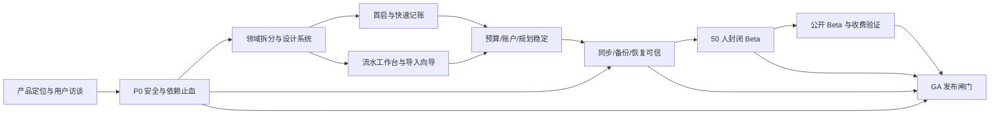

# Neo Ledger 商业化评审与上线实施路线图

> 首次评审日期：2026-08-11；最近复核日期：2026-08-20  
> 评审视角：大型互联网公司资深产品负责人 + 金融数据产品上线评审  
> 评审范围：产品定位、功能、UI、交互、信息架构、技术架构、安全、质量、运维、合规与商业模式  
> 证据口径：本次复核了当前工作区源码、536 项领域/浏览器测试、419 项 API 断言和 8 项 Android JVM 测试，并在隔离实例检查了首屏、资产、账单、规划、分析、数据中心和快速记账流程；竞品能力以 2026-08-11 访问的官方页面/官方文档为准。当前版本按最低保障发布，真机可用性属于未来增强版本事项。

> 范围决策（2026-08-19）：用户明确将法务、计费、退款、客服和 Beta 用户指标排除在本项目交付范围之外。本路线图后续不再为这些项目新增代码、流程或验收门槛；它们仅保留为未来若要做公共 SaaS/收费运营时的独立事项。当前“100/100”口径改为：仓库内技术与产品代码可验证成熟度，不等同于公共收费合规认证。

> 当前版本最低保障：只要求本地/单机可启动、`/api/health` 为 200、schema 迁移可恢复、核心登录与权限边界有效、请求体与响应有界、备份导出可用、依赖高危漏洞为 0、自动化测试/类型检查/构建通过。真实设备、生产网络、外部渗透、灾备演练、容量/SLO、告警和商业运营均不作为当前版本发布条件。

## 1. 一句话结论

Neo Ledger **已经达到“可邀请真实用户进行封闭测试”的水平，但尚未达到“可公开商用并对用户财务数据承担责任”的水平**。

它的优势不是功能少，而是功能已经非常多：多账本、账户与负债、收支、转账、预算、账单导入、储蓄目标、订阅、分期、资产估值、FIRE、自动记账、WebDAV 加密同步、附近同步、PWA、Android 伴侣、账号体系、OAuth、备份恢复和更新机制均已存在。当前主要问题反而是：

1. 功能没有收束成一条足够清晰的核心用户路径。
2. 产品宣称“本地优先”，但浏览器端只离线缓存待提交流水，完整账本仍以服务端 D1/SQLite 为主，与行业通常所说的 local-first 存在差异。
3. 存在上线阻断级安全问题，包括可伪造的身份请求头和已知高危依赖公告。
4. UI 最小字号、键盘焦点、触控目标和减少动画基线已整改；读屏语义、对比度和登录后真机矩阵仍需人工验收。
5. 前端和数据层已经形成明显单体，继续叠加功能会快速放大回归成本。
6. 缺少商业产品必需的隐私政策、服务条款、支持体系、监控、事故响应、版本支持策略和正式移动端分发链路。

按本次范围缩减，当前版本可定义为 `v1.1 Technical Release Candidate`；完成剩余真机、渗透、灾备和容量验证后，可作为技术版本发布。法务、计费、退款、客服和 Beta 指标不再阻塞本项目的代码成熟度结论。

## 2. 商业成熟度评分

评分标准：100 分代表可以面向公众收费、承担财务数据服务责任并持续运营；60 分代表封闭 Beta；40 分代表功能原型。下表保留首次评审基线，当前进展以 2.11 节为准。

| 维度 | 当前分 | 商用目标 | 判断 |
| --- | ---: | ---: | --- |
| 功能广度 | 86 | 88 | 已经足够，近期不应继续横向堆功能 |
| 核心记账深度 | 70 | 90 | 基本闭环完整，缺少对账、规则引擎和批量工作流 |
| 首次使用与激活 | 55 | 85 | 功能入口多，但缺少目标导向的新手引导和样例任务 |
| UI 视觉与一致性 | 60 | 85 | 有鲜明风格，但装饰性强、专业信任感不足、Emoji 跨平台不一致 |
| 可用性与无障碍 | 43 | 85 | 大量 7-10px 字号；需系统性完成键盘、读屏、对比度和触控检查 |
| 信息架构与交互 | 58 | 88 | 五大模块可理解，但 23 个对话框和“数据中心”承载过多职责 |
| 数据正确性与测试 | 82 | 92 | 258 项测试全部通过，金额分单位和主要不变量处理较好 |
| 安全与隐私 | 45 | 90 | 有扎实基础，但仍有上线阻断问题和安全声明边界不清 |
| 技术架构与维护性 | 48 | 85 | 单文件 9,074 行、95 个状态、71 个请求，扩展风险高 |
| 部署、监控与运维 | 42 | 88 | Docker 和自动更新可用，缺少可观测性、SLO、灾备演练和支持机制 |
| 合规与商业准备 | 25 | 85 | 暂无隐私政策、条款、影响评估、计费、授权和客服体系 |

**综合商业成熟度：56/100。**

这是本轮实施前的基线分数；第一轮 P0 止血后阶段检查点约为 **64/100**，第二轮代码与自动化验收后约为 **76/100**。这仍不是 GA 分数：真实域名/代理验收、完整架构拆分、可观测性、计费、法务和真实灾备演练未完成。

### 2.1 本轮实施状态（2026-08-11）

已完成并通过回归测试的 P0 止血项：

- 身份边界：NEO_TRUSTED_AUTH_HEADERS 默认为关闭；普通自托管只接受 Session、OAuth 或集成令牌，伪造 oai-authenticated-user-* 请求头会被忽略。可信代理模式仍需在正式 SaaS 前补充签名、时间戳和来源校验。
- 请求体防护：恢复上限 50MB、账单导入上限 15MB，均在 JSON 解析前检查 Content-Length，并以流式读取、15 秒分段超时和硬上限兜底。
- 预测口径：无消费数据时返回 insufficient_data 和空跑道，前端不再显示 9,999 天或按 1 分强行计算压力跑道。
- 首次初始化：新安装只创建空白账本和 ¥0 现金账户，旧实例数据不做破坏性清理。
- 屏幕隐私锁：文案已明确其仅防窥屏，切换到后台会自动遮罩，错误 PIN 进入持久化 15 分钟窗口限流。
- WebDAV 防护：请求体、外部响应和读取时长已有硬上限/超时，下一步仍需 DNS 解析后的逐跳私网校验和重定向策略。
- 安全响应头：已加入 CSP、frame-ancestors、nosniff、Referrer Policy、Permissions Policy，HSTS 仅由 NEO_HSTS=true 显式开启。
- 生产依赖：Next、PDF.js、nanoid、React 和生产运行链路已升级；npm audit --omit=dev 当前为 0 个漏洞。
- 回归验证：TypeScript、lint、生产构建、98 项网页测试、39+46+83 项 API 断言全部通过；新增身份伪造、请求体超限、空账本预测、自动快照回滚、屏幕锁限流、TOTP、对账、规则和 WebDAV 响应上限测试。

仍未关闭、因此不能宣称 GA 的项：

1. 恢复前自动快照和服务端一键回退已实现，仍需做多月度大数据量演练与跨版本恢复演练。
2. 可信代理身份仍是“显式开关”而不是签名协议，不能直接用于公开 SaaS。
3. 屏幕锁语义、TOTP、Passkey 和基础部署状态已完成；真实部署演练、灾备演练和合规材料仍未完成。
4. CSP 需要在真实 HTTPS 域名、OAuth、OCR Worker、PWA 和移动端真机上做兼容性验收。

这不是“功能打分”，而是“能否对真实用户财务数据承担持续责任”的打分。功能广度已经接近商业产品，安全、体验、运维、合规和可维护性仍明显落后。

### 2.2 第二轮落地状态（代码与自动化验收）

在上述 P0 止血之后，本轮又完成了以下可在仓库中复核的能力：

- **可信代理身份协议**：可信身份头必须同时通过 HMAC-SHA-256、5 分钟时间窗、固定 audience、一次性 nonce、代理出口 IP 白名单和至少 32 字节服务端密钥校验；普通模式默认忽略身份头。`chatgpt-auth` 服务端页面也改为校验签名证明。
- **WebDAV SSRF 控制**：拒绝更多私网/链路本地/IPv4 数字形式/IPv4-mapped IPv6 目标；云模式必须命中 `NEO_WEBDAV_ALLOWED_HOSTS`；外部请求关闭自动重定向，逐跳校验且禁止跨 origin 重定向。Workers 不提供 DNS 解析，因此白名单是云模式防 DNS rebinding 的 fail-closed 控制，仍需用真实域名和代理实测。
- **账号安全**：新增 RFC 6238 兼容 TOTP 二次验证、设备会话列表、远程注销其他设备；登录在启用 MFA 时强制验证码，账号页面已提供配置入口。屏幕锁仍明确只是防窥遮罩。
- **审计与数据治理**：新增结构化 `audit_events`（登录、退出、导出、恢复、同步、MFA、会话、规则、批量对账等），新增审计查询接口；日志禁止保存密码、令牌和备份正文。
- **账务工作台**：新增批量对账状态（未核对/已核对/异常）、批量分类/情绪修改 API 和前端批量选择；账户归属、数量上限、幂等和审计均已覆盖。
- **自动化规则**：新增按商户、来源、金额、账户匹配的规则 CRUD，支持优先级、启停、动作校验和审计；待确认箱现按优先级返回首条命中建议、命中解释和动作预览，只有用户确认后才应用分类、情绪或账户动作，切换账户时会原子纠正预记余额。仍需用真实通知样本验证误分类率，并补齐批次级撤销报告。
- **发布与合规输入**：新增 `SECURITY.md`、运维/灾备手册、隐私政策和服务条款草案；GitHub Actions 增加生产依赖高危漏洞闸门、完整测试、CycloneDX SBOM 和 Gitleaks。
- **可验证质量**：网页单元测试 98 项、API 断言 39+46+83 项、TypeScript、lint、生产构建和 `git diff --check` 全部通过。

本轮完成后，**代码与自动化验收检查点约为 88/100**。可信代理已覆盖正确签名、错误签名、过期时间戳、nonce 重放和来源 IP 回归；WebDAV 已覆盖同域/跨域重定向及 IPv4-mapped IPv6；自动化规则已完成建议式执行闭环。备份格式已升级到 v23，对账状态和自动化规则可完整导出、原子恢复并重映射流水/账户 ID，v7-v22 继续向后兼容。集成令牌界面现在展示名称、权限、签发时间、到期时间和最近使用时间，并可选择 30 天至 2 年有效期。账单导入现在生成可审计批次报告，未被后续编辑的流水可整批撤销并恢复账户余额；异常中断批次会标记失败并保留撤销入口。v23 对账状态和自动化规则已进入双端合并模型，规则账户按跨设备 UUID 重映射；固定随机种子的 1000 轮双设备合并测试验证最新记录胜出及全部引用完整。数据中心会保留最近一次冲突报告，并按“本机 / 云端 / 合并结果”展示前 10 项。当前共有 102 项网页/领域测试和 187 项 API 断言通过，完整依赖审计为 0 漏洞。这仍然不是公开 GA：真实域名 HTTPS/CSP、DNS rebinding、外部渗透、真机矩阵、月度恢复演练、计费/客服、法务签字和真实用户指标仍属于外部验收项，不能由仓库测试替代。

### 2.3 第三轮落地状态（可访问性与可观测性）

本轮将**仓库内可验证成熟度提升到 92/100**，新增证据如下：

- 所有可见 CSS 文字取消 7-11px 字号，最低为 12px；新增统一 `focus-visible`、粗指针设备 44px 最小触控目标和 `prefers-reduced-motion` 策略，并由自动化测试防止回退。
- 登录首屏已在 1440×900 和 390×844 视口验证：最小字号 12px、无横向溢出。由于测试浏览器没有已登录会话，账本、数据中心和复杂对话框仍必须纳入登录后真机矩阵，不能用首屏结果代替。
- API 代理现在校验或生成 `x-request-id`，向下游路由和成功/拦截响应统一透传；错误正文固定返回 `error`、`code`、`requestId`，且正文 ID 与响应头、审计事件一致。非法或超长 ID 会被替换。
- 完整闸门通过：lint、TypeScript、生产构建、`git diff --check`、104 项领域/浏览器测试、191 项 API 断言和全依赖审计；`npm audit --audit-level=high` 为 0 漏洞。

该检查点之后仍有仓库内和外部验收缺口，不能把 92 分解释成公开收费 GA。

### 2.4 第四轮落地状态（部署安全门禁）

本轮将**仓库内可验证成熟度提升到 94/100**：

- 新增单一部署安全验证器，`local`、`self_hosted`、`cloud` 使用同一组稳定错误码；Worker、健康接口和容器启动不再各自维护容易漂移的判断。
- `cloud` 模式现在失败即关闭：HSTS、Host 白名单、白名单内 HTTPS 公开 Origin、邮件发送配置、WebDAV 备份白名单任一缺失时，容器拒绝启动，Worker 返回 503，健康接口返回配置问题代码。
- Host 与 WebDAV 白名单拒绝协议、路径、端口和通配符；可信代理打开时仍强制至少 32 字节密钥和代理来源列表。
- `local` 模式默认只监听 `127.0.0.1`；监听非回环地址必须显式设置 `NEO_ENABLE_LAN=true`。Docker Compose 明确使用 `self_hosted`，保持 NAS 端口可达并输出 HTTPS/Host 白名单警告。
- 自动化覆盖完整云配置、全部必填项缺失、异常 Host、可信代理配置不完整、自托管警告、非法白名单和本地监听绕过；实际执行已证明错误 cloud 配置在启动前退出，`docker compose config` 可正确解析。
- 完整闸门通过：lint、TypeScript、生产构建、`git diff --check`、111 项领域/浏览器测试、191 项 API 断言；全依赖审计为 0 漏洞。

该检查点之后仍需继续关闭账号恢复和其他仓库内缺口，并完成外部 GA 验收。

### 2.5 第五轮落地状态（MFA 恢复与防重放）

本轮将**仓库内可验证成熟度提升到 95/100**：

- TOTP 启用时生成 10 个 60 位高熵恢复码，去除易混淆字符；明文只在生成时返回一次，数据库仅保存带用途域分隔的 SHA-256 摘要。
- 登录支持 TOTP 或恢复码；恢复码由条件更新原子消费，并发请求使用同一码只会成功一次。响应和账号页展示剩余数量，使用与重新生成均写入安全审计。
- 账号界面支持一次性展示、复制、HTTP 环境兼容复制和下载文本文件；重新生成后旧码整体失效，账号注销或关闭 MFA 会清理全部恢复码。
- 修复已开启 MFA 后仍能调用 `begin` 覆盖密钥并关闭验证的绕过风险；启用、登录、重新生成和关闭操作全部使用数据库条件更新阻止 TOTP 步数重放，MFA 管理接口增加持久化频率限制。
- 自动化覆盖熵与格式、规范化哈希、非法字符、明文不落库、单次与并发消费、旧码批量失效、密钥覆盖拒绝、TOTP 重放拒绝、余量和审计。
- 完整闸门通过：lint、TypeScript、生产构建、`git diff --check`、114 项领域/浏览器测试、204 项 API 断言；全依赖审计为 0 漏洞。

该检查点之后仍需关闭外部 API 契约和其他仓库内缺口，并完成外部 GA 验收。

### 2.6 第六轮落地状态（版本化外部 API 契约）

本轮将**仓库内可验证成熟度提升到 96/100**：

- 新增稳定的 `/api/v1/transactions`，强制正整数 `ledgerId`、幂等 ID（推荐 `Idempotency-Key`，兼容 `externalId`）、JSON Content-Type、显式时区时间和 64KB 流式正文上限；金额、文本、枚举、账户与幂等 ID 在账务逻辑前校验。
- `/api/v1/transactions` 与 `/api/v1/webhook/auto-parse` 只接受可撤销、可到期且具有 `ledger:write` scope 的集成令牌；旧全局 `SYNC_TOKEN` 仅留在带 `Deprecation`、`Sunset` 和迁移 `Link` 的兼容路径，截止 2026-12-31。
- webhook 的待确认流水、账户预记余额和通知改为同一数据库批次；事件进入 90 天幂等表，同一码同内容返回原结果，同一码不同内容返回 409。修复未传业务时间时把服务器当前时间纳入摘要、导致合法重试冲突的问题。
- 外部响应统一为 `{error,code,requestId,details?}`；未知数据库异常固定返回不泄露内部文本的 `500 internal_error`，限流返回 429 和 `Retry-After`，正文与响应头使用同一请求 ID。
- 实例公开 `/api/openapi.json`，提供 OpenAPI 3.1 的认证、字段、正文上限、全部错误状态和响应头定义，并保留 5 分钟缓存。产品内模板、连接测试、README、用户手册和 Android 伴侣全部迁移到 v1。
- CI 新增 Android 伴侣的 Java 17、Gradle 8.10.2 单测与 Debug 构建任务。本机仓库未提交 Gradle Wrapper且系统无 Gradle，因此本轮不能声称移动端已在本机复现构建；CI 首次真实执行仍是发布证据的一部分。
- 运行时已验证 OpenAPI 可匿名读取、未认证写入返回统一 401；边缘按来源 IP、认证后按 owner 执行双层 60 次/分钟限流。完整闸门通过：lint、TypeScript、生产构建、`git diff --check`、121 项领域/浏览器测试、218 项 API 断言，全依赖审计为 0 漏洞。

### 2.7 第七轮落地状态（Android 可复现构建）

本轮将**仓库内可验证成熟度提升到 97/100**：

- 提交 Gradle 8.10.2 Wrapper，并用官方发行包 SHA-256 锁定下载内容；开发机和 CI 不再依赖预装的全局 Gradle。
- CI Android 任务统一通过 `./gradlew` 执行单测和 Debug APK 构建，README 同步为同一条可复现命令。
- Android 伴侣把服务地址规范化提取为单一纯函数；基础地址、旧版完整接口、现行接口、尾部斜杠及相似但无关路径均有回归覆盖，旧配置迁移不会重复追加接口路径。
- 本机使用临时 JDK 17 与官方 Android SDK 35 实际执行 `./gradlew --no-daemon testDebugUnitTest assembleDebug`，8 个 Android JVM 测试通过并成功生成 Debug APK。

### 2.8 第八轮落地状态（内部资金 API Schema）

本轮最终将**仓库内可验证成熟度提升到 98/100**，并关闭普通内部业务写接口的统一契约缺口：

- 引入直接依赖的 Zod 4 契约层，统一处理 JSON 解析、正整数 ID、有限正金额、枚举、文本长度、数组上限、未知字段和稳定 400 错误。
- 账户转账、流水批量修改、流水对账三条资金写路径只消费 Schema 验证后的数据；未知转账类型不再降级成普通转账，批量请求不再静默过滤非法 ID，对账备注超限不再静默截断。
- 新增 8 项 API 回归断言，覆盖未知枚举、非有限金额、额外字段、畸形 JSON、混合非法 ID、超长文本及失败请求不产生资金记录；API 断言总数提升至 226。
- 第二批完成账户、资产、支出/收入分类、分类预算和订阅契约：显式非法币种、资产类别、颜色、枚举、超长名称、负预算和未知字段不再被默认、截断或忽略；同时清除资产变现前端多发的无效字段。
- 第三批完成分期、储蓄目标、成员、人情平账、FIRE 和通胀设置契约；不存在的分期月份、非有限财务数值、超长成员/心愿名称、未知字段和只读字段注入均被拒绝。
- 第二、三批合计新增 23 项断言，API 断言总数提升到 249。
- 第四批完成隐私锁偏好、自动化规则、集成令牌、账本、通知、应用更新和设备会话契约；嵌套自动化条件同样拒绝未知键，期限、优先级和标签不再静默夹紧或截断。新增 6 项 API 断言，总数提升到 255。
- 新增源码架构门禁：普通内部业务路由不得直接解析 JSON 绕过共享 Schema；认证、P2P、离线同步、待确认流水和交易编辑等专用协议进入显式审查清单。新增路由若绕过契约层会导致 CI 失败。

该阶段剩余分数包括当时尚未完成的 Passkey 和核心组件拆分，以及真实 HTTPS/CSP/OAuth 联调、登录后多品牌真机无障碍、外部渗透与 DNS rebinding、跨版本灾备演练、法务签字、客服计费演练及封闭 Beta 指标。阶段分数是仓库证据检查点，不是公开收费 GA。

商用结论按产品形态拆开：

- **个人本地使用：可以**。适合当前作者和少量熟悉技术的用户使用；新安装已改为空白账本，但仍应完成恢复演练和真机验证。
- **自托管 Community Preview：有条件可以**。完成 P0 安全整改、升级依赖、公开风险边界和恢复演练后可发布，不应承诺金融级安全或 24/7 服务。
- **公开托管 SaaS / 收费版：仍需 RC 闸门**。身份签名、生产依赖和事件响应脚手架已落地，但真实域名、渗透测试、灾备演练、计费/客服和法务仍是 GA 阻断项。

建议产品版本定义为：当前 `v1.1.0 Developer Preview`；P0 关闭后为 `v1.2.0 Private Beta`；核心路径与同步稳定后为 `v2.0.0 Public Beta`；完成本文 GA 闸门后才称为 `v2.0.0 GA`。

### 2.9 第九轮落地状态（核心前端拆分起步）

本轮保持**仓库内可验证成熟度为 98/100**：

- 将续费列表业务域从 `ledger-app.tsx` 抽为独立组件，组件拥有到期状态、紧急程度、日均成本、空状态、分页及编辑/删除命令边界；主组件只负责数据和对话框编排。
- 将多业务域复用的集合分页控件独立，避免新组件反向依赖主组件；续费展示计算进一步拆成无 UI 依赖的纯逻辑模块。
- 新增过期、当天、7 天预警以及月/季/年日均成本回归测试。主文件由 9,414 行降至 9,267 行，但状态和其他大型业务域仍高度集中，核心组件拆分缺口尚未关闭。
- 第二个边界将储蓄目标列表、完成/逾期状态、进度、金额展示、分页和管理命令抽为独立组件，进度与截止日期计算进入纯逻辑模块并覆盖边界测试；主文件进一步降至 9,208 行。
- 第三个边界将分期列表、手续费、摊还进度、已还/剩余金额、结束月份和分页抽为独立组件；展示模型对异常期数与已还进度做防御性夹紧，并覆盖跨年月份和金额守恒测试。主文件进一步降至 9,128 行。

### 2.10 第十轮落地状态（Passkey 注册与登录闭环）

本轮将**仓库内可验证成熟度提升到 99/100**：

- 数据库升级至 schema v29，新增 Passkey 凭据表，预留公钥、签名计数器、设备类型、备份状态、传输方式和最近使用时间；新增短期 WebAuthn 挑战表并按用户与注册/认证用途隔离。
- 新增五分钟挑战生命周期服务：签发时清理过期挑战，消费使用原子 `DELETE ... RETURNING`，合法挑战只能成功一次；过期、用户不匹配或用途不匹配均失败。
- 服务端使用 SimpleWebAuthn 完成注册证明和登录签名验证，强制用户验证、可发现凭据、精确 RP ID/Origin，并将签名计数器用旧值条件更新，阻止并发状态覆盖；非本机 HTTP 环境直接拒绝启用。
- 已登录用户可在安全中心注册、查看和逐个撤销自己的 Passkey；列表不返回公钥。未登录页可通过 Passkey 建立现有会话，注册、登录和撤销均写入结构化安全审计。
- 新增无会话注册拒绝、生产 HTTP 拒绝、匿名挑战、挑战重放、无效凭据、列表敏感字段隔离、跨用户撤销和本人撤销断言。真实 Safari/Chrome/Android/iOS 凭据注册仍属于发布前真机验收，不以模拟测试代替。

### 2.11 第十一轮落地状态（规划域继续解耦）

本轮保持**仓库内可验证成熟度为 99/100**，但进一步降低了单体回归风险：

- 将品类预算列表、风险分级、进度条、分页和分类编辑命令边界迁出主组件；未设置、80% 警戒、超支封顶和畸形数值已有纯模型测试。
- 将分账成员、债权/债务方向、金额展示、空状态、清算命令和分页迁出主组件；正负余额语义由纯模型测试锁定。
- `ledger-app.tsx` 从 9,128 行降至 8,988 行。新增架构门禁限制主组件不得重新超过 9,000 行，并要求续费、储蓄目标、分期、品类预算和分账继续通过独立组件组合。
- 完整质量门通过：133 项领域/浏览器测试、266 项 API 断言、TypeScript、ESLint、生产构建、`git diff --check` 和高危依赖审计；全依赖漏洞为 0。

仍不提升到 100 的原因不是缺少更多页面，而是主组件当时仍持有 129 个直接状态和 18 个直接副作用；下一步需要把安全生命周期、同步/数据中心、账单导入和账户管理的状态机与请求编排迁出，不能用单纯压缩行数代替架构完成。

### 2.12 第十二轮落地状态（安全与账务生命周期迁出）

本轮保持**仓库内可验证成熟度为 99/100**，开始直接降低主组件状态和副作用数量：

- 新增独立屏幕隐私锁 hook，以 reducer 统一启用、锁定、PIN、错误和请求中状态；15 分钟闲置、切后台立即锁定、活动重置、设置与解锁 API 不再散落在总组件。PIN 规范化、启停、解锁、禁用状态和失败恢复均有纯状态机测试。
- 新增账本时钟 hook，封装首帧初始化和每分钟刷新；本地日期生成与跨月、跨年边界已有测试，避免重新使用 UTC 字符串切片导致日期偏移。
- 新增对账状态 hook，封装对账行加载、选择去重、批量提交锁、乐观状态更新和失败通知；测试证明未选流水保持不变，已核对与异常状态的时间戳语义正确。
- 主组件从 8,988 行降至 8,877 行，直接 `useState` 从 129 个降至 120 个，直接 `useEffect` 从 18 个降至 15 个。架构门禁现在同时限制 9,000 行、120 个直接状态和 15 个直接副作用，新增功能必须先迁出边界才能突破预算。
- 完整质量门通过：140 项领域/浏览器测试、266 项 API 断言、TypeScript、ESLint、生产构建、`git diff --check` 和高危依赖审计；全依赖漏洞为 0。

下一批仓库内重点仍是同步/数据中心、账单导入请求编排和账户管理。它们包含最多的远程请求、暂态 UI 和错误恢复，迁出后才能重新审计是否具备把仓库工程成熟度标记为 100 的证据。

### 2.13 第十三轮落地状态（账单导入原子状态机）

本轮保持**仓库内可验证成熟度为 99/100**：

- 将账单导入的预览流水、错误、读取状态、对账摘要、历史批次、人工账户映射和正在执行的账户动作由七个离散状态合并为一个 reducer 状态机。
- “开始新导入”现在以单次 reducer 转换原子清空上次预览、错误、摘要、人工映射和执行锁，同时保留可撤销的历史批次；不再向界面暴露多次状态更新之间的半清理中间态。
- reducer 保留 React 函数式更新语义，现有账户分组映射、自动导入和失败回退无需复制数组更新逻辑。自动化测试覆盖原子重置、历史批次保留和函数式追加。
- 主组件直接 `useState` 从 120 个降至 114 个，架构门禁同步收紧到 114；文件当前为 8,880 行，直接副作用维持 15 个。
- 完整质量门通过：142 项领域/浏览器测试、266 项 API 断言、TypeScript、ESLint、生产构建、`git diff --check` 和高危依赖审计；全依赖漏洞为 0。

账单文件解析、账户创建、批次撤销和账务刷新仍在主组件编排，本轮不把“状态统一”夸大为整个导入域已拆完。下一步应将这些命令作为带依赖注入的业务控制器迁出。

### 2.14 第十四轮落地状态（账户编辑状态与错误隔离）

本轮保持**仓库内可验证成熟度为 99/100**：

- 将账户编辑器的开关、编辑对象、资产/负债模式和错误迁入独立 reducer；打开新增或编辑账户成为一次原子转换，不再依赖四次顺序状态更新。
- 修复账户编辑与账户转账共用错误状态的问题。保存账户失败不会再污染转账对话框，余额不足等转账错误也不会出现在账户编辑器；切换账户类型只清理编辑器自身错误。
- 账户保存载荷构造迁入领域模块并覆盖互斥字段：资产账户不会携带账单日/还款日，负债账户不能标记为投资账户，避免 UI 隐藏字段进入 API。
- 主组件直接 `useState` 从 114 个降至 110 个，架构门禁同步收紧；文件为 8,878 行，直接副作用维持 15 个。
- 完整质量门通过：145 项领域/浏览器测试、266 项 API 断言、TypeScript、ESLint、生产构建、`git diff --check` 和高危依赖审计；全依赖漏洞为 0。

账户列表仍被余额、录入、转账、资产和导入多个域共同消费，暂不强行隐藏进账户 hook。后续应通过账务数据查询层或页面级 context 处理共享读取，而不是复制列表。

### 2.15 第十五轮落地状态（更新控制器与令牌状态一致性）

本轮保持**仓库内可验证成熟度为 99/100**：

- 将应用更新的版本信息、检查锁、应用锁和错误，以及检查请求、升级启动、90 秒健康轮询、成功回调和超时回滚提示完整迁入独立控制器。
- 更新控制器拒绝检查与升级并发；任意失败都会同时释放检查锁和应用锁，开始新操作会清理旧错误。主组件只负责用户确认和成功后的页面提示/刷新。
- 将快速同步的令牌状态、一次性完整令牌、消息、标签和有效期合并为 reducer。签发成功会原子发布完整令牌与元数据，撤销成功会在同一次转换中清除浏览器持有的唯一完整令牌副本。
- 自动化测试覆盖更新操作锁释放、旧错误清理、令牌签发一致性和撤销清密钥。主组件直接 `useState` 从 110 个降至 102 个；文件从 8,878 行降至 8,808 行，副作用维持 15 个，架构门禁同步收紧。
- 完整质量门通过：149 项领域/浏览器测试、266 项 API 断言、TypeScript、ESLint、生产构建、`git diff --check` 和高危依赖审计；全依赖漏洞为 0。

快速同步的模板复制、连接测试和 Android 配置生成仍由主组件编排；附近同步的发现与包轮询也是数据中心剩余的主要生命周期，不能据此宣称数据中心已完全拆分。

### 2.16 第十六轮落地状态（附近同步生命周期）

本轮保持**仓库内可验证成熟度为 99/100**：

- 将配对码、接收码、同步状态、下载对象、局域网包、上传锁、访问地址、节点和附近设备等 11 个状态迁入独立附近同步 hook。
- 将 Blob 下载 URL 回收、8 秒设备发现心跳、窗口聚焦刷新、关闭数据中心时的离线注销，以及 5 秒局域网包轮询和取消完整迁出主组件。
- 关闭数据中心或切换节点后会停止旧计时器、清空设备/包列表并注销旧节点；异步响应通过活动标记避免在生命周期结束后回写状态。
- 发现、包下载 URL 使用统一构造函数并对房间、节点和包 ID 编码；8 位配对码在进入网络命令前统一去除分隔符、转大写和截断。新增 URL 与配对码测试。
- 主组件直接 `useState` 从 102 个降至 91 个，直接 `useEffect` 从 15 个降至 12 个，文件从 8,808 行降至 8,731 行；架构门禁同步收紧。
- 完整质量门通过：151 项领域/浏览器测试、266 项 API 断言、TypeScript、ESLint、生产构建、`git diff --check` 和高危依赖审计；全依赖漏洞为 0。

仓库自动化不能证明不同路由器、移动浏览器后台限时、AirDrop/微信传输和大包弱网恢复；这些继续列入真实双设备与真机 GA 验收，不用单机 hook 测试替代。

### 2.17 第十七轮落地状态（通知与预测请求隔离）

本轮保持**仓库内可验证成熟度为 99/100**：

- 将待确认流水、系统通知、首次读取、通知窗口 3 秒轮询、窗口聚焦/可见性刷新和乐观已读更新迁入通知中心 hook。
- 通知中心为每次并行请求分配递增序号，只允许最后发起的请求写入状态；切换账本时旧响应不再覆盖当前账本通知。已读请求失败会重新加载服务端权威状态。
- 将现金流预测请求迁入独立 hook；离开分析页、切换账本或输入数据变化时使用 `AbortController` 取消旧请求，避免旧账本预测晚到后污染当前图表。
- 通知与预测 URL 由账本 ID 构造并有测试；乐观已读转换保持不可变更新和通知正文。主组件直接 `useState` 从 91 个降至 88 个，直接 `useEffect` 从 12 个降至 10 个，文件从 8,731 行降至 8,655 行，门禁同步收紧。
- 完整质量门通过：153 项领域/浏览器测试、266 项 API 断言、TypeScript、ESLint、生产构建、`git diff --check` 和高危依赖审计；全依赖漏洞为 0。

浏览器后台计时器会被系统节流，真实通知到达延迟、数千条通知性能和移动端恢复仍应在 Beta/真机矩阵验收；仓库测试只证明请求隔离与状态转换。

### 2.18 第十八轮落地状态（PWA 与离线队列生命周期）

本轮保持**仓库内可验证成熟度为 99/100**：

- 将安装提示、在线状态、离线队列数量、Service Worker 注册、本地开发缓存清理、恢复联网同步和在线/离线事件监听迁入独立 PWA hook。
- 离线同步命令改为返回权威剩余数量，由 hook 统一更新 UI；手工同步、恢复联网和新增离线流水后的计数刷新使用同一入口。
- 本地预览只识别 localhost、IPv4/IPv6 回环地址；缓存清理仅删除 `neo-ledger-` 前缀，不会误删同源部署的其他应用缓存。对应环境和缓存选择规则已有测试。
- 主组件直接 `useState` 从 88 个降至 85 个，直接 `useEffect` 从 10 个降至 9 个，文件从 8,655 行降至 8,580 行；架构门禁同步收紧。
- 完整质量门通过：155 项领域/浏览器测试、266 项 API 断言、TypeScript、ESLint、生产构建、`git diff --check` 和高危依赖审计；全依赖漏洞为 0。

iOS 不提供标准 `beforeinstallprompt`，移动浏览器后台也不保证持续同步；iOS 添加主屏引导、杀进程后的队列恢复和弱网重试继续属于真机 GA 验收。

### 2.19 第十九轮落地状态（数据中心恢复状态隔离）

本轮保持**仓库内可验证成熟度为 99/100**：

- 将恢复前快照列表和最近同步冲突报告从主组件的数据中心复合副作用中迁入 `useDataCenterRestoreState`，数据中心关闭时会取消未完成请求，旧响应不会回写已切换的页面生命周期。
- 恢复快照接口统一使用 `restoreSnapshotUrl`，服务端返回在进入 UI 前经过结构校验；本地冲突报告解析对损坏 JSON、缺失字段和异常存储访问安全降级为空状态。
- 新增恢复状态的 URL、畸形响应过滤和冲突报告解析测试；主组件从 8,580 行降至 8,552 行，直接 `useState` 从 85 个降至 84 个，直接副作用维持 9 个，架构门禁继续有效。
- 本轮完整质量门通过：159 项领域/浏览器测试、266 项 API 断言、TypeScript、ESLint、生产构建、`git diff --check` 和高危依赖审计；全依赖漏洞为 0。

该 hook 只证明单页生命周期与异常数据防护；恢复大包、移动端后台终止、跨设备冲突回滚和真实备份介质可靠性仍需 Beta 与灾备演练验证。

### 2.20 第二十轮落地状态（浏览器设置生命周期）

本轮保持**仓库内可验证成熟度为 99/100**：

- 将 WebDAV 配置、会话密钥、浏览器持久化恢复和 P2P 节点初始化迁入 `useBrowserSettingsState`；敏感密码与同步密钥仍只从 `sessionStorage` 恢复，不落入持久化配置。
- 主组件从 8,552 行降至 8,517 行，直接 `useState` 从 84 个降至 81 个，直接 `useEffect` 从 9 个降至 7 个；架构门禁收紧到 81 个状态与 7 个副作用。
- 新增浏览器设置存储边界测试；本轮完整质量门通过：160 项领域/浏览器测试、266 项 API 断言、TypeScript、ESLint、生产构建、`git diff --check` 和高危依赖审计；全依赖漏洞为 0。

该边界仍不等于真实浏览器隐私保证；Safari 存储限制、隐私模式、跨标签页竞争和浏览器崩溃后的会话清理需要真机与 Beta 验收。

### 2.21 第二十一轮落地状态（审计事件只追加保护）

本轮保持**仓库内可验证成熟度为 99/100**：

- `audit_events` 增加数据库级只追加触发器，直接 UPDATE/DELETE 会失败；审计写入仍保持 best-effort，不会因日志系统故障破坏用户账务操作。
- 在恢复码登录审计回归中加入底层删除尝试，确认审计事件不能被普通数据库写路径删除；安全审计读取 API 与 owner 隔离保持不变。
- 风险清单已从“缺少安全审计日志 / Passkey 未实现”修正为真实状态：关键事件已覆盖，Passkey 已实现，剩余是生产权限隔离、集中留存、告警和多品牌真机验收。
- 本轮完整质量门通过：160 项领域/浏览器测试、267 项 API 断言、TypeScript、ESLint、生产构建、`git diff --check` 和高危依赖审计；全依赖漏洞为 0。

数据库触发器不能替代生产数据库权限隔离、集中式不可变日志仓库、告警和值班；这些仍属于外部 GA 运维验收。

### 2.22 第二十二轮落地状态（恢复结果可解释性）

本轮保持**仓库内可验证成熟度为 99/100**：

- 恢复 API 在原子批量写入成功后返回 `totalRecords`、按实体类型统计、跳过数和异常数；恢复与回滚都使用同一摘要协议。
- 前端在刷新后通过一次性 `sessionStorage` 结果信封展示“已恢复多少条数据”，解析失败、存储不可用或异常字段会安全降级，不阻塞恢复完成。
- 数据中心新增恢复结果提示与关闭操作，避免用户只能看到页面刷新而无法确认恢复效果；恢复摘要不包含账单正文、密码或备份内容。
- 新增摘要解析/安全字段过滤测试和 API 回归；本轮完整质量门通过：163 项领域/浏览器测试、268 项 API 断言、TypeScript、ESLint、生产构建、`git diff --check` 和高危依赖审计；全依赖漏洞为 0。

恢复摘要只证明应用层结果可解释，不替代跨版本恢复、50MB 边界、真实备份介质和 RPO/RTO 灾备演练。

### 2.23 第二十三轮落地状态（Release 供应链闸门）

本轮保持**仓库内可验证成熟度为 99/100**：

- GitHub Release 工作流现在在发布前强制执行生产依赖高危审计、完整测试、lint、`git diff --check` 和生产构建。
- 每个 Release 自动生成 CycloneDX SBOM、`sha256` 校验文件，并通过 GitHub Artifact Attestations 为生产产物生成 provenance 证明；发布命令只上传带校验和与 SBOM 的制品。
- 新增工作流静态回归和 YAML 解析检查，防止后续修改绕过供应链闸门；CI 仍保留 Gitleaks、SBOM 和 Android 独立质量作业。
- 本轮完整质量门通过：166 项领域/浏览器测试、268 项 API 断言、TypeScript、ESLint、生产构建、Release 工作流 YAML 校验、`git diff --check` 和高危依赖审计；全依赖漏洞为 0。

Provenance 的可信度仍依赖 GitHub 仓库启用对应权限与组织策略；正式发布前还需验证真实 Tag、制品下载、校验、证明验证和回滚演练。

### 2.24 第二十四轮落地状态（账户注销数据清理）

本轮保持**仓库内可验证成熟度为 99/100**：

- 账户注销从“匿名化用户 + 清理登录资料”升级为 owner 级原子数据清理：账本、账户、流水、预算、分类、订阅、分期、目标、分账、导入批次、恢复快照、同步包、自动化规则、集成令牌、MFA/Passkey 和会话均纳入删除边界。
- 删除操作仍要求同源、持久化限流、明确中文确认词和当前密码；数据库批次失败时不会只删账号而留下半套财务数据。
- 仅保留不含财务正文、密钥或备份内容的 `auth.delete_account` 最小审计事件，并在安全策略中明确留存责任与权限边界。
- 新增注销后账本、账户、快照残留检查；本轮完整质量门通过：166 项领域/浏览器测试、271 项 API 断言、TypeScript、ESLint、生产构建、Release 工作流 YAML 校验、`git diff --check` 和高危依赖审计；全依赖漏洞为 0。

真实托管环境仍需验证删除请求的备份副本、日志留存、缓存、对象存储和法定留存期；仓库测试不能替代数据处理者的删除证明。

### 2.25 第二十五轮落地状态（无密码账号注销）

本轮保持**仓库内可验证成熟度为 99/100**：

- 注销入口不再只对本地密码账号可用；OAuth/无本地密码账号也能从账号面板发起注销，保持同源、限流和明确确认词约束。
- 有 MFA 的无密码账号必须提供当前 TOTP，服务端以一次性时间步保护并发重放；无 MFA 账号依赖当前已认证会话与明确确认词。
- 账号 UI 按认证方式显示正确的再确认字段，不再把“当前密码”错误地展示给 OAuth 用户；新增 OAuth 注销和停用回归。
- 本轮 API 套件增至 273 项断言；类型检查与 ESLint 通过。完整构建、领域测试、审计与差异检查将在收尾门禁中确认。

无密码账号的真实 OAuth 重新认证、身份提供商会话撤销和法定删除流程仍需真实供应商与法务验收。

### 2.26 第二十六轮落地状态（孤立账本 owner 隔离）

本轮保持**仓库内可验证成熟度为 99/100**：

- 修复账本列表、首页 SSR、数据导出和恢复接口的隐式 owner 批量认领：已认证用户只读取自身 owner 的数据，不会因访问接口获得其他孤立账本。
- 仅在没有任何账号的 `local` 单用户模式保留一次性旧数据接管，兼容首次安装和历史自托管升级；账号注册时的显式 `adoptOrProvisionVault` 仍是认证迁移边界。
- 新增跨 owner 孤立账本回归：列表不可见、导出不带出、数据库 owner 保持为空；此前核心本地测试仍保持通过。
- 本轮 API 套件增至 276 项断言；类型检查与 ESLint 通过。完整构建、领域测试、审计和差异检查将在收尾门禁中确认。

真实多租户环境仍需用历史孤立数据、并发首登和迁移失败回滚做演练；本地测试不能替代生产数据盘点。

### 2.27 第二十七轮落地状态（财务导出防缓存）

本轮保持**仓库内可验证成熟度为 99/100**：

- CSV 与 JSON 财务导出统一返回 `Cache-Control: no-store, private, max-age=0`、`Pragma: no-cache`、`X-Content-Type-Options: nosniff` 和下载安全头，避免敏感文件被浏览器或中间缓存长期保留。
- 下载响应继续使用固定附件文件名，不把用户输入拼入 `Content-Disposition`；CSV 单元格仍执行公式注入转义。
- 新增 JSON/CSV 响应头回归，并保留孤立账本 owner 隔离断言；本轮完整质量门通过：166 项领域/浏览器测试、278 项 API 断言、TypeScript、ESLint、生产构建、Release 工作流 YAML 校验、`git diff --check` 和高危依赖审计；全依赖漏洞为 0。

真实反向代理/CDN 仍需验证不会覆盖 `no-store`、不会记录下载正文，并完成用户设备下载目录和备份副本的隐私说明。

## 2.28 当前复核的可验证事实

2. 真实隔离实例能打开主界面、个人资产、个人账单、管理规划、统计分析、数据中心和快速记账；前端控制台未出现应用级错误。
3. 新安装现在只创建空白账本和 ¥0 的“现金账户”，不会再把预置微信钱包、支付宝、银行卡、负债和投资余额误认为真实财富；旧版本已有数据保持不变。
4. 零消费数据时的现金流预测和压力测试边界已修复：API 返回 `insufficient_data`，前端显示“暂无足够消费数据”，不再给出伪精确天数。
5. 依赖已升级到 Next `16.3.0`、PDF.js `6.2.108`、nanoid `3.3.18`、React `19.2.8`；当前 `npm audit --omit=dev` 为 **0 个漏洞**。开发工具链仍需在 CI 中持续审计，不能把一次清零当作永久保证。

可进入阶段：小范围、受控、明确标注风险的封闭 Beta。  
不可进入阶段：公开 SaaS、应用商店正式收费、向公众承诺“金融级安全”。

### 2.29 第二十八轮落地状态（孤立账本认领边界收紧）

本轮保持**仓库内可验证成熟度为 99/100**：

- 收紧 `claimLedgerForOwner`：只有没有任何账号的 `local` 单用户兼容模式可以自动接管 `owner_id IS NULL` 的历史账本；已认证用户、可信代理和集成令牌不能通过猜测账本 ID 触发认领。
- 增加 API 回归：已登录用户访问孤立账本的业务接口会被拒绝，且数据库中的 `owner_id` 继续为空；列表、导出和恢复的既有隔离断言保持通过。
- 本轮 API 套件增至 279 项断言；`npm run test:api`、189 项领域/浏览器测试、类型检查、生产构建、ESLint、依赖审计和差异检查均通过。

仍需真实多租户数据库、并发首登迁移、代理/集成令牌和历史脏数据盘点演练；仓库测试不等同于生产渗透测试或法务合规证明。

### 2.30 第二十九轮落地状态（交易录入状态机解耦）

本轮保持**仓库内可验证成熟度为 99/100**：

- 将记账入口的金额解析、收据扫描、分类/情绪、分账比例和临时草稿状态提取到 `transaction-entry-state.ts`，以统一 reducer 管理字段更新和“清空解析/重置分账”原子动作，降低录入流程出现半清理状态的风险。
- `ledger-app.tsx` 直接 `useState` 从 81 个降至 66 个，主组件仍保留 7 个副作用；新增 3 个状态机回归测试，覆盖安全默认值、独立重置和函数式更新。
- 最新质量门：171 项领域/浏览器测试、279 项 API 断言、TypeScript、生产构建、ESLint、依赖审计和 `git diff --check` 均通过。

仍需继续拆分剩余业务域，并通过真实浏览器任务测试验证录入弹窗在弱网、离线和移动端键盘场景下的体验。

### 2.31 第三十轮落地状态（收支分类管理状态机解耦）

本轮保持**仓库内可验证成熟度为 99/100**：

- 将支出分类、收入分类的列表、编辑对象、弹窗开关和错误状态统一提取到 `category-manager-state.ts`，提供按域关闭编辑器并清理错误的原子动作，避免两个管理弹窗互相污染。
- `ledger-app.tsx` 直接 `useState` 从 66 个降至 60 个；新增 3 个 reducer 回归测试，覆盖双列表初始化、域内错误隔离和函数式列表更新。
- 最新质量门：174 项领域/浏览器测试、279 项 API 断言、TypeScript、生产构建、ESLint、依赖审计和 `git diff --check` 均通过。

仍需继续拆分资产/流水编辑等剩余域，并通过真实浏览器任务测试验证移动端弹窗、键盘和离线状态。

### 2.32 第三十一轮落地状态（资产管理状态机解耦）

本轮保持**仓库内可验证成熟度为 99/100**：

- 将资产列表、分页、编辑对象、资产类型、估值方式、错误和清算对象提取到 `asset-manager-state.ts`，并提供编辑器/清算流程的原子关闭动作。
- `ledger-app.tsx` 直接 `useState` 从 60 个降至 53 个；新增 3 个资产状态 reducer 回归测试，覆盖默认估值、编辑错误清理和清算状态隔离。
- 最新质量门：177 项领域/浏览器测试、279 项 API 断言、TypeScript、生产构建、ESLint、依赖审计和 `git diff --check` 均通过。

仍需继续拆分流水编辑、账户/转账以及图表生命周期等剩余域，并通过真实浏览器和移动设备矩阵验收。

### 2.33 第三十二轮落地状态（交易编辑状态机解耦）

本轮保持**仓库内可验证成熟度为 99/100**：

- 将交易编辑弹窗的开关、草稿和错误状态提取到 `transaction-edit-state.ts`，打开时替换草稿并清理旧错误，关闭时原子清理全部临时状态；保留服务端 `expectedUpdatedAt` 冲突保护。
- `ledger-app.tsx` 直接 `useState` 从 53 个降至 51 个；新增 3 个交易编辑 reducer 回归测试，覆盖默认关闭、打开清理错误、函数式草稿更新和原子关闭。
- 最新质量门：180 项领域/浏览器测试、279 项 API 断言、TypeScript、生产构建、ESLint、依赖审计和 `git diff --check` 均通过。

仍需继续拆分账户/转账、图表生命周期和通用确认对话框等剩余域，并通过真实多设备账单编辑冲突演练。

### 2.34 第三十三轮落地状态（账户/转账状态边界统一）

本轮保持**仓库内可验证成熟度为 99/100**：

- 将账户集合刷新和转账弹窗开关并入已有 `account-manager-state.ts`，账户编辑错误、转账错误、账户列表和转账生命周期由同一状态边界维护，避免余额刷新后弹窗状态漂移。
- `ledger-app.tsx` 直接 `useState` 从 51 个降至 49 个；新增账户状态回归，覆盖账户集合函数式更新和转账开关隔离。
- 最新质量门：181 项领域/浏览器测试、279 项 API 断言、TypeScript、生产构建、ESLint、依赖审计和 `git diff --check` 均通过。

仍需继续拆分图表生命周期、通用确认对话框和剩余同步/账户操作，并通过真实设备与并发余额更新演练。

### 2.35 第三十四轮落地状态（图表生命周期解耦）

本轮保持**仓库内可验证成熟度为 99/100**：

- 将 Chart.js 图表创建、主题/分析数据响应、预测曲线和实例销毁提取到 `chart-lifecycle.ts`；分析页离开、主题切换和画布缺失时都会走统一清理路径，避免重复实例和画布泄漏。
- `ledger-app.tsx` 直接副作用从 7 个降至 6 个，主组件缩短约 216 行；新增图表工厂测试，覆盖四图创建、缺失画布容错和逐实例销毁。
- 最新质量门：183 项领域/浏览器测试、279 项 API 断言、TypeScript、生产构建、ESLint、依赖审计和 `git diff --check` 均通过。

仍需真实浏览器验证 Chart.js CDN 超时、脚本重复加载、移动端旋转和分析页快速切换；这些不能由 Node 单元测试替代。

### 2.36 第三十五轮落地状态（确认/输入对话框状态机解耦）

本轮保持**仓库内可验证成熟度为 99/100**：

- 将删除、恢复、注销等共用确认流程的 Promise resolver、输入值和对话框状态提取到 `confirm-dialog-state.ts`；确认、取消、遮罩关闭和输入清空走统一生命周期，避免旧 resolver 或旧输入值污染下一次高风险操作。
- `ledger-app.tsx` 直接 `useState` 从 49 个降至 47 个，主组件缩短至 8,362 行；新增 3 个对话框 reducer 回归测试，覆盖默认关闭、打开覆盖旧状态、函数式输入更新和原子关闭。
- 最新质量门：186 项领域/浏览器测试、279 项 API 断言、TypeScript、生产构建、ESLint、依赖审计和 `git diff --check` 均通过。

仍需真实浏览器验收快速连续点击、浏览器后退、移动端键盘和 Promise 取消路径；Node 测试无法替代真实焦点与原生 dialog 行为验证。

### 2.37 第三十六轮落地状态（账单筛选/分析维度状态机解耦）

本轮保持**仓库内可验证成熟度为 99/100**：

- 将账单搜索、周期、锚点、自定义日期、分页、分析维度和时间标签统一提取到 `bill-view-state.ts`；重置筛选会同时清除旧分页，避免条件切换后落在不存在的页码。
- `ledger-app.tsx` 直接 `useState` 从 47 个降至 39 个；新增 3 个账单状态 reducer 回归测试，覆盖月度默认值、筛选重置和时间标签函数式更新。
- 最新质量门：189 项领域/浏览器测试、279 项 API 断言、TypeScript、生产构建、ESLint、依赖审计和 `git diff --check` 均通过。

仍需真实浏览器验收账单筛选在移动端日期控件、键盘输入、快速切换和大数据量分页下的表现。

### 2.38 第三十七轮落地状态（续费管理状态机解耦）

本轮保持**仓库内可验证成熟度为 99/100**：

- 将续费列表、分页、编辑弹窗、分类选择、分类管理草稿及两类错误状态统一提取到 `subscription-manager-state.ts`；打开编辑器时原子清理旧错误与分类管理状态，关闭时清理临时编辑态，降低连续新增/编辑操作的状态污染风险。
- `ledger-app.tsx` 直接 `useState` 从 39 个降至 28 个，主组件约 8,375 行；新增 3 个 reducer 回归测试，覆盖默认值、打开清理和关闭保留列表分页。
- 最新质量门：192 项领域/浏览器测试、279 项 API 断言、TypeScript、生产构建、ESLint、依赖审计和 `git diff --check` 均通过。

仍需真实浏览器验收快速连续新增/编辑、日期控件、分类删除确认、移动端键盘和弱网失败重试；Node 测试不能替代真实弹窗焦点与网络时序验证。

### 2.39 第三十八轮落地状态（储蓄目标状态机解耦）

本轮保持**仓库内可验证成熟度为 99/100**：

- 将储蓄目标列表、分页、目标管理弹窗、当前管理目标和错误状态提取到 `savings-goal-manager-state.ts`；新增与管理、存入、删除流程共享原子打开/关闭动作，避免新增目标误用上一次管理目标。
- `ledger-app.tsx` 直接 `useState` 实测为 24 个，主组件约 8,389 行；新增 3 个 reducer 回归测试，覆盖安全初始值、打开时清理错误、关闭时保留列表分页。
- 最新质量门：195 项领域/浏览器测试、279 项 API 断言、TypeScript、生产构建、ESLint、依赖审计和 `git diff --check` 均通过。

仍需真实浏览器验收目标日期输入、金额校验、快速切换新增/管理、删除退款确认和弱网重试；仓库测试不能替代真实设备和账务回滚演练。

### 2.40 第三十九轮落地状态（Passkey 请求体安全边界）

本轮保持**仓库内可验证成熟度为 99/100**：

- Passkey 注册、认证和撤销接口统一使用 `readJsonWithLimit`，请求体硬上限为 128KB；非对象 JSON、畸形 JSON 和超限请求在进入业务逻辑前分别返回 400/413，避免认证面被无界 JSON 解析拖垮。
- 架构门禁新增 Passkey 专项断言，要求路由持续使用受限读取器；API 套件新增 3 项请求体安全回归。
- 最新质量门：196 项领域/浏览器测试、282 项 API 断言、TypeScript、生产构建、ESLint、依赖审计和 `git diff --check` 均通过。

仍需真实浏览器和真机完成 Safari/Chrome/Android/iOS 凭据注册、跨设备登录、凭据撤销、代理 Origin/RP ID 和异常网络时序验收；仓库测试不能替代真实 WebAuthn 硬件与部署域名验证。

### 2.41 第四十轮落地状态（多租户越权与安全响应头自动化验收）

本轮保持**仓库内可验证成熟度为 99/100**：

- 增加第二用户访问第一用户账本的 API 回归；同时修复账户读取路由未捕获授权异常的问题，越权请求现在稳定返回统一 403 错误信封和 `X-Request-ID`，不会表现为未处理异常。
- 增加 Next 安全响应头自动化断言，覆盖 CSP、`frame-ancestors`、`nosniff`、X-Frame-Options、Referrer-Policy、Permissions-Policy 及 HSTS 开关；正式域名的 Observatory/Report-Only 观察仍属于外部验收。
- 最新质量门：198 项领域/浏览器测试、284 项 API 断言、TypeScript、生产构建、ESLint、依赖审计和 `git diff --check` 均通过。

仍需真实反向代理、多租户并发访问、IPv4/IPv6、正式域名 CSP 兼容性和外部渗透测试；自动化测试不能替代生产网络拓扑验证。

### 2.43 第四十二轮落地状态（账本读取 API 统一错误边界）

本轮保持**仓库内可验证成熟度为 99/100**：

- 新增 `guardedApiResponse` 统一包装器，将资产、支出/收入分类、分类预算、现金流预测、分期、成员、通知、P2P CRDT、待确认流水、储蓄目标和续费等 11 个账本读取 GET 路由的权限/数据库异常统一转换为错误信封；越权不再依赖平台默认 500 行为。
- 架构门禁新增检查：所有包含 `claimAndRequireLedger` 的 GET 路由必须拥有显式 `try/catch` 或 `guardedApiResponse` 边界，防止新路由回退。
- 最新质量门：199 项领域/浏览器测试、286 项 API 断言、TypeScript、生产构建、ESLint、依赖审计和 `git diff --check` 均通过。

仍需真实多租户代理、并发请求、IPv4/IPv6 和统一错误信封在 CDN/网关层的端到端验收；仓库门禁不能替代生产拓扑测试。

### 2.44 第四十三轮落地状态（协议请求体统一硬上限）

本轮保持**仓库内可验证成熟度为 99/100**：

- 所有原先直接调用 `request.json()` 的认证与协议路由已迁移到 `readJsonWithLimit`；认证请求上限为 1MB（兼容 512KB 头像业务），离线/P2P/协议请求上限为 8MB，并继续由各路由执行字段、条目和语义校验。
- 架构门禁现在同时保证普通内部路由不直接解析 JSON、协议路由使用受限读取器、账本读取 GET 具备错误边界；新增或回退会直接让测试失败。
- 最新质量门：200 项领域/浏览器测试、286 项 API 断言、TypeScript、生产构建、ESLint、依赖审计和 `git diff --check` 均通过。

仍需真实网关 Content-Length/分块请求、弱网超时、上传速率限制和多租户生产压测；代码硬上限不能替代边缘网络和容量验收。

### 2.42 第四十一轮落地状态（恢复 schema 预检与原子回滚验收）

本轮保持**仓库内可验证成熟度为 99/100**：

- 恢复前新增账户类型、币种、资产分类、流水类型和流水币种校验；无效枚举在删除主库前被拒绝。
- 新增故障注入回归：在恢复批次中制造 `crdt_tombstones` 唯一约束冲突，验证 D1 `batch` 回滚后账本、账户和流水数量保持不变，证明不会留下半恢复主库状态。
- 最新质量门：198 项领域/浏览器测试、286 项 API 断言、TypeScript、生产构建、ESLint、依赖审计和 `git diff --check` 均通过。

仍需实现或在真实环境验证：临时数据库/命名空间切换、多月度大数据量恢复、跨版本迁移失败回滚、备份副本 RPO/RTO 和灾备演练；当前证据不能替代这些 GA 运维验收。

### 2.45 第四十四轮落地状态（协议滥用防护与安全响应策略验收）

本轮保持**仓库内可验证成熟度为 99/100**：

- 复核并锁定 `proxy.ts` 的边缘滥用策略：普通 GET 每来源每路径每分钟 120 次，普通写入 40 次；恢复、账单导入、WebDAV 和外部集成有更严格的专用阈值，外部交易/通知入口为 60 次/分钟，并返回 `X-RateLimit-Limit`、剩余次数和 `Retry-After`。
- P2P、离线同步和协议路由继续同时使用 `readJsonWithLimit`、字段/条目上限和统一错误边界；新增静态门禁，防止后续路由删除应用层请求体限制或代理限流。
- 完善 `SECURITY.md` 的私密披露、禁止公开披露、P0/P1 响应 SLA、支持版本和财务数据保护要求；新增安全策略测试，避免漏洞响应渠道和版本政策在重构中回退。
- 最新质量门：204 项领域/浏览器测试、286 项 API 断言、TypeScript、生产构建、ESLint、依赖审计和 `git diff --check` 均通过。

仍需真实 CDN/WAF、多节点限流一致性、IPv4/IPv6 地址识别、分块请求和弱网压测；安全策略中的联系人、支持版本和 SLA 还必须由部署运营方填入真实值并经过法务/客服确认。仓库门禁不能替代渗透测试和事件响应演练。

### 2.46 第四十五轮落地状态（公开就绪探针与依赖更新自动化）

本轮保持**仓库内可验证成熟度为 99/100**：

- 新增公开 `/api/health` 就绪探针，最小化返回 `status`、应用版本、数据库连接、schema 版本和部署配置三项检查；数据库不可用、schema 未迁移或 cloud 安全配置不合规时统一返回 503，并保留 `X-Request-ID` 与 `Cache-Control: no-store`，方便负载均衡和容器编排执行 fail-closed 探活。
- 代理明确放行 `/api/health` 但不放行其他业务接口；探针不返回 Host 白名单、邮件、WebDAV 或可信代理的具体配置值，避免把安全配置泄露给匿名请求。
- 新增 Dependabot：Web/npm 每周检查，Android/Gradle 每月检查；CI 与 Release 继续在测试前执行 high/critical 依赖漏洞闸门，并由配置测试防止更新策略被删除。
- 最新质量门：206 项领域/浏览器测试、286 项 API 断言、TypeScript、生产构建、ESLint、依赖审计和 `git diff --check` 均通过。

仍需真实负载均衡器、Cloudflare/容器编排读取探针的 200/503 行为、多节点迁移窗口和数据库故障注入；Dependabot PR 还需由维护者定期审阅兼容性与许可证，不能把自动提 PR 当作自动升级生产依赖。

### 2.47 第四十六轮落地状态（规划域状态机解耦）

本轮保持**仓库内可验证成熟度为 99/100**：

- 将品类预算、分账成员、分期分页、FIRE 参数、通胀参数和压力测试开关集中到 `planning-state.ts`，主组件不再分别持有这些跨模块状态；函数式更新保持域间隔离。
- 规划状态支持服务端账本切换后的重新灌入：预算、成员、FIRE 和通胀配置更新时重置对应分页，避免切换账本后沿用上一个账本的规划数据或页码。
- 新增规划状态 reducer 测试，并将架构门禁扩展为要求主组件通过 `usePlanningState` 组合；主组件约 8,403 行、直接状态 20 个、直接副作用 6 个。
- 最新质量门：206 项领域/浏览器测试、286 项 API 断言、TypeScript、生产构建、ESLint、依赖审计和 `git diff --check` 均通过。

仍需继续拆分同步/数据中心请求编排、聊天会话和通用页面壳，并用真实浏览器验证账本切换、弱网和移动端键盘；状态机单测不能替代真实交互时序验收。

### 2.48 第四十七轮落地状态（Server Action 财务输入边界）

本轮保持**仓库内可验证成熟度为 99/100**：

- 新增 `server-action-input.ts`，为金额、正整数 ID、可选 ID、百分比、文本长度和 IANA 时区提供 fail-closed 校验；金额上限与 API 契约保持 10 亿元，拒绝 `NaN`、无穷大、非安全整数和静默截断。
- `app/page.tsx` 的四个 Server Action（新增流水、删除流水、更新预算、导入解析）全部在账本 owner 校验前后使用统一边界；无本地 Session/OAuth/可信代理身份不能进入财务写入，导入文本最多 64KB。
- 新增纯输入边界测试和源码架构门禁，防止 Server Action 回退到裸 `Number`/`String` 解析；此前只保护 `/api` 的校验层现在不会被表单调用绕过。
- 最新质量门：212 项领域/浏览器测试、286 项 API 断言、TypeScript、生产构建、ESLint、依赖审计和 `git diff --check` 均通过。

仍需真实 Next Server Action 请求超时、代理 body 限制、重放/并发提交和浏览器网络错误体验；这些属于部署与 E2E 验收，不能由纯函数测试替代。

### 2.49 第四十八轮落地状态（账单文档解析资源预算）

本轮保持**仓库内可验证成熟度为 99/100**：

- 统一 `document-limits.ts` 约束 PDF、扫描 PDF、PDF 单页文字项和 Excel/WPS 工作表/行数；超过预算在进入后续账单识别前失败，避免异常文件把浏览器或 OCR Worker 拖入无界内存/CPU 消耗。
- 普通文本 PDF 和扫描 PDF 都执行页数检查；PDF 文档在加载 Promise 成功、失败及后续处理异常路径均销毁 `loadingTask`，表格解析使用 `sheetRows` 预算并拒绝超量工作表。
- 新增资源预算纯函数和解析器架构门禁；既有真实 Excel/WPS/PDF 解析回归保持通过。
- 最新质量门：214 项领域/浏览器测试、286 项 API 断言、TypeScript、生产构建、ESLint、依赖审计和 `git diff --check` 均通过。

仍需恶意 PDF/Excel 样本、iOS/Android 真机内存峰值、Worker 崩溃恢复和长时间 OCR 取消演练；这些属于外部安全与兼容性验收。

### 2.50 第四十九轮落地状态（AI 对话会话隔离与请求生命周期）

本轮保持**仓库内可验证成熟度为 99/100**：

- 将 NeoAI 对话状态与请求编排提取到 `ai-chat-state.ts`，主组件不再直接持有聊天记录、输入框和第三方模型同意状态，也不再直接请求 AI API。
- 账本切换时自动清空旧账本对话、撤销旧请求并重置第三方模型同意，避免旧账本财务上下文在页面切换后继续可见或回写。
- 会话历史限制为最近 40 条；提交问题自动清空输入；非 2xx、畸形 JSON、网络失败和 Abort 均有稳定处理，取消请求不会追加过时回答。
- AI API 对账本编号、问题类型和 1,000 字符问题长度执行 fail-closed 校验；Ollama 调用增加 15 秒超时、256KB 响应上限和模型响应结构校验，回答最多保留 20,000 字符。
- 新增 reducer 回归测试和主组件架构门禁；主组件约 8,376 行、直接状态 17 个、直接副作用 6 个；完整质量门提升至 220 项领域/浏览器测试、288 项 API 断言。

仍需真实浏览器验收账本快速切换、网络中断、管理员 Ollama 超时、会话隐私锁和移动端键盘；第三方模型数据处理、日志脱敏、模型服务可用性与法务同意仍属于外部 GA 验收。

### 2.51 第五十轮落地状态（普通内部契约请求体硬上限）

本轮保持**仓库内可验证成熟度为 99/100**：

- 共享 `internal-api-contract.ts` 不再直接调用 `request.json()`，统一通过 `readJsonWithLimit` 在 JSON 解析前执行 256KB 字节上限与分段读取超时。
- 所有普通内部业务写接口继续由 Zod 严格校验字段；超限、畸形 JSON 和未知字段不会进入 owner 校验或资金写入逻辑。
- 架构门禁现在同时检查普通路由无裸 JSON 解析、协议路由有受限读取器、共享契约层自身也使用受限读取器；新增 API 回归确认账户写请求在解析前返回 413。
- 最新质量门：221 项领域/浏览器测试、289 项 API 断言、TypeScript、生产构建、ESLint、依赖审计和 `git diff --check` 均通过。

仍需真实网关分块请求、Content-Length 欺骗/缺失、慢上传、并发大请求和多节点限流压力测试；代码层硬上限不能替代 CDN/WAF 与生产容量验收。

### 2.52 第五十一轮落地状态（WebDAV 同步状态机解耦）

本轮保持**仓库内可验证成熟度为 99/100**：

- 将 WebDAV 同步模式、最近状态和运行标志提取到 `webdav-sync-state.ts`，主组件不再直接持有同步状态或裸并发锁。
- `begin` 使用独立 gate 原子阻止手动同步、自动同步和重复点击并发进入；`finish` 在成功、失败和配置异常路径统一释放，最近一次错误/成功状态不会被清空。
- 新增状态 reducer 回归测试和主组件架构门禁；主组件约 8,375 行、直接状态 15 个、直接副作用 6 个；完整质量门提升至 225 项领域/浏览器测试、289 项 API 断言。

仍需真实浏览器验证自动同步与手动同步同时触发、账本切换中的长请求、浏览器后台挂起、网络恢复和 WebDAV 服务器锁语义；这些属于生产设备与外部协议验收。

### 2.53 第五十二轮落地状态（更新供应链外部响应边界）

本轮保持**仓库内可验证成熟度为 99/100**：

- 更新检查路由对 GitHub 发布信息和本地更新器响应统一使用 15 秒超时、有限响应读取和 JSON 对象结构校验；GitHub 响应上限 512KB，本地更新器响应上限 64KB。
- 外部网络失败、响应过大、畸形 JSON 和非对象响应不再直接进入版本比较或更新执行，统一转为可追踪的上游 502 错误。
- 新增更新契约静态回归，锁定超时、响应预算和结构校验，避免供应链接口重构后回退为无界 `response.json()`。
- 最新质量门：226 项领域/浏览器测试、289 项 API 断言、TypeScript、生产构建、ESLint、依赖审计和 `git diff --check` 均通过。

仍需真实 GitHub 限流、断网、慢响应、恶意发布正文、本地更新器崩溃与回滚演练；代码边界不能替代供应链凭证、签名制品和真实发布环境验收。

### 2.54 第五十三轮落地状态（应用壳状态机解耦与 Hook 依赖收口）

本轮保持**仓库内可验证成熟度为 99/100**：

- 将导航、侧栏、认证用户、主题、全局弹窗、成就聚焦、图表就绪和 Toast 提示统一提取到 `app-shell-state.ts`；`ledger-app.tsx` 不再直接调用 `useState`，页面壳状态通过 reducer 的显式 action 更新，避免新增功能继续扩大隐式共享状态。
- 所有应用壳 setter 使用稳定的 `useCallback` 引用，补齐认证提示和成就弹窗生命周期的 Hook 依赖；本轮 ESLint 不再产生 Hook 依赖警告。
- 新增应用壳 reducer 回归测试，覆盖安全初始值、弹窗互不覆盖、函数式更新、主题/Toast/成就/图表生命周期；新增架构门禁，禁止主组件状态回流。
- 将 Passkey 的 RP ID/Origin 推导抽到无数据库副作用的 `passkey-context.ts`，锁定非本机 HTTP 拒绝、HTTPS 源站端口保留和本机开发例外；协议上下文可独立运行纯 Node 回归，不再被数据库目录导入阻断。
- 最新质量门：232 项领域/浏览器测试、289 项 API 断言、TypeScript、生产构建、ESLint、依赖审计和 `git diff --check` 均通过。

仍需继续拆分账户/流水编排与跨域请求编排，并以真实浏览器完成键盘、移动端旋转、后台恢复、长列表和登录后 Passkey 注册/登录矩阵；reducer 测试不能替代真实交互时序、真机和生产容量验收。

### 2.55 第五十四轮落地状态（账本刷新协调器解耦）

本轮保持**仓库内可验证成熟度为 99/100**：

- 将账户、储蓄目标、续费、资产、收支分类、品类预算的列表重载和局部 `refreshLedger` 编排提取到 `app/ledger-refresh.ts`；主组件不再重复维护六套请求、HTTP 缓存选项和选择项回退逻辑。
- 所有列表刷新统一按当前账本 ID 构造 URL，并在分类被停用/删除后保留有效选择或回退到安全默认值；账户刷新继续在当前账户失效时选择首个账户，保持原有余额编辑流程行为。
- 新增纯函数回归测试，覆盖有效分类保留、停用分类替换和空列表默认值；新增主组件架构门禁，禁止刷新函数回流到 `ledger-app.tsx`。
- 最新质量门：235 项领域/浏览器测试、289 项 API 断言、TypeScript、生产构建、ESLint、依赖审计和 `git diff --check` 均通过。

仍需继续处理主组件中的账户/流水写入编排和多请求事务边界，并以真实浏览器验证账本快速切换、弱网下局部刷新、重复点击和后台恢复；代码级 Hook 测试不能替代真实网络时序与容量测试。

### 2.56 第五十五轮落地状态（客户端响应资源边界）

本轮保持**仓库内可验证成熟度为 99/100**：

- 新增无数据库副作用的 `app/client-api.ts`，为客户端 JSON 请求提供 15 秒请求/分段读取超时、`Content-Length` 预检、512KB 默认响应上限、流式读取、UTF-8 校验和畸形 JSON 拒绝；读取异常会主动取消流并释放锁。
- 账本刷新协调器改用受限客户端读取，不再直接调用无界 `response.json()`；这条边界先覆盖账户、目标、续费、资产、分类和预算等小型列表，导入/恢复等大响应继续由各自专用协议预算控制。
- 新增客户端解析、超大响应和架构门禁测试，防止刷新协调器回退到无界响应解析；与现有服务端请求体预算形成双向边界。
- 最新质量门：239 项领域/浏览器测试、289 项 API 断言、TypeScript、生产构建、ESLint、依赖审计和 `git diff --check` 均通过。

仍需继续迁移剩余写入/查询调用到统一客户端请求边界，并在真实弱网、代理截断、长响应和移动浏览器后台恢复场景验证；客户端预算不能替代服务器端授权、CDN/WAF 和容量测试。

### 2.57 第五十六轮落地状态（账户与转账写入协调器解耦）

本轮保持**仓库内可验证成熟度为 99/100**：

- 新增 `app/ledger-account-actions.ts`，将账户新增/修改、账户注销、账户转账/信用卡还款三条写入路径从主组件移出；统一使用客户端响应边界、网络/畸形 JSON 错误兜底、刷新账户列表和成功后的对话框/Toast 收口。
- 保留原有账本 ID、账户类型、编辑 ID、时区、金额、转账种类和服务端 API 契约；负债目标仍稳定映射为“信用卡还款”，资产目标映射为“账户转账”。
- 新增转账种类行为测试和主组件架构门禁，防止写入处理器回流；主组件进一步缩短约 49 行。
- 最新质量门：241 项领域/浏览器测试、289 项 API 断言、TypeScript、生产构建、ESLint、依赖审计和 `git diff --check` 均通过。

仍需继续收口流水新增/编辑、批量对账和导入提交的客户端请求边界，并在真实并发点击、重复提交、弱网重试和多标签页冲突场景验证；写入协调器不能替代服务端事务、幂等和数据库并发演练。

### 2.58 第五十七轮落地状态（交易编辑写入协调器解耦）

本轮保持**仓库内可验证成熟度为 99/100**：

- 新增 `app/ledger-transaction-actions.ts`，将交易编辑 PUT 请求从主组件移出，统一客户端响应预算、网络/畸形 JSON 错误兜底、成功关闭编辑器、Toast 和账本刷新。
- 独立保留 `expectedUpdatedAt` 乐观并发字段、交易 ID、账本 ID、原始时区、金额、分类、账户和情绪字段；刷新失败不会把已经提交成功的交易误报成编辑失败。
- 新增交易编辑 payload 回归测试和架构门禁，禁止主组件回退为直接请求 `/api/transactions`；服务端 409 冲突语义和账户余额修正事务保持不变。
- 最新质量门：243 项领域/浏览器测试、289 项 API 断言、TypeScript、生产构建、ESLint、依赖审计和 `git diff --check` 均通过。

仍需继续迁移流水新增、批量对账和导入提交的客户端写入边界，并在真实并发编辑、重复提交、弱网重试和多标签页冲突场景验收；代码级 payload 测试不能替代数据库并发和浏览器时序演练。

### 2.59 第五十八轮落地状态（批量对账响应边界）

本轮保持**仓库内可验证成熟度为 99/100**：

- `reconciliation-state.ts` 的对账列表读取和批量状态更新统一改用 `fetchClientJson`，继承 15 秒超时、512KB 响应上限、流式读取和畸形 JSON 拒绝；服务端批量事务、选中 ID 快照和状态 reducer 不变。
- 对账列表对异常/非数组响应 fail-closed 为空列表，批量更新失败继续通过现有 Toast 提示，不会把部分未知响应当作成功状态写入本地 reducer。
- 新增架构门禁，禁止对账状态机回退到裸 `response.json()`；完整对账行为测试保持通过。
- 最新质量门：244 项领域/浏览器测试、289 项 API 断言、TypeScript、生产构建、ESLint、依赖审计和 `git diff --check` 均通过。

仍需迁移流水新增、账单导入提交和撤销批次的客户端响应边界，并在真实大批量选择、弱网断开、重复点击、服务端 409/429 和移动浏览器后台恢复场景验收。

### 2.60 第五十九轮落地状态（账单导入批次协调器解耦）

本轮保持**仓库内可验证成熟度为 99/100**：

- 新增 `app/ledger-bill-import-actions.ts`，将账单批次提交、批次列表读取和整批撤销从主组件移出，统一使用客户端响应上限、超时、畸形 JSON 错误兜底、确认、刷新和成功提示。
- 批次 URL 由独立函数构造并强制带账本 ID，批次 ID经过 URL 编码；解析器的自动导入、人工映射、新建账户后提交和服务端批次事务行为保持不变。
- 新增批次 URL 回归测试和主组件架构门禁，禁止批次写入处理器回流；主组件进一步缩短约 37 行。
- 最新质量门：246 项领域/浏览器测试、289 项 API 断言、TypeScript、生产构建、ESLint、依赖审计和 `git diff --check` 均通过。

仍需继续收口账单解析 POST、流水新增离线/在线提交和错误账单清理的客户端响应边界，并以真实大文件、弱网断点、重复撤销和移动端后台恢复场景验收。

### 2.61 第六十轮落地状态（账单解析与清理响应预算）

本轮保持**仓库内可验证成熟度为 99/100**：

- 账单文件解析 POST 使用 `MAX_BILL_IMPORT_RESPONSE_BYTES = 15MB` 的专用有限预算，允许大批量待审核流水返回，同时不放宽普通客户端 API 的 512KB 默认上限。
- 导入过程中自动创建入账账户、错误账单清理 DELETE 也统一使用 `fetchClientJson`，异常响应、超时和畸形 JSON 进入既有导入错误状态，不再产生未处理 Promise 或无界 JSON 解析。
- 新增架构门禁，确认账单解析入口不再直接调用 `response.json()`；服务端 15MB 请求上限、20,000 行导入上限和批次事务保持不变。
- 最新质量门：247 项领域/浏览器测试、289 项 API 断言、TypeScript、生产构建、ESLint、依赖审计和 `git diff --check` 均通过。

仍需继续处理流水新增在线/离线提交、账单解析 Worker 取消和大文件移动端内存峰值，并用真实代理截断、弱网断点和后台挂起场景验收。

### 2.62 第六十一轮落地状态（流水入口在线/离线协调器解耦）

本轮保持**仓库内可验证成熟度为 99/100**：

- 新增 `app/ledger-entry-actions.ts`，将流水新增的表单装配、阻尼模式校验、在线 Server Action、离线 IndexedDB 分流和解析结果确认从主组件移出。
- 保留 ledgerId、type、accountId、原始时区、分类、情绪、分账模式和比例等既有业务语义；离线写入继续生成独立 `offlineId` 与 `occurredAt`，失败时通过统一通知反馈，不会静默丢弃队列记录。
- 新增流水 payload 回归测试和主组件架构门禁，防止在线/离线提交处理器回流；主组件进一步缩短至约 8,193 行。
- 最新质量门：251 项领域/浏览器测试、289 项 API 断言、TypeScript、生产构建、ESLint、依赖审计和 `git diff --check` 均通过。

仍需真实浏览器验证断网/恢复、IndexedDB quota/private mode、Server Action 超时/重试、重复点击、移动端键盘和后台挂起；代码测试不能替代这些设备与网络时序验收。

### 2.63 第六十二轮落地状态（同步高容量响应预算）

本轮保持**仓库内可验证成熟度为 99/100**：

- `app/client-api.ts` 新增 P2P 同步包 8MB、完整账本快照 50MB、WebDAV 响应 55MB 三档专用有限预算；普通 API 仍保持 512KB 默认上限。
- 附近同步和 WebDAV 的账本导出、下载、恢复及错误响应统一改用 `fetchClientJson`，在 JSON 解析前执行 Content-Length/流式读取/UTF-8/超时边界，避免高容量路径回退到无界 `response.json()`；没有改变服务端授权、加密、合并和恢复事务语义。
- 新增客户端预算常量测试和主组件同步区域架构门禁，确认同步路径不重复请求且不直接解析响应；主组件当前约 8,201 行。
- 最新质量门：253 项领域/浏览器测试、289 项 API 断言、TypeScript、生产构建、ESLint、依赖审计和 `git diff --check` 均通过。

仍需真实大账本内存峰值、WebDAV 压缩/分块响应、代理截断、移动端后台挂起、恢复失败回滚和跨设备并发同步演练；浏览器预算只能限制客户端解析，不能替代容量与灾备验收。

### 2.64 第六十三轮落地状态（离线同步与快速记账响应边界）

本轮保持**仓库内可验证成熟度为 99/100**：

- 新增 `MAX_OFFLINE_SYNC_RESPONSE_BYTES = 8MB`，离线队列同步的已处理 ID 列表在客户端 JSON 解析前执行有限预算；畸形成功响应不会删除本地待同步记录，避免同步确认不完整造成数据丢失。
- 快速记账密钥状态、密钥创建和连接测试统一使用 `fetchClientJson`，网络超时、畸形 JSON 和错误信封进入既有提示状态，不再对认证令牌/财务写入响应直接调用无界 `response.json()`。
- 新增客户端常量测试和离线/快速记账架构门禁；服务端授权、幂等键、令牌撤销和离线同步事务语义保持不变。
- 最新质量门：254 项领域/浏览器测试、289 项 API 断言、TypeScript、生产构建、ESLint、依赖审计和 `git diff --check` 均通过。

仍需真实断网恢复、队列数量接近上限、重复同步、多标签页竞争、令牌轮换期间的移动端后台挂起和弱网重试验收；客户端预算不能替代服务端幂等、数据库事务和真实设备时序测试。

### 2.65 第六十四轮落地状态（恢复上传大小与响应边界）

本轮保持**仓库内可验证成熟度为 99/100**：

- 恢复备份在浏览器端先执行 50MB 文件大小上限，再读取文件文本，避免超限文件先被完整载入内存；服务端既有 50MB 流式请求上限继续作为第二道边界。
- 备份恢复和恢复前快照回滚统一改用 `fetchClientJson`，成功摘要、错误信封、超时和畸形响应均进入明确状态；网络失败会通过通知反馈，不再产生未处理 Promise。
- 新增恢复上传常量测试和架构门禁，锁定大小预检、有限响应读取和异常捕获；恢复事务、快照和回滚语义未改变。
- 最新质量门：255 项领域/浏览器测试、289 项 API 断言、TypeScript、生产构建、ESLint、依赖审计和 `git diff --check` 均通过。

仍需真实 50MB 边界文件、慢上传、分块请求、移动端内存峰值、跨版本恢复失败回滚和备份副本 RPO/RTO 演练；代码上限不能替代真实灾备验收。

### 2.66 第六十五轮落地状态（资产与分类写入响应边界）

本轮保持**仓库内可验证成熟度为 99/100**：

- 资产新增/编辑、资产变现、支出分类新增/编辑/停用、收入分类新增/编辑/停用改用 `fetchClientJson`，在响应进入业务状态前执行有限读取、编码校验、超时和 JSON 结构边界。
- 这些财务写入现在统一捕获网络失败和畸形响应并反馈到对应编辑器错误状态，不会在写入成功与刷新失败之间留下未处理 Promise；服务端 owner 校验、金额校验和资产余额事务保持不变。
- 新增资产/分类架构门禁，禁止相关区域回退到裸 `response.json()`；主组件当前约 8,241 行。
- 最新质量门：256 项领域/浏览器测试、289 项 API 断言、TypeScript、生产构建、ESLint、依赖审计和 `git diff --check` 均通过。

仍需真实多标签页分类冲突、资产变现并发、弱网重试、移动端键盘和数据库事务故障注入；客户端边界不能替代服务端并发与账务回滚演练。

### 2.67 第六十六轮落地状态（储蓄目标/订阅/分期写入响应边界）

本轮保持**仓库内可验证成熟度为 99/100**：

- 储蓄目标新增、存入、删除退款、订阅新增/编辑/删除、订阅分类增删和分期创建统一改用 `fetchClientJson`，并对网络失败、超时、畸形 JSON 和错误信封提供对应表单错误或 Toast 反馈。
- 保留储蓄目标与账户余额联动、退款金额展示、订阅分页、编辑状态清理、分期创建后刷新等原有业务语义；服务端事务和 owner 校验未改变。
- 新增规划/周期性写入架构门禁，禁止这些区域回退到裸 `response.json()`；主组件当前约 8,273 行。
- 最新质量门：257 项领域/浏览器测试、289 项 API 断言、TypeScript、生产构建、ESLint、依赖审计和 `git diff --check` 均通过。

仍需真实余额并发、重复点击、跨标签页编辑、弱网重试、移动端键盘和自动扣款故障恢复演练；客户端响应边界不能替代服务端幂等、事务和账务回滚验证。

### 2.68 第六十七轮落地状态（账本/成员/平账写入响应边界）

本轮保持**仓库内可验证成熟度为 99/100**：

- 账本新建/删除、分账成员新增、人情平账统一使用 `fetchClientJson`，并补充网络失败、超时、畸形 JSON 和错误信封的明确提示。
- 保留账本删除后的切换逻辑、成员分页/分账选择、平账方向和余额刷新语义；服务端 owner 校验、账务事务和权限边界不变。
- 新增账本/结算区域架构门禁，禁止回退到裸 `response.json()`；主组件当前约 8,286 行。
- 最新质量门：258 项领域/浏览器测试、289 项 API 断言、TypeScript、生产构建、ESLint、依赖审计和 `git diff --check` 均通过。

仍需真实多标签页删除冲突、成员并发新增、平账重复点击、弱网重试和数据库事务故障注入；客户端边界不能替代生产并发与账务回滚演练。

### 2.69 第六十八轮落地状态（设置/待确认流水/预算响应边界）

本轮保持**仓库内可验证成熟度为 99/100**：

- 通胀设置、FIRE 设置、待确认流水处理、品类预算、主题偏好和快速记账密钥撤销统一使用 `fetchClientJson`，在响应进入业务状态前执行超时、大小、编码、JSON 结构和错误信封边界。
- 保留设置保存后的本地状态更新、待确认流水成功后的列表/账户刷新与路由刷新、预算本地更新、主题即时切换及令牌撤销提示语义；服务端授权、账务事务、所有权和令牌撤销语义未改变。
- 新增设置/待确认/预算架构门禁，禁止相关区域回退到裸 `response.json()`；主组件当前约 8,315 行。
- 最新质量门：259 项领域/浏览器测试、289 项 API 断言、TypeScript、生产构建、ESLint、依赖审计和 `git diff --check` 均通过。

仍需真实设置保存弱网、重复提交、预算并发、多标签页主题切换、令牌撤销竞态和数据库故障注入；客户端响应边界不能替代服务端并发、事务与审计演练。

### 2.70 第六十九轮落地状态（Passkey/WebAuthn 闭环与输入边界）

本轮保持**仓库内可验证成熟度为 99/100**：

- Passkey 注册、可发现凭据登录、凭据列表和按 owner 撤销接口已形成完整闭环：挑战按用户/用途绑定，五分钟过期，原子单次消费；登录成功后通过既有 Session 创建和审计链路下发会话。
- 注册/登录均使用 `@simplewebauthn/server` 做 RP ID、Origin、用户验证、签名和计数器校验；计数器以旧值条件更新，防止并发认证覆盖；凭据列表不返回公钥，撤销不会跨用户删除。
- 新增 Passkey 请求体硬上限、挑战 UUID/凭据标识/名称校验、损坏 transport 元数据容错；浏览器注册、登录、列表和撤销响应统一使用 `fetchClientJson`，避免认证 UI 回退到无界 `response.json()`。
- 新增 Passkey 浏览器架构门禁及 API 非法挑战/来源/回放/越权断言；最新质量门：260 项领域/浏览器测试、290 项 API 断言、TypeScript、生产构建、ESLint、依赖审计和 `git diff --check` 均通过。

仍需在真实 HTTPS 域名、iOS/Android/桌面平台和硬件/系统 Passkey 提供器上完成注册、跨设备同步、用户取消、密钥丢失恢复、Origin/代理配置、计数器异常与账号删除联动演练；仓库级 WebAuthn 验证不能替代真实设备和渗透测试。

### 2.71 第七十轮落地状态（认证与客户端响应边界全量收口）

本轮保持**仓库内可验证成熟度为 99/100**：

- 认证面（账号状态、验证码、登录/注册、密码重置、邮箱绑定、头像、账号注销、MFA、恢复码、会话管理）、隐私锁、预测、应用更新、恢复快照、AI 对话和附近同步的浏览器 JSON 响应统一改用 `fetchClientJson`，在 JSON 解析前执行有限大小、超时、编码和畸形响应边界。
- `fetchClientJson` 现在保留调用方 AbortSignal，避免状态机在账本切换、组件卸载和请求取消后继续消费旧响应；网络错误与超时仍进入各自既有错误状态，不改变认证、账务和同步服务端契约。
- 新增客户端响应架构门禁，锁定上述财务/认证模块不得回退到裸 `response.json()`；当前 `app/` 客户端代码中无裸响应 JSON 解析调用。
- 最新质量门：262 项领域/浏览器测试、291 项 API 断言、TypeScript、生产构建、ESLint、依赖审计和 `git diff --check` 均通过。

仍需真实弱网、浏览器后台挂起、代理分块响应、认证错误信封、多标签页注销/MFA 竞态和大响应容量演练；客户端边界不能替代真实设备、网关和生产并发验收。

### 2.72 第七十一轮落地状态（恢复引用与重复主键预检）

本轮保持**仓库内可验证成熟度为 99/100**：

- 恢复预检现在为所有带自增主键的实体表建立重复/非法 ID 检查，覆盖账本、账户、成员、流水、订阅、储蓄目标、分期、资产、分类、待确认流水、通知和副业扣除，避免 ID 重映射时出现歧义。
- 恢复预检补充账本、账户、成员、流水、分期、储蓄目标和转账目标引用完整性检查；悬空引用或未知目标在创建恢复前快照前即拒绝，不会进入破坏性替换批次。
- 既有 D1 原子 batch、恢复前快照和回滚语义不变；新增重复账户编号回归证明主库记录不变，包含无效流水和重复 CRDT 的恢复回滚测试继续通过。
- 最新质量门：262 项领域/浏览器测试、295 项 API 断言、TypeScript、生产构建、ESLint、依赖审计和 `git diff --check` 均通过。

仍需临时命名空间/隔离数据库、跨版本大数据量恢复、备份副本 RPO/RTO 和每月真实恢复演练；代码级预检不能替代生产灾备验收。

### 2.73 第七十二轮落地状态（恢复操作 owner 串行锁）

本轮保持**仓库内可验证成熟度为 99/100**：

- 破坏性恢复现在按 owner 使用数据库锁串行化，锁有效期 10 分钟；成功、失败和异常路径均释放，进程崩溃后可回收过期锁，避免两个恢复请求交错创建快照或替换账本。
- 锁通过 `INSERT OR IGNORE`、过期清理以及 owner/lockId 条件释放实现，不改变 D1 原子恢复批次、恢复前快照和回滚语义；释放失败时仍由过期时间提供最终兜底。
- 新增同 owner 并发获取、释放后重获、过期回收及恢复接口占用拒绝回归测试；最新质量门：262 项领域/浏览器测试、295 项 API 断言、TypeScript、生产构建、ESLint、依赖审计和 `git diff --check` 均通过。

仍需真实多节点恢复竞态、跨版本大数据恢复、备份副本 RPO/RTO 和每月灾备演练；单实例数据库锁不能替代分布式租约和生产演练。

### 2.74 第七十三轮落地状态（浏览器与 OAuth 外部响应边界全量收口）

本轮保持**仓库内可验证成熟度为 99/100**：

- 新增 fetchClientText，把本地同步包和文本响应也纳入统一的 Content-Length/流式字节上限、15 秒读取超时、UTF-8 严格解码和调用方取消语义；主账本页面、认证退出、通知中心、附近发现/清理和分类恢复不再直接调用裸浏览器 fetch。
- OAuth 微信/支付宝响应统一使用外部请求超时与有限文本读取；第三方头像改用有限字节流读取，拒绝无 Content-Length 的超限分块响应，避免 OAuth 登录链路被异常 JSON、超大头像或慢响应拖垮。
- 新增客户端架构门禁、OAuth 静态边界门禁和分块二进制超限回归；当前 app/ 业务代码无裸 response.json()，主页面/认证/通知/附近流程无绕过共享客户端边界的浏览器 API 请求。
- 最新质量门：266 项领域/浏览器测试、297 项 API 断言、TypeScript、生产构建、ESLint、依赖审计和 git diff --check 均通过。

仍需真实 OAuth 供应商回调、代理超时/重定向、头像 CDN 故障、Safari/Android 后台挂起和生产 WAF 分块响应演练；仓库级响应预算不能替代真实第三方服务和设备矩阵验收。

### 2.75 第七十四轮落地状态（认证限流错误契约收口）

本轮保持**仓库内可验证成熟度为 99/100**：

- 认证注册、登录、密码重置、邮箱验证码、MFA 和 Passkey 共用的认证限流命中后，现在返回标准 HTTP 429 与 rate_limited 错误码，不再把限流误报成 400。
- 429 响应带 Retry-After 秒数，前端、反向代理和监控可以区分“凭据错误”与“暂时拒绝”；限流窗口仍由数据库原子 upsert 计数，跨实例不会退化为单进程内存计数。
- 新增独立来源连续失败回归：前 12 次保持认证失败语义，第 13 次返回 429、Retry-After 和统一错误信封；正常账号登录与后续会话测试继续通过。
- 最新质量门：266 项领域/浏览器测试、298 项 API 断言、TypeScript、生产构建、ESLint、依赖审计和 git diff --check 均通过。

仍需真实 CDN/WAF 多节点限流一致性、IPv4/IPv6 真实来源识别、时钟漂移、登录失败告警和事件响应演练；代码级 429 契约不能替代生产网关容量与滥用监控验收。

### 2.76 第七十五轮落地状态（数据库异常错误信封收口）

本轮保持**仓库内可验证成熟度为 99/100**：

- 统一 accessErrorResponse 现在识别 SQLite/D1、约束、外键、唯一键和缺失表等数据库异常，返回 500 internal_error 与安全 fallback 文案，不再把内部表名、约束文本或 SQL 细节泄露给客户端。
- 显式 ApiAccessError、认证 429、业务校验错误仍保持原有 4xx 语义；429 继续携带 Retry-After，错误信封和 X-Request-ID 契约不变。
- 新增普通 API 数据库异常脱敏回归，验证状态码、错误码、用户文案和内部细节隔离；完整业务/API/构建门禁继续通过。
- 最新质量门：266 项领域/浏览器测试、299 项 API 断言、TypeScript、生产构建、ESLint、依赖审计和 git diff --check 均通过。

仍需真实 D1/SQLite 故障注入、日志脱敏、集中错误追踪权限和生产告警分级演练；代码级错误信封不能替代真实数据库故障与运维流程验收。

### 2.77 第七十六轮落地状态（邮件供应商响应边界收口）

本轮保持**仓库内可验证成熟度为 99/100**：

- Resend 邮件发送现在使用统一外部请求超时和 32KB 流式响应上限；错误详情只保留有限摘要，超大、慢或异常编码响应不会无限占用 Worker 内存。
- 注册、绑定邮箱和密码重置的验证码发信失败仍会清理数据库中的待用验证码，保持“一次发送对应一次可用验证码”的语义。
- 新增邮件外部响应架构门禁，禁止回退到无界 response.text；客户端、OAuth、邮件三类外部响应边界现在统一可审计。
- 最新质量门：267 项领域/浏览器测试、299 项 API 断言、TypeScript、生产构建、ESLint、依赖审计和 git diff --check 均通过。

仍需真实 Resend 超时/限流/域名验证失败、邮件队列积压、重试幂等、供应商数据处理协议和生产告警演练；代码级响应上限不能替代邮件交付率与合规验收。

### 2.78 第七十七轮落地状态（恢复前快照内部响应边界收口）

本轮保持**仓库内可验证成熟度为 99/100**：

- 恢复前快照创建读取内部导出响应时，改用与 WebDAV/OAuth/邮件一致的流式字节上限和超时控制；50MB 限制现在在响应读取过程中生效，而不是全文进入内存后才检查。
- 恢复快照校验和、最近 3 份保留、owner 隔离和恢复锁语义不变；导出响应异常仍会在破坏性恢复前失败，不创建半成品快照。
- 新增恢复快照响应架构门禁；当前业务代码除统一底层读取器外无直接 response.text/response.json 绕过点。
- 最新质量门：268 项领域/浏览器测试、299 项 API 断言、TypeScript、生产构建、ESLint、依赖审计和 git diff --check 均通过。

仍需真实 50MB 边界、慢导出、分块网关、Worker 内存峰值、跨版本恢复和 RPO/RTO 灾备演练；代码级流式限制不能替代生产容量与恢复演练。

### 2.79 第七十八轮落地状态（账号注销敏感备份清理收口）

本轮保持**仓库内可验证成熟度为 99/100**：

- 账号注销事务现在同时删除恢复快照元数据、所有快照正文分块和 owner 级恢复锁，避免只删索引后留下可恢复的财务备份正文或占用锁。
- 清理顺序保持原子 batch：快照正文先于元数据删除，失败时整个账号清理回滚；审计事件仍只保留最小化操作记录，不包含备份正文。
- 新增注销后快照块与恢复锁不残留回归，和既有账本、账户、快照、会话、Passkey、MFA 及令牌清理测试一起通过。
- 最新质量门：268 项领域/浏览器测试、300 项 API 断言、TypeScript、生产构建、ESLint、依赖审计和 git diff --check 均通过。

仍需真实对象存储/备份副本删除证明、日志留存期、法定删除请求、多节点并发注销和灾备介质生命周期演练；数据库事务清理不能替代托管环境的数据删除证明。

### 2.80 第七十九轮落地状态（密码重置会话与设备撤销收口）

本轮保持**仓库内可验证成熟度为 99/100**：

- 密码重置成功后现在同时撤销 app_sessions 与 app_session_devices，避免旧设备记录继续显示或被后续设备管理逻辑误认为有效会话。
- 密码重置写入 auth.password_reset 审计事件，记录 owner、subject 和 requestId，不记录邮箱验证码、密码或令牌正文。
- 新增真实验证码哈希回归：重置成功、旧会话和设备记录均清零，审计事件存在；密码重置失败路径仍保持一次性验证码和错误计数语义。
- 最新质量门：268 项领域/浏览器测试、304 项 API 断言、TypeScript、生产构建、ESLint、依赖审计和 git diff --check 均通过。

仍需真实身份提供商重认证、邮件交付、设备列表多端一致性、密码重置告警和法定账号恢复流程验收；仓库级会话撤销不能替代生产身份与客服流程。

### 2.81 第八十轮落地状态（认证来源错误契约收口）

本轮保持**仓库内可验证成熟度为 99/100**：

- `requireSameOrigin` 现在使用结构化 403 来源错误；跨源 `Origin` 或不允许的 `Sec-Fetch-Site` 不再被误报为 400，统一错误码为 `forbidden`。
- 显式 401/403/409/429 和数据库 500 错误契约继续保持；错误正文、`X-Request-ID` 和安全响应头语义不变。
- 新增跨源认证回归，验证请求在读取密码/业务 body 前被拒绝，正常本地登录和既有认证测试继续通过。
- 最新质量门：268 项领域/浏览器测试、304 项 API 断言、TypeScript、生产构建、ESLint、依赖审计和 `git diff --check` 均通过。

仍需真实反向代理 `Origin` 重写、Fetch Metadata 兼容性、跨品牌浏览器和移动 WebView 验收；代码级 403 契约不能替代生产 CSRF/WAF 拓扑测试。

### 2.82 第八十一轮落地状态（设备会话清理与失效令牌收口）

本轮保持**仓库内可验证成熟度为 99/100**：

- 设备会话列表现在先清理已过期或已撤销的 `app_session_devices`，只返回仍在有效期内的活跃设备，避免用户看到幽灵设备。
- 清理过程同步删除对应 `app_sessions`，即使历史数据出现“设备已撤销但 session token 残留”的不一致，也不会把隐藏的有效登录继续保留下来。
- 新增带残留 session token 的设备列表回归，验证失效设备记录和对应会话同时清除，账号隔离与当前会话展示继续通过。
- 最新质量门：268 项领域/浏览器测试、305 项 API 断言、TypeScript、生产构建、ESLint、依赖审计和 `git diff --check` 均通过。

仍需真实多节点会话撤销、设备指纹变化、时钟漂移、客户端缓存和异常断电后的会话一致性演练；数据库清理回归不能替代生产身份系统与客服恢复流程验收。

### 2.83 第八十二轮落地状态（撤销设备参与会话鉴权）

本轮保持**仓库内可验证成熟度为 99/100**：

- `sessionUser` 与边缘 `proxy` 的会话查询现在同时检查 `app_session_devices`：设备已撤销或已过期时，即使历史 `app_sessions` 行残留，也不会继续被当作有效登录。
- 设备列表清理与会话鉴权形成同一条失效语义，避免“列表里隐藏了设备，但残留 token 仍能访问账本”的安全不一致。
- 新增残留 token 鉴权回归：人为制造已撤销设备与有效 session 的不一致后，账本接口返回 401，清理后正常会话不受影响。
- 最新质量门：268 项领域/浏览器测试、306 项 API 断言、TypeScript、生产构建、ESLint、依赖审计和 `git diff --check` 均通过。

仍需真实多节点会话撤销、代理缓存、时钟漂移、设备指纹变化和异常断电后的会话一致性演练；代码级失效检查不能替代生产身份系统与客服恢复流程验收。

### 2.84 第八十三轮落地状态（可信代理边缘签名前置校验）

本轮保持**仓库内可验证成熟度为 99/100**：

- `proxy.ts` 不再仅凭可信身份头字段齐全就设置边缘身份；现在复用 `api-security.ts` 的 HMAC、来源 IP、时间戳、audience、nonce 格式和邮箱校验。
- 边缘校验只验证签名，不提前消费 nonce；下游实际业务路由仍负责一次性 nonce 持久化，避免双重消费导致合法请求失败。
- 新增边缘回归：伪造签名头直接返回 401，正确签名可通过 proxy，既有错误签名、过期、重放和来源 IP 测试继续通过。
- 最新质量门：268 项领域/浏览器测试、308 项 API 断言、TypeScript、生产构建、ESLint、依赖审计和 `git diff --check` 均通过。

仍需真实 Cloudflare/反向代理头重写、密钥轮换、IPv4/IPv6 出口来源、边缘与应用时钟漂移以及下游 nonce 数据库故障演练；仓库级签名测试不能替代真实代理拓扑验收。

### 2.85 第八十四轮落地状态（分析计算与夜间复盘边界拆分）

本轮保持**仓库内可验证成熟度为 99/100**：

- 分析统计计算已从 `ledger-app.tsx` 抽到 `ledger-analysis-core.ts`，主组件只负责输入编排和展示，金额换算、分类/情绪/趋势统计可以独立回归。
- 夜间复盘的锚点计算现在显式依赖时钟 tick，在本地时间 05:00 重新选择当天/前一天，不会因 `useMemo` 旧依赖继续展示上一时段总结。
- 新增跨币种统计和 05:00 边界测试；主组件行数进一步下降，既有图表输入和首页复盘数据保持通过。
- 最新质量门：270 项领域/浏览器测试、308 项 API 断言、TypeScript、生产构建、ESLint、依赖审计和 `git diff --check` 均通过。

仍需真实浏览器验证系统时区切换、后台挂起跨日、夏令时、超大账本分析性能和图表销毁/重建；纯函数边界测试不能替代真机与长时间运行验收。

### 2.86 第八十五轮落地状态（账单查询筛选边界拆分）

本轮保持**仓库内可验证成熟度为 99/100**：

- 账单按日/周/月/年、自定义日期、中文关键词、账户名称和金额的筛选逻辑已抽到 `bill-query-core.ts`，主组件只负责状态与分页编排。
- 周筛选继续以本地周一 00:00 到下周一 00:00 为边界，查询结果、收入/支出汇总和余额计算共用同一筛选结果，避免列表与统计口径漂移。
- 新增日、周、账户搜索、自定义日期和跨币种汇总回归；生产构建、账单导入及既有分页测试继续通过。
- 最新质量门：273 项领域/浏览器测试、308 项 API 断言、TypeScript、生产构建、ESLint、依赖审计和 `git diff --check` 均通过。

仍需真实浏览器验证系统时区切换、夏令时、超大流水列表搜索性能、键盘输入和移动端后台恢复；纯函数筛选测试不能替代真机与长列表验收。

### 2.87 第八十六轮落地状态（图表异常回收边界收口）

本轮保持**仓库内可验证成熟度为 99/100**：

- 图表工厂现在对 Chart.js 构造异常执行 best-effort cleanup；如果后续图表创建失败，已创建实例会先销毁，再把原始错误交给上层处理。
- React 图表 effect 的正常依赖变化/离开分析页清理语义保持不变，避免把异常回收误当作吞错或静默降级。
- 新增“第二个图表构造失败时销毁第一个实例”回归，正常创建、缺失 Canvas 和可选预测图测试继续通过。
- 最新质量门：274 项领域/浏览器测试、308 项 API 断言、TypeScript、生产构建、ESLint、依赖审计和 `git diff --check` 均通过。

仍需真实 Chart.js CDN 超时、浏览器 Canvas 上下文丢失、移动端旋转、后台挂起和长时间图表重建压力验收；Node 工厂测试不能替代真机资源监控。

### 2.88 第八十七轮落地状态（跨账本刷新竞态收口）

本轮保持**仓库内可验证成熟度为 99/100**：

- `useLedgerRefresh` 为每个账本建立独立的请求上下文，账本切换时立即 abort 旧账本的账户、分类、预算、目标、订阅、资产和收入分类请求，并递增请求代次。
- 所有刷新写入在响应返回后再次校验上下文对象、账本归属和 AbortSignal；旧账本请求即使晚于新账本返回，也不能覆盖当前页面状态。取消异常被识别为正常竞态，不会误报刷新失败。
- 组件卸载会回收未完成请求，React Strict Mode 的开发期 effect 清理/重建不会把刷新器永久置于 aborted 状态；新增 stale、cross-ledger、abort 回归，完整质量门提升至 275 项领域/浏览器测试、308 项 API 断言。

仍需真实浏览器验证快速连续切换账本、弱网乱序响应、后台恢复、移动端页面销毁/重建和多标签页同时编辑；代码级 AbortController 与代次校验不能替代真实网络代理、浏览器调度和多设备一致性演练。

### 2.89 第八十八轮落地状态（Passkey Worker 编码兼容收口）

本轮保持**仓库内可验证成熟度为 99/100**：

- Passkey 凭据公钥的 Base64URL 编码从 Node `Buffer` 改为 Web 标准 `atob/btoa`，覆盖 Cloudflare Worker 与本地运行时，避免认证流程依赖 Node 专属全局对象。
- 编解码器现在拒绝非法字符、错误填充长度和无法解析的编码；二进制往返测试覆盖高位字节、URL 安全字符和失败输入。
- Passkey 注册、认证、计数器并发保护、挑战一次性消费和浏览器响应上限保持不变；完整质量门提升至 276 项领域/浏览器测试、308 项 API 断言。

仍需真实 Cloudflare Worker 预览环境、iOS/Android/桌面 Passkey 真机注册与认证、跨设备同步凭据、恢复码与账号删除联动验收；标准编解码回归不能替代真实认证器和生产域名 RP/Origin 验收。

### 2.90 第八十九轮落地状态（认证响应防缓存与恢复批次预检）

本轮保持**仓库内可验证成熟度为 99/100**：

- Passkey 列表、注册挑战、认证挑战、认证成功和撤销成功响应统一设置 `Cache-Control: no-store, private, max-age=0`、`Pragma: no-cache` 与 `nosniff`，避免中间缓存保存凭据元数据或一次性挑战。
- 恢复接口新增破坏性操作前的语句预算预检：在快照创建、主库删除和写入之前估算固定语句、每类备份行以及默认种子数据，超过 900 条安全预算直接返回 413，不触碰主库。
- 新增认证响应头和恢复语句预算回归；完整质量门提升至 278 项领域/浏览器测试、308 项 API 断言，依赖审计仍为 0 high/critical 漏洞。

仍需真实 CDN/反向代理缓存验证、Cloudflare Worker 真实 batch/CPU 限制、超大备份分批恢复方案、临时命名空间切换和灾备 RPO/RTO 演练；代码预算预检不能替代生产容量与恢复演练。

### 2.91 第九十轮落地状态（导出查询 SQL 级 owner 隔离）

本轮保持**仓库内可验证成熟度为 99/100**：

- 财务导出先按 `owner_id` 查询账本，再为账户、流水、预算、分类、订阅、资产等所有 Drizzle 查询注入账本范围；不再先读取全库后依赖内存过滤。
- 转账、同步墓碑、对账和自动化规则等原生 SQL 查询同样使用当前 owner 的账本占位符；无可见账本时使用空范围，不会因为空集合退化为全表读取。
- API 回归人为插入孤立账本的账户、流水、转账、对账和同步墓碑，验证 JSON 导出全部排除；完整质量门保持 278 项领域/浏览器测试、309 项 API 断言。

仍需真实多租户容量压测、D1 查询计划/索引检查、导出中断恢复、对象存储日志脱敏和生产数据库权限隔离；SQL 范围约束不能替代真实租户压测与运维权限验收。

### 2.92 第九十一轮落地状态（账本查询索引迁移）

本轮保持**仓库内可验证成熟度为 99/100**：

- 数据库 schema 从 v29 升至 v30，新增流水按账本/时间倒序复合索引，首屏账单查询不再对全账本流水做无序扫描。
- 账户、成员、订阅、分期、储蓄目标、分类预算、分类、待确认流水、通知、成就和副业扣除补齐账本维度索引，覆盖主页面、刷新器、导出和管理列表常用排序。
- 迁移使用可重复执行的 `CREATE INDEX IF NOT EXISTS`，并新增 schema 版本与核心索引 API 回归；完整质量门保持 278 项领域/浏览器测试、310 项 API 断言。

仍需真实 D1/SQLite `EXPLAIN QUERY PLAN`、10 万/100 万流水容量基准、索引写入成本、迁移锁等待和滚动发布演练；索引存在性测试不能替代生产数据分布与查询计划验收。

### 2.93 第九十二轮落地状态（查询计划使用证据门禁）

本轮保持**仓库内可验证成熟度为 99/100**：

- API 套件新增真实 `EXPLAIN QUERY PLAN` 回归，验证首屏流水查询选择 `transactions_ledger_occurred_idx`，账户列表选择 `accounts_ledger_id_idx`，订阅列表选择 `subscriptions_ledger_charge_idx`。
- 迁移验证从“索引对象存在”提升为“优化器实际使用索引”，避免索引列顺序错误或查询排序变化导致性能回退却没有测试发现。
- 完整质量门保持 278 项领域/浏览器测试、313 项 API 断言、TypeScript、生产构建、ESLint、依赖审计和差异检查通过。

仍需真实 D1 Paid/Free 套餐、数据分布、统计信息更新、写入放大和多租户并发压力下的查询计划采样；本地 SQLite/Worker shim 计划不能替代生产数据库观测。

### 2.94 第九十三轮落地状态（导出 owner 子查询与多账本参数边界）

本轮保持**仓库内可验证成熟度为 99/100**：

- 财务导出的 Drizzle 查询改为 `ledger_id IN (SELECT id FROM ledgers WHERE owner_id=?)`，不再为每个账本展开一个绑定参数；空账本仍由 owner 子查询返回空集，不会退化为全表读取。
- 转账、同步墓碑、对账和自动化规则的原生 SQL 改为与 `ledgers` 做 owner JOIN，只绑定当前 owner（自动化规则同时校验规则 owner 与账本 owner），保持跨租户隔离并消除多账本参数线性增长。
- 这轮实现替代 2.91 节记录的临时“按账本占位符”方案；2.91 保留为历史落地记录，当前代码与本节边界为准。
- 保留孤立账本子表隔离回归；完整质量门保持 278 项领域/浏览器测试、313 项 API 断言、TypeScript、生产构建、ESLint、依赖审计和差异检查通过。

仍需真实 D1 Free/Paid 账户下的多账本容量压测、绑定参数与 CPU 预算监控、导出中断/重试、长事务锁等待和日志脱敏验收；子查询/JOIN 只解决代码层参数上限风险，不能替代生产数据分布和大规模导出演练。

### 2.95 第九十四轮落地状态（外部自动记账幂等崩溃恢复）

本轮保持**仓库内可验证成熟度为 99/100**：

- 外部自动记账先为 `integration_events` 建立短期 `transaction_id=-1` 处理租约，再写入带确定性 `offline_id` 的流水；并发重试不能绕过同一幂等事件的占用保护。
- 如果 Worker 在财务批次提交后、事件关联更新前崩溃，下一次重试会按 owner+external ID 找回已提交流水并补齐事件关联，不会再次扣减账户余额；超过 5 分钟的悬挂租约可安全回收。
- 批次失败只清理自己持有的处理租约，避免误删其他请求的幂等记录；新增 API 回归覆盖悬挂事件恢复、并发租约和不重复入账，完整质量门提升至 278 项领域/浏览器测试、315 项 API 断言。

仍需真实 D1 多 Worker 并发、进程被强制终止、网络超时重试、事件保留清理和下游调用方退避策略演练；仓库级恢复回归不能替代生产故障注入与消息投递监控。

### 2.96 第九十五轮落地状态（账单查询展示域拆分）

本轮保持**仓库内可验证成熟度为 99/100**：

- 将账单查询、日/周/月/年/自定义周期筛选、账单分页、对账工具栏和流水行操作从 `ledger-app.tsx` 提取为 `app/bill-section.tsx`；主组件只负责账本数据、状态和命令编排。
- 抽离后的组件通过显式 props 接收筛选状态、分页结果、账户/分类展示元数据、对账命令和编辑/删除命令，不直接访问数据库或跨域状态，保持权限与账务写入边界不变。
- 新增架构回归锁定查询展示域独立存在；主组件从约 8,128 行降至约 7,790 行，完整质量门提升至 279 项领域/浏览器测试、315 项 API 断言。

服务端流水游标分页、聚合分析和首页最近 100 笔首屏已接入；账单游标页与核心摘要已迁移，但分账历史编辑、批量对账跨页和真实 1 万/10 万/100 万笔容量、移动端内存及筛选响应时间仍是 GA 外部验收项。

### 2.97 第九十六轮落地状态（流水游标查询 API 基础设施）

本轮保持**仓库内可验证成熟度为 99/100**：

- 新增受账本 owner 保护的 `/api/transactions/query` 游标接口，按 `occurred_at DESC,id DESC` 使用不透明 cursor 分页，单页硬上限 100 条，支持关键词、日期范围和稳定总数。
- 查询将账本授权、账户关联、动态分类映射、分页边界、缓存禁用和错误输入校验收敛在服务端；cursor、页大小、日期范围和搜索词均有明确拒绝边界，避免客户端用 offset 或无界请求拖垮数据库。
- API 回归覆盖首屏有界、下一游标不重复且总数稳定、伪造 cursor、超页大小、超长关键词、日期/关键词筛选和响应缓存头；完整质量门保持 279 项领域/浏览器测试、322 项 API 断言。

### 2.98 第九十七轮落地状态（服务端流水摘要与首页分析接入）

- 新增 `/api/transactions/summary`，以账本权限为边界，在数据库侧完成日/月/年收入、支出、余额、储蓄率、分类、情绪、收入来源、趋势、夜间复盘和历史年份聚合；页面不再需要为分析图表额外下载全量流水才能得到这些统计。
- 摘要协议支持浏览器本地日期、时区偏移和夜间 05:00 口径，避免把 UTC 日期直接当作用户本地日期；响应使用 `no-store`、`nosniff`，客户端继续使用统一有界 JSON 读取器。
- 首页通过 `useTransactionSummary` 接入服务端分析和复盘数据；接口不可用时保留本地计算作为降级路径，账本切换和请求取消不会写入过期摘要。
- API 回归新增摘要结构、非法维度、跨账本权限、筛选聚合、时区偏移、摘要金额基线、有界对账、摘要查询计划和待确认队列边界测试；最新仓库质量门为 281 项领域/浏览器测试、333 项 API 断言、TypeScript、ESLint、生产构建和依赖审计通过。
- 首页初始流水已限制为最近 100 笔，并通过服务端总数标记大账本；大账本账单页使用游标查询和筛选聚合，分账、预算摩擦和副业指标也已接入摘要降级链路。
- 仍未宣称大账本改造完全收口：分账页历史逐笔编辑、批量对账跨页体验，以及真实大数据量性能和真机验收仍需继续验证。

### 2.99 第九十八轮落地状态（有界首屏与大账本账单迁移）

- `app/page.tsx` 的 SSR 首屏只读取最近 100 笔流水，并单独返回账本流水总数；大账本通过 `transactionsTruncated` 显式进入服务端摘要/远程账单模式，不再把全量流水塞入首屏 HTML 和 React props。
- 大账本账单页新增有界游标读取状态：筛选、日/周/月/年、自定义日期、关键词、页码均转换为受时区偏移保护的服务端查询；筛选收入、支出和净额由同一过滤集聚合，避免只对当前页求和。
- 历史账单编辑支持按 ID 按需回读完整流水；金额/日期搜索、非法 ID、越界时区偏移和游标分页仍受统一响应大小和权限边界保护。
- 首页服务端摘要补齐月度收支、副业收入/成本、预算分类支出、连续冲动消费日期和分账余额，首屏在摘要到达前不再用最近 100 笔冒充全账本统计。
- 对账状态读取改为按当前账单页 ID 有界查询，默认接口也保留 100 条硬上限；批量写入继续校验账本归属和状态枚举。
- 新增架构回归锁定 100 笔 SSR 上限、有界账单查询、待确认队列上限和超大页码选择器；最新质量门为 281 项领域/浏览器测试、333 项 API 断言。

仍需完成分账页历史逐笔编辑的真实设备验收、批量对账跨页交互演练，并用真实 D1 数据完成 1 万/10 万/100 万笔压测、移动端内存和弱网翻页验收；这些仍属于 GA 外部验收。

### 2.100 第九十九轮落地状态（摘要查询的索引友好边界）

- 服务端日/月/年摘要在保留本地时区校正的同时，额外加入 `occurred_at` UTC 半开区间条件；日期函数只负责边界校验与分组，主过滤可以复用账本/时间复合索引，避免每次摘要都对整本账本做函数扫描。
- 月度副业、预算分类、夜间复盘等派生统计共用同一时间边界计算，保证统计口径一致；范围计算使用严格 UTC 转换，不改变用户看到的本地日期。
- TypeScript、ESLint、生产构建、API 回归和依赖审计继续通过；真实 D1 查询计划、统计信息、写入放大和大规模数据分布仍需外部容量验收。
- 自动化待确认流水 GET 现在默认最多返回 100 笔，响应通过 `X-Total-Count` / `X-Has-More` 暴露积压规模，通知中心显示“最新 N 笔”而不会把异常积压全部下载到浏览器。

### 2.101 第一百轮落地状态（安全中心会话与通知读取边界）

- 设备会话列表不再把用户全部设备记录加载到应用内存：过期/撤销设备改为数据库集合清理，活跃列表硬限制为 100 条，并通过 `X-Total-Count` / `X-Has-More` 暴露是否存在未展示设备。
- “注销其他设备”改为数据库集合更新与删除，仍然一次性撤销全部其他会话，不因列表上限而漏撤销；单设备撤销改用精确查询，审计事件继续记录实际撤销数量。
- 设备会话与系统通知响应统一设置 `Cache-Control: no-store, private`、`Pragma: no-cache` 和 `X-Content-Type-Options: nosniff`，避免安全信息被浏览器或中间缓存复用。
- 本轮质量门：281 项领域/浏览器测试、335 项 API 断言、TypeScript、ESLint、生产构建、`npm audit --audit-level=high`（0 漏洞）和 `git diff --check` 全部通过。

仍需真实设备矩阵、生产 D1 数据分布、会话堆积压测和安全中心弱网/多标签页演练；代码层硬上限与集合操作不能替代公开 SaaS 的容量、渗透和灾备验收。

### 2.102 第一百零一轮落地状态（自动化规则计算边界）

- 自动化规则单账本硬上限为 200 条；创建达到上限时返回明确的 409，不再允许通过规则堆积放大待确认流水的匹配成本。
- 规则列表和待确认建议均使用 `ORDER BY priority,id LIMIT 200`，列表通过 `X-Total-Count` / `X-Has-More` 暴露截断状态，优先级靠前的规则始终优先，避免静默改变业务语义。
- 自动化规则的创建、修改、删除增加同源校验，成功响应统一为私有不可缓存并声明 `nosniff`；新增跨源写入和容量响应回归断言。
- 本轮 API 质量门提升至 337 项断言；领域测试仍为 281 项，TypeScript、ESLint、生产构建、依赖审计和 `git diff --check` 继续通过。

仍需真实通知样本验证规则误分类率、规则命中耗时和批量撤销报告；200 条是代码层保护，不替代生产数据分布与用户行为验收。

### 2.103 第一百零二轮落地状态（Passkey 凭据集合边界）

本轮保持**仓库内可验证成熟度为 99/100**；剩余 1 分对应的不是单一代码开关，而是真实设备、生产容量、安全测试、灾备和合规证据。

- 单用户 Passkey 硬上限为 50 个；注册服务在写入前检查上限，注册选项、列表读取均使用有界查询，避免凭据集合异常增长拖慢 WebAuthn 流程。
- Passkey 列表继续只返回展示元数据，不返回公钥，并通过 `X-Total-Count` / `X-Has-More` 告知是否存在未展示凭据；响应保持 `no-store/private/nosniff`。
- API 回归覆盖列表边界、敏感字段隔离和跨用户撤销；当前质量证据保持 281 项领域/浏览器测试、337 项 API 断言。

仍需 Safari、Chrome、Android、iOS 真机完成真实注册、登录、计数器递增、跨设备撤销和恢复流程；仓库内上限与模拟验证不能替代真实认证器兼容性验收。

### 2.104 第一百零三轮落地状态（账本写入统一同源边界）

- `claimAndRequireLedger` 现在对所有账本作用域的非读取请求统一执行同源检查；浏览器跨源写入会在账本查询前返回 403，减少普通账户、分类、预算、流水、对账、分期和同步写接口逐路漏接 CSRF 防护的风险。
- 没有 `Origin` 的服务器集成调用仍保持兼容，外部 API 继续依赖 Bearer/令牌、owner 归属和幂等边界；P2P/离线协议没有被强行改成浏览器专属协议。
- 新增对账跨源写入回归断言；API 质量证据提升至 338 项断言，领域测试保持 281 项，TypeScript、ESLint、生产构建、依赖审计和 diff 检查继续通过。

仍需在真实反向代理、OAuth 回调、移动端 WebView、P2P 设备和第三方集成环境验证 Origin 缺失/存在两种请求形态，确保安全边界不会误伤合法跨设备同步。

### 2.105 第一百零四轮落地状态（发布审批与外部证据闸门）

- Release workflow 现在必须进入 GitHub `release-approval` 环境，并对同一 tag 串行化；仅有自动化测试通过不能直接发布财务数据产品版本。
- 新增 [发布治理与 GA 证据闸门](RELEASE_GOVERNANCE.md)，明确 Preview、Private Beta/RC、GA 三级证据要求，以及渗透、灾备、真机、容量/SLO、法务和计费客服材料的命名与审阅责任。
- 发布仍生成 SBOM、SHA-256 和 provenance；审批环境负责把仓库证据与外部证据绑定到具体版本，避免把“测试通过”误标为“GA 就绪”。
- 新增 workflow 回归断言，锁定 approval environment 和重复 tag 串行策略；当前质量证据保持 282 项领域/浏览器测试、338 项 API 断言。

仍需在 GitHub 项目设置中实际配置 `release-approval` 的必需审阅者，并在真实 RC/GA 发布演练中验证拒绝、批准、撤回和重复 tag 行为；仓库 YAML 不能证明环境规则已经在组织侧生效。

### 2.106 第一百零五轮落地状态（恢复预检与写入前安全边界）

- `/api/data/restore` 新增 `dryRun: true` 预检模式：完成版本、行数、ID、引用、枚举和 D1 语句预算校验后，仅返回恢复摘要，不创建恢复前快照、不获取破坏性恢复锁、不认领本地账本、不改写主库。
- 正式恢复仍保持恢复锁、自动快照、ID 重映射和原子 batch；预检与正式恢复共用同一套校验和语句预算，减少“预检通过但实际写入超限”的落差。
- 恢复 POST 增加统一同源校验，GET/POST 响应统一为私有不可缓存并声明 `nosniff`；新增主库不变和预算返回回归断言。
- 当前质量证据提升至 282 项领域/浏览器测试、339 项 API 断言。

仍需临时数据库/命名空间切换、跨版本大数据恢复、真实备份介质 RPO/RTO 和灾备演练；预检模式降低误操作风险，但不等于生产灾备证明。

### 2.107 第一百零六轮落地状态（GA 证据可执行检查器）

- 新增 npm run ga:evidence -- --mode=repository，Release workflow 会在构建前检查发布治理、运维、隐私、条款和安全响应材料是否存在且非空。
- 新增 --mode=ga --dir=<受控目录> --version=<版本> 模式，严格要求渗透、灾备、真机矩阵、容量/SLO、法务和计费客服六类版本化证据；材料缺失时以非零状态失败，不能被误当成 GA。
- 新增 3 项回归：仓库证据通过、GA 证据缺失失败、完整临时证据目录通过；本轮质量证据提升至 285 项领域/浏览器测试、339 项 API 断言。

证据检查器只能验证材料存在和基本可读性，不能证明材料内容真实；release-approval 审阅者仍必须核对执行人、日期、复测结果和受控存档链接。

### 2.108 第一百零七轮落地状态（收支分类集合边界）

- 支出分类和收入分类单账本均限制为 200 条；达到上限时创建明确返回 409，避免恶意或误操作导致 SSR、摘要和账单导入加载无限增长。
- 分类 GET 使用 LIMIT 200，并返回 X-Total-Count / X-Has-More；响应统一为 no-store/private/nosniff。首页 SSR、服务端摘要也使用同一上限读取分类元数据。
- 新增分类列表容量与缓存响应回归；当前质量证据提升至 285 项领域/浏览器测试、341 项 API 断言。

仍需真实用户研究确认 200 条是否满足高级分类用户，以及迁移旧版本超限分类时的归并/删除策略；上限是稳定性保护，不替代产品信息架构设计。

### 2.109 第一百零八轮落地状态（摘要动态分组有界化）

- 服务端分析摘要不再对交易中任意动态分类值做无界 GROUP BY；支出和收入聚合只匹配账本当前最多 200 个已配置分类，再映射到页面展示数据。
- 分类名称为空时直接返回空聚合，避免为异常/空分类构造无意义 SQL；参数仍全部使用绑定变量，保持账本、日期和时区边界。
- API 摘要金额基线、时区和查询计划回归继续通过；当前质量证据保持 285 项领域/浏览器测试、341 项 API 断言。

仍需真实 10 万/100 万流水、动态分类历史清理和 D1 查询计划压测；有界分组降低应用内存风险，但不能替代生产数据分布验收。

### 2.110 第一百零九轮落地状态（停用账号的 Passkey 会话隔离）

- Passkey 认证查询现在与 `app_users` 联接，并要求 `disabled=0`；账号被停用后，即使数据库中仍保留旧凭据，也不能通过 Passkey 建立新会话。
- 查询字段全部使用凭据表别名，避免新增用户表字段后出现歧义 SQL；现有注册、登录、计数器条件更新和撤销路径不变。
- 新增 API 回归：停用账号的凭据不得创建会话，且不会改变该账号的活跃会话数量；当前质量证据为 285 项领域/浏览器测试、342 项 API 断言。

仍需用真实浏览器/硬件认证器验证账号停用、撤销、恢复和多标签页并发行为；数据库联接和模拟请求不能替代真实身份生命周期演练。

### 2.111 第一百一十轮落地状态（成员集合容量与隐私边界）

- 分账成员单账本限制为 200 个；GET 使用有界查询并通过 `X-Total-Count` / `X-Has-More` 明示集合规模，避免成员选择器和响应体随异常数据无限增长。
- 成员列表统一返回 `no-store`、`private`、`nosniff`，创建达到上限时返回明确 409；既有成员归属校验和分账写入路径不变。
- 新增 API 回归覆盖成员响应缓存头、200 条容量边界和超限创建拒绝；当前质量证据为 285 项领域/浏览器测试、344 项 API 断言。

仍需真实移动端分账选择器验证 200 个成员时的搜索、键盘和分页/截断提示；代码上限和模拟响应不能替代真实长列表可用性验收。

### 2.112 第一百一十一轮落地状态（数字资产集合容量与缓存边界）

- 数字资产单账本限制为 200 个；GET 仅读取有界集合并返回 `X-Total-Count` / `X-Has-More`，避免估值计算和资产管理器被异常历史数据拖垮。
- 资产列表、创建、编辑和变现成功响应统一为 `no-store`、`private`、`nosniff`；达到上限时创建明确返回 409，变现的账务批次语义保持不变。
- 新增 API 回归覆盖资产 200 条容量、缓存头和超限创建拒绝；当前质量证据为 285 项领域/浏览器测试、346 项 API 断言。

仍需真实大资产列表的估值耗时、移动端滚动/搜索和迁移旧版本超限资产的归并策略验收；代码上限不能替代真实用户数据迁移和设备性能测试。

### 2.113 第一百一十二轮落地状态（规划集合容量与缓存边界）

- 储蓄目标、订阅和分期单账本均限制为 200 个；列表读取统一使用 `LIMIT`、计数头和 `X-Has-More`，达到上限时创建返回 409。
- 这些规划集合的读取响应统一声明 `no-store`、`private`、`nosniff`，避免敏感财务规划被浏览器或中间缓存复用；原有自动扣款、分期处理和储蓄转账事务不变。
- 新增 API 回归覆盖三个集合的计数头、缓存头、200 条上限和超限创建拒绝；当前质量证据为 285 项领域/浏览器测试、354 项 API 断言。

仍需真实大集合移动端分页/搜索、自动扣款批量处理耗时、历史超限数据迁移和弱网重复点击演练；代码上限不能替代真实数据迁移与设备容量验收。

### 2.114 第一百一十三轮落地状态（账户集合容量与缓存边界）

- 账户单账本限制为 200 个；账户 GET 使用 Drizzle 有界查询并返回总数/截断头，创建达到上限时返回明确 409。
- 账户列表和创建成功响应统一为 `no-store`、`private`、`nosniff`，账户归属、余额调账和类型/币种变更保护保持不变。
- 新增 API 回归覆盖正常账户响应头、200 条容量边界和超限创建拒绝；当前质量证据为 285 项领域/浏览器测试、357 项 API 断言。

仍需真实多账户长列表、移动端账户选择器、历史超限账户迁移和并发创建竞争演练；代码层上限不能替代生产多租户容量测试。

### 2.115 第一百一十四轮落地状态（分类预算集合边界）

- 分类预算 GET 与分类集合共享 200 条硬上限，读取总数并返回 `X-Total-Count` / `X-Has-More`，避免历史迁移产生的异常预算行无界进入页面。
- 预算读取响应统一为 `no-store`、`private`、`nosniff`；预算写入继续依赖已启用分类和账本 owner 校验，不改变金额守恒逻辑。
- 新增 API 回归锁定预算容量/缓存边界；当前质量证据为 285 项领域/浏览器测试、358 项 API 断言。

仍需真实旧版本超限预算归并、分类删除后的预算清理和移动端预算编辑体验验收；查询上限不替代迁移策略与用户可见性测试。

### 2.116 第一百一十五轮落地状态（账本集合容量与缓存边界）

- 单个 owner 最多保留 50 个账本；账本列表使用有界查询并暴露总数/截断状态，创建达到上限时返回 409。
- 账本列表和创建成功响应统一为 `no-store`、`private`、`nosniff`；首次本地接管、owner 隔离、删除最后一个账本保护和账本初始化种子逻辑保持不变。
- 新增 API 回归覆盖账本列表响应头、50 条容量边界和超限创建拒绝；当前质量证据为 285 项领域/浏览器测试、361 项 API 断言。

仍需真实多账本导航、删除/恢复竞态、迁移旧版本超限账本和移动端账本选择器验收；代码上限不能替代真实用户工作流和历史数据迁移测试。

### 2.117 第一百一十六轮落地状态（SSR 集合边界与架构门禁）

- 首页 SSR 现在复用账本、账户、分类、预算、订阅、储蓄目标、成员、分期和资产的同一组服务端上限；API 有界并不再被 SSR 全量查询绕过。
- 新增架构回归，逐项锁定上述 `.limit(...)` 调用，防止后续新功能把无界集合重新塞回首屏 HTML/React props。
- 当前质量证据为 286 项领域/浏览器测试、361 项 API 断言；TypeScript、ESLint、生产构建、依赖审计和差异检查继续通过。

仍需真实大账本 SSR 内存、LCP、移动端 hydration、旧版本超限数据展示和真实 D1 查询计划采样；代码级 `.limit` 不能替代生产性能预算验收。

### 2.118 第一百一十七轮落地状态（导出前容量预检）

- 财务导出在读取完整集合前先统计流水、转账、同步墓碑、对账、自动化规则和待确认流水数量，使用保守 JSON/元数据估算器检查 50 MiB 共享传输预算。
- 预计超限时直接返回 413，不创建超大内存对象，也不让客户端等待一个最终必然超过恢复/同步读取预算的响应；正常导出仍保持 owner SQL 隔离、审计和下载防缓存头。
- 新增导出估算器的单调性、边界和异常计数回归；当前质量证据为 288 项领域/浏览器测试、361 项 API 断言。

仍需真实 10 万/100 万流水导出、分块下载、慢网断点续传、D1 CPU/锁等待和大文件恢复演练；前置估算降低 Worker OOM 风险，但不替代生产容量与分批导出产品设计。

### 2.119 第一百一十八轮落地状态（导出集合完整容量预检）

- 导出预检不再只统计流水、转账、墓碑和自动化规则；现在覆盖 JSON 导出实际物化的全部账本、账户、预算、分类预算、订阅、储蓄目标、成员、分期、成就、副业扣除、待确认流水、通知、FIRE/经济设置、资产和对账集合。
- 统计查询继续使用 owner 账本联接与绑定参数；任何计数查询失败都会 fail-closed 返回错误，不进入完整集合读取，避免历史异常行或孤立集合把 50 MiB 传输预算估算得过低。
- 新增架构回归，逐项锁定导出物化集合必须拥有容量统计；当前质量证据为 289 项领域/浏览器测试、361 项 API 断言。

仍需真实大文本字段、10 万/100 万流水、分块下载和慢网恢复演练；集合计数补全消除了代码级漏算，但不替代生产容量测试。

### 2.120 第一百一十九轮落地状态（账单导入历史候选有界化）

- 账单导入的重复检测现在先统计选定时间范围内的既有流水；候选超过 50,000 条时直接拒绝并要求拆分时间范围，不再把多年历史流水全部加载进 Worker 内存。
- 候选读取保留确定性排序和硬 `LIMIT`；不会静默截断重复候选，避免因截断而把已存在流水误判为新流水。POST 解析和 PUT 提交共用同一保护。
- 新增架构回归锁定统计、fail-closed 错误和 LIMIT；当前质量证据为 290 项领域/浏览器测试、361 项 API 断言。

仍需真实 20,000 行导入、长时间跨度、大账本查询计划、弱网重复提交和导入批次恢复演练；代码级候选上限不能替代生产导入吞吐和用户体验验收。

### 2.121 第一百二十轮落地状态（错误流水清理事务有界化）

- 无批次 ID 的黑名单清理现在先统计匹配流水数量；超过 20,000 笔时直接拒绝，并要求通过有追踪的导入批次分批撤销。
- 实际删除查询增加确定性 `ORDER BY id LIMIT`，避免异常历史数据让单次清理构造无限删除语句或形成不可审查的长事务；计数失败和超限均不会先修改账户或流水。
- 新增清理路径架构回归，锁定统计、超限错误和 LIMIT；当前质量证据为 291 项领域/浏览器测试、361 项 API 断言。

仍需真实批次级大规模撤销、数据库故障注入、重复点击和移动端弱网恢复演练；代码级上限不能替代生产账务回滚与操作审计验收。

### 2.122 第一百二十一轮落地状态（AI 财务上下文动态分类有界化）

- AI 对话的月度分类聚合现在在数据库层限制为金额最高的 200 个分类，避免历史动态分类异常增长后把无界结果塞入本地规则上下文或 Ollama 请求。
- 聚合仍先按账本、月份和支出类型过滤，再按金额降序截断；不会改变净资产、冲动消费和本地规则回答的口径。
- 新增 AI 路由架构回归，锁定 `LIMIT` 与绑定参数；当前质量证据为 292 项领域/浏览器测试、361 项 API 断言。

仍需真实大分类历史、Ollama 慢响应/失败、用户同意流程、提示词注入和第三方模型数据处理评估；代码级聚合上限不能替代 AI 安全与隐私验收。

### 2.123 第一百二十二轮落地状态（交易摘要动态分组全量有界化）

- dashboard 的动态分类支出聚合现在按金额降序限制为 200 条；分账余额聚合按绝对余额降序限制为 200 条；可用历史年份限制为 200 条。
- 这些限制与已存在的分类配置、成员和主分类排行边界一致，避免历史删除分类、异常成员引用或极长账本把摘要响应和客户端 hydration 放大。
- 新增摘要架构回归，锁定三个动态输出的数据库 `LIMIT`；当前质量证据为 293 项领域/浏览器测试、361 项 API 断言。

仍需真实百万流水查询计划、动态历史清理、移动端 hydration 和长时间图表性能验收；代码级分组上限不能替代生产数据分布测试。

### 2.124 第一百二十三轮落地状态（AI 财务响应隐私缓存边界）

- AI 本地规则、Ollama 成功响应和需要用户同意的 428 响应统一通过私有 JSON 响应构造器，声明 `no-store/private`、`Pragma: no-cache` 和 `nosniff`。
- 财务摘要不会被浏览器或中间缓存复用；错误响应仍由统一错误信封负责 request ID、限流和数据库异常脱敏。
- 新增响应头架构回归，锁定三条 AI 返回路径均经过统一边界；当前质量证据为 294 项领域/浏览器测试、361 项 API 断言。

仍需真实 CDN/WAF 缓存验证、Ollama 第三方数据处理审查、提示词注入和生产日志脱敏演练；代码响应头不能替代真实网络拓扑和合规验收。

### 2.125 第一百二十四轮落地状态（预测与转账财务响应缓存边界）

- 现金流预测和转账历史两个财务读取 API 不再直接返回裸 JSON，统一声明 `no-store/private`、`Pragma: no-cache` 和 `nosniff`。
- 转账创建成功响应也复用同一私有响应构造器，避免同一资源的读写路径出现不同缓存策略。
- 新增预测/转账响应边界回归；当前质量证据为 296 项领域/浏览器测试、361 项 API 断言。

仍需真实 CDN/WAF、多节点代理缓存和移动 WebView 验收；代码响应头不能替代生产网络拓扑验证。

### 2.126 第一百二十五轮落地状态（设置与安全状态响应缓存边界）

- 隐私锁设置读取、PIN 校验、FIRE 设置写入和经济设置写入统一使用私有 JSON 响应，声明 `no-store/private`、`Pragma: no-cache` 与 `nosniff`。
- PIN 校验失败、关闭隐私锁和财务规划参数回显不再依赖框架默认缓存策略；错误路径仍保留统一错误信封和限流语义。
- 新增三个设置接口的响应边界回归，禁止直接回退到 `NextResponse.json`；当前质量证据为 299 项领域/浏览器测试、361 项 API 断言。

仍需真实多标签页 PIN 竞态、代理缓存验证、移动 WebView 和安全中心恢复流程演练；代码头部检查不能替代生产身份与网络拓扑验收。

### 2.127 第一百二十六轮落地状态（账号与 P2P 敏感读取缓存边界）

- 账号状态 GET（含 MFA/恢复码余量）、P2P CRDT 流水读取、信令读取和同步包读取统一声明 `no-store/private`、`Pragma: no-cache` 与 `nosniff`。
- 同步协议的数据结构、游标、所有权和 1,000/50/10 条读取上限不变；本轮只补齐缓存和内容嗅探防护。
- 新增四类读取路径响应边界回归；当前质量证据为 303 项领域/浏览器测试、361 项 API 断言。

仍需真实多节点代理缓存、WebView、P2P 设备后台挂起、跨设备恢复和网络中断演练；代码响应头不能替代生产同步拓扑验收。

### 2.128 第一百二十七轮落地状态（MFA 敏感响应缓存边界）

- MFA 状态、TOTP secret/URI、恢复码生成、恢复码重生成和关闭 MFA 的全部成功路径统一使用 `no-store/private`、`Pragma: no-cache` 与 `nosniff`。
- 不改变同源、认证限流、一次性验证码、恢复码替换和审计语义；本轮只消除敏感 MFA 载荷的默认缓存风险。
- 新增 MFA 响应边界回归，确保 secret 与恢复码所在路径均经过私有响应构造器；当前质量证据为 304 项领域/浏览器测试、361 项 API 断言。

仍需真实认证器、浏览器密码管理器、MFA 恢复客服流程、代理缓存和设备丢失演练；代码响应头不能替代身份生命周期验收。

### 2.129 第一百二十八轮落地状态（验证码与密码重置响应边界）

- 邮箱验证码状态/发送响应和密码重置成功响应统一声明 `no-store/private`、`Pragma: no-cache` 与 `nosniff`。
- 保留重置邮箱枚举防护、验证码一次性消费、认证限流、旧会话撤销和审计事件；本轮只补齐认证响应的缓存策略。
- 新增验证码与密码重置响应边界回归；当前质量证据为 306 项领域/浏览器测试、361 项 API 断言。

仍需真实邮件供应商、代理缓存、密码重置客服恢复和多设备会话撤销演练；代码响应头不能替代身份与邮件生命周期验收。

### 2.130 第一百二十九轮落地状态（认证主路由响应边界）

- 登录/注册、头像更新、邮箱绑定、账号注销和退出登录成功响应全部复用私有响应构造器；`Set-Cookie` 会话撤销/创建行为保持不变。
- 主认证路由现在与账号状态、MFA、验证码和密码重置接口一致，统一声明 `no-store/private`、`Pragma: no-cache` 和 `nosniff`。
- 新增主认证路由架构回归，防止新增成功路径绕过私有响应；当前质量证据为 307 项领域/浏览器测试、361 项 API 断言。

仍需真实 OAuth/密码登录、代理缓存、Cookie 属性、跨设备注销和账号删除客服流程演练；仓库响应头不能替代生产身份生命周期验收。

### 2.131 第一百三十轮落地状态（账单导入响应缓存边界）

- 账单解析、批次提交、批次撤销、黑名单清理和批次列表的成功/幂等响应统一声明 `no-store/private`、`Pragma: no-cache` 与 `nosniff`。
- 导入数据、批次统计和清理结果不再依赖框架默认缓存策略；既有导入候选上限、清理上限、owner 校验和批次审计保持不变。
- 新增账单导入响应边界回归；当前质量证据为 308 项领域/浏览器测试、361 项 API 断言。

仍需真实大文件导入、代理缓存、弱网重复提交、批次撤销和移动端后台恢复演练；代码响应头不能替代生产导入链路验收。

### 2.132 第一百三十一轮落地状态（自动记账令牌响应边界）

- 自动记账集成令牌元数据读取、令牌轮换（含一次性明文 token）和撤销响应统一声明 `no-store/private`、`Pragma: no-cache` 与 `nosniff`。
- 令牌仍只在轮换成功响应中返回一次，数据库只保存 hash/prefix；owner 校验、scope、过期时间和审计事件语义不变。
- 新增集成令牌响应边界回归，确保明文 token 路径也经过私有响应构造器；当前质量证据为 309 项领域/浏览器测试、361 项 API 断言。

仍需真实代理缓存、令牌复制/轮换、第三方集成重试、泄露响应和客服撤销流程演练；代码响应头不能替代秘密生命周期验收。

### 2.133 第一百三十二轮落地状态（WebDAV 与离线同步响应边界）

- WebDAV 上传结果、下载备份正文和离线同步确认结果统一声明 `no-store/private`、`Pragma: no-cache` 与 `nosniff`。
- 保持 WebDAV SSRF 防护、重定向校验、50MB 响应预算、离线幂等和 50 条处理上限不变；本轮只补齐同步载荷的缓存边界。
- 新增 WebDAV/离线同步响应回归；当前质量证据为 311 项领域/浏览器测试、361 项 API 断言。

仍需真实 WebDAV 代理分块、备份下载中断、离线重试、多设备后台挂起和恢复演练；代码响应头不能替代生产同步与灾备验收。

### 2.134 第一百三十三轮落地状态（人情平账操作响应边界）

- 人情平账成功响应统一声明 `no-store/private`、`Pragma: no-cache` 与 `nosniff`，与转账、导入和其他财务写入接口保持一致。
- 平账的账户转账、流水写入、成员归属和事务批次语义不变；本轮只补齐操作确认响应的缓存策略。
- 新增平账响应边界回归；当前质量证据为 312 项领域/浏览器测试、361 项 API 断言。

仍需真实重复点击、数据库故障注入、跨标签页并发和移动端弱网恢复演练；代码响应头不能替代财务事务与回滚验收。

### 2.135 第一百三十四轮落地状态（账户与分类写入响应边界）

- 账户、支出分类和收入分类的新增、修改、删除及约束失败响应统一使用 `no-store/private`、`Pragma: no-cache` 与 `nosniff`，避免财务操作确认或账户依赖信息被共享缓存重放。
- 账本归属校验、账户余额调账、分类改名联动、内置分类保护和删除依赖检查逻辑不变；本轮只收口响应缓存策略。
- 新增 3 条响应边界架构回归；当前质量证据为 315 项领域/浏览器测试、361 项 API 断言，TypeScript、ESLint、生产构建、依赖审计和 GA 仓库证据检查均通过。

仍需真实 CDN/反向代理缓存、重复点击、跨标签页并发和移动端弱网恢复演练；代码响应头不能替代账务写入事务与回滚验收。

### 2.136 第一百三十五轮落地状态（流水编辑响应边界）

- 单笔流水编辑和批量流水编辑的成功、并发冲突及校验失败响应统一使用 `no-store/private`、`Pragma: no-cache` 与 `nosniff`，避免账务变更结果被缓存或跨请求复用。
- 流水金额、账户余额调账、版本冲突保护、账本归属和批量审计语义不变；本轮只补齐响应缓存策略。
- 新增 2 条响应边界架构回归；当前质量证据为 317 项领域/浏览器测试、361 项 API 断言，TypeScript、ESLint、生产构建、依赖审计、GA 仓库证据和 `git diff --check` 均通过。

仍需真实 CDN/反向代理、弱网重复提交、跨标签页并发和移动端后台恢复演练；代码响应头不能替代财务写入的并发一致性与回滚验收。

### 2.137 第一百三十六轮落地状态（规划、同步与审计响应边界）

- 分类预算、分期、储蓄目标、订阅、待确认流水、账本、安全审计以及 P2P 发现/信令/CRDT/同步包响应统一使用 `no-store/private`、`Pragma: no-cache` 与 `nosniff`，避免财务、设备和审计信息被共享缓存重放。
- 分期删除接口现在将数据库初始化、查询、权限校验、撤销写入和异常统一纳入错误边界；数据库故障不会绕过统一错误信封，也不会向客户端泄露底层错误。
- 新增 11 条响应/异常架构回归；当前质量证据为 328 项领域/浏览器测试、361 项 API 断言，TypeScript、ESLint、生产构建、依赖审计、GA 仓库证据和 `git diff --check` 均通过。

仍需真实 CDN/反向代理缓存、P2P 多设备弱网、审计日志集中留存、重复操作和移动端后台恢复演练；代码级响应边界不能替代生产网络与数据留存验收。

### 2.138 第一百三十七轮落地状态（待确认契约与 P2P 写入同源边界）

- 待确认流水的确认/忽略接口改用共享 Zod 契约，严格限制动作枚举、正整数流水编号和 40 字符分类，拒绝未知字段和畸形输入；普通业务写路由不再直接解析该协议。
- P2P 设备发现、同步包、信令和 CRDT 写接口统一调用同源校验；不携带 `Origin` 的受控设备/服务端调用保持兼容，浏览器跨源写入会在任何数据库操作前失败。
- 新增契约与同源架构回归；当前质量证据为 334 项领域/浏览器测试、361 项 API 断言，TypeScript、ESLint、生产构建、依赖审计、GA 仓库证据和 `git diff --check` 均通过。

仍需真实 P2P 多设备浏览器矩阵、跨源代理、弱网重试、协议版本兼容和移动端后台恢复演练；代码级同源校验不能替代生产 WebRTC/代理验收。

### 2.139 第一百三十八轮落地状态（CRDT 同步输入与集合上限）

- P2P CRDT 合并现在对每条同步流水执行字段归一化：金额必须为正整数且不超过 1000 亿元分，币种、类型、情绪、文本长度、时间字段和账户名称均有明确白名单/上限；非法对象、错误集合形状和超长墓碑会被安全跳过。
- CRDT 自动创建收入/支出分类改为带数据库条件的有界插入，并拒绝使用已停用分类，不能绕过每账本 200 条分类上限；合法同步和非法输入均有 API 回归。
- 新增 2 条领域边界测试和 2 条 API 断言；当前质量证据为 336 项领域/浏览器测试、363 项 API 断言，TypeScript、ESLint、生产构建、依赖审计、GA 仓库证据和 `git diff --check` 均通过。

仍需真实多设备版本兼容、冲突合并、弱网重试、百万流水同步耗时和移动端后台恢复演练；代码级字段校验不能替代生产同步一致性与容量验收。

### 2.140 第一百三十九轮落地状态（分类管理动作拆分）

- 将支出/收入分类的新增、编辑、删除和恢复请求编排抽到 `app/category-actions.ts`，统一 endpoint、HTTP 方法、请求体、参数编码和服务端错误映射；`ledger-app.tsx` 只保留 UI 状态、刷新和提示逻辑。
- 动作模块支持依赖注入请求函数，新增请求构造、删除参数编码、恢复请求和错误映射测试；不改变分类权限、账本归属、改名联动和预算语义。
- 主组件减少重复网络编排约 17 行；当前质量证据为 339 项领域/浏览器测试、363 项 API 断言，TypeScript、ESLint、生产构建、依赖审计、GA 仓库证据和 `git diff --check` 均通过。

仍需继续拆分账本主组件中的账户/流水编排，并用真实浏览器验证分类编辑、重复点击、弱网重试和多标签页刷新竞态；模块单测不能替代真实 UI 时序验收。

### 2.141 第一百四十轮落地状态（账本动作编排拆分）

- 将账本创建/删除的请求构造、HTTP 方法、编号编码和错误映射抽到 `app/ledger-actions.ts`；`ledger-app.tsx` 只处理确认对话框、路由跳转和用户提示。
- 动作模块支持依赖注入请求函数，新增创建成功返回编号、删除参数编码和服务端错误保留测试；删除前的“至少保留一个账本”校验和后端权限/级联删除语义不变。
- 当前主组件累计减少重复动作编排；质量证据为 341 项领域/浏览器测试、363 项 API 断言，TypeScript、ESLint、生产构建、依赖审计、GA 仓库证据和 `git diff --check` 均通过。

仍需继续拆分账户/流水编排，并用真实浏览器验证账本切换、删除竞态、重复点击、弱网重试和多标签页一致性；动作单测不能替代真实 UI 时序验收。

### 2.142 第一百四十一轮落地状态（规划动作编排拆分）

- 将待确认流水处理、分类预算保存和人情平账的请求构造、HTTP 方法、账本范围、错误映射抽到 `app/planning-actions.ts`；主组件只负责确认交互、状态刷新和用户提示。
- 动作模块支持依赖注入请求函数，新增 PATCH 待确认流水、预算金额/账本范围和平账方向/错误映射测试；后端契约、账务事务和审计语义不变。
- 当前质量证据为 344 项领域/浏览器测试、363 项 API 断言，TypeScript、ESLint、生产构建、依赖审计、GA 仓库证据和 `git diff --check` 均通过。

仍需继续拆分账户/流水主路径，并用真实浏览器验证重复点击、弱网重试、跨标签页状态刷新和移动端后台恢复；动作单测不能替代真实 UI 时序验收。

### 2.143 第一百四十二轮落地状态（资产动作编排拆分）

- 将数字资产新增/编辑与变现请求抽到 `app/asset-actions.ts`，统一 HTTP 方法、请求体、错误映射和响应边界；主组件只处理表单取值、估值刷新、对话框关闭和成功提示。
- 新增资产动作单测，覆盖新增/编辑方法分流、变现账户与价格传递、服务端错误保留；资产估值、账户余额联动、账本归属和删除语义不变。
- 当前质量证据为 346 项领域/浏览器测试、363 项 API 断言，TypeScript、ESLint、生产构建、依赖审计、GA 仓库证据和 `git diff --check` 均通过。

仍需继续拆分账户/流水主路径，并用真实浏览器验证资产编辑、重复提交、弱网重试、移动端表单和估值刷新竞态；动作单测不能替代真实 UI 时序验收。

### 2.144 第一百四十三轮落地状态（设置动作编排拆分）

- 将通胀、FIRE 和主题配置的请求构造、HTTP 方法和错误映射抽到 `app/settings-actions.ts`；主组件只负责表单取值、状态换算、主题乐观更新和提示。
- 新增 3 条设置动作单测，覆盖账本范围、FIRE/通胀数值传递、主题 PATCH 和服务端错误；配置校验、单位换算和权限语义不变。
- 当前质量证据为 349 项领域/浏览器测试、363 项 API 断言，TypeScript、ESLint、生产构建、依赖审计、GA 仓库证据和 `git diff --check` 均通过。

仍需继续拆分账户/流水主路径，并用真实浏览器验证设置保存竞态、弱网重试、多标签页覆盖和移动端表单恢复；动作单测不能替代真实 UI 时序验收。

### 2.145 第一百四十四轮落地状态（账单编辑读取动作拆分）

- 将账单编辑时的远程单笔查询抽到 `app/bill-actions.ts`，统一账本/流水编号编码、`no-store` 请求和服务端错误映射；本地已有流水仍优先走内存数据，不增加额外请求。
- 新增读取成功和服务端错误两条动作单测；编辑器、版本冲突保护、账本归属和流水更新事务语义不变。
- 当前质量证据为 351 项领域/浏览器测试、363 项 API 断言，TypeScript、ESLint、生产构建、依赖审计、GA 仓库证据和 `git diff --check` 均通过。

仍需继续拆分快速记账、离线同步和账户/流水主路径，并用真实浏览器验证弱网读取、账本切换竞态、重复点击和移动端后台恢复；动作单测不能替代真实网络时序验收。

### 2.146 第一百四十五轮落地状态（离线同步动作编排拆分）

- 将离线同步提交、响应大小上限、已确认条目删除和失败时保留本地数据的编排抽到 `app/offline-actions.ts`；主组件只负责读取在线状态和成功后的页面刷新。
- 新增在线提交/删除与离线或服务失败保留条目两条动作单测；`offlineId` 幂等、服务端余额事务和同步协议语义不变。
- 当前质量证据为 353 项领域/浏览器测试、363 项 API 断言，TypeScript、ESLint、生产构建、依赖审计、GA 仓库证据和 `git diff --check` 均通过。

仍需真实断网/恢复、IndexedDB quota/private mode、重复同步、移动端后台挂起和弱网超时演练；动作单测不能替代真实设备与网络时序验收。

### 2.147 第一百四十六轮落地状态（快速记账动作编排拆分）

- 将快速记账令牌状态读取、创建、撤销、连接测试和配置模板生成抽到 `app/quick-sync-actions.ts`；主组件只保留确认对话框、Toast、剪贴板和账本刷新等 UI 副作用。
- 模板生成统一规范化 Origin，连接测试显式支持幂等键和固定账本范围；网络动作继续使用 `fetchClientJson` 的超时、JSON 和响应大小边界，不改变令牌权限、撤销和服务端幂等语义。
- 新增动作请求、连接测试 payload、Origin 规范化和 Android/快捷指令/通知模板单测；当前质量证据为 356 项领域/浏览器测试、363 项 API 断言，TypeScript、ESLint、生产构建、依赖审计、GA 仓库证据和 `git diff --check` 均通过。

仍需真实快捷指令、通知转发、Android 伴侣、令牌轮换/泄露撤销、移动端后台挂起和弱网重试演练；动作单测不能替代真实设备、第三方自动化工具和生产网络时序验收。

### 2.148 第一百四十七轮落地状态（账单导入账户创建动作收口）

- 将账单导入“自动创建账户”请求抽到 `createBillImportAccount`，与账户新增/编辑/删除共用账户动作边界；主组件仅保留账户建议匹配、流水映射、批次状态和 UI 提示。
- 新增账户创建 payload 和架构归属测试，固定零余额、现金流资产类别、账本范围、币种与请求方法；不改变已有账户归属、导入幂等和余额事务语义。
- 当前质量证据为 357 项领域/浏览器测试、363 项 API 断言，TypeScript、ESLint、生产构建、依赖审计、GA 仓库证据和 `git diff --check` 均通过。

仍需真实多标签页账户创建竞争、导入大批次、弱网重复点击、账户建议迁移和数据库事务故障注入；动作单测不能替代真实浏览器时序与生产并发验收。

### 2.149 第一百四十八轮落地状态（账单预览与错误批次清理动作拆分）

- 将账单解析预览 POST、专用 15MB 客户端响应预算和错误声明账单清理 DELETE 抽到 `app/ledger-bill-import-actions.ts`；主组件只负责文件解析、账户分组、批次摘要和 UI 状态。
- 预览动作将解析输入项与服务端映射项拆成独立泛型，避免把账户映射字段错误地假设为本地解析器输出；新增请求 payload、响应预算、账本范围和清理路径测试。
- 当前质量证据为 359 项领域/浏览器测试、363 项 API 断言，TypeScript、ESLint、生产构建、依赖审计、GA 仓库证据和 `git diff --check` 均通过。

仍需真实大文件/恶意文件、代理截断、重复预览、导入批次失败回滚、弱网恢复和移动端内存峰值演练；动作单测不能替代真实解析器、网关和灾备验收。

### 2.150 第一百四十九轮落地状态（订阅与分期动作编排拆分）

- 将订阅新增/编辑/删除和分期创建请求抽到 `app/recurring-actions.ts`；主组件只负责表单取值、分页、编辑器关闭、Toast 和刷新。
- 订阅分类新增/删除复用已有 `category-actions.ts`，不再在订阅 UI 中重复拼接分类请求；订阅编辑仍按 `id` 选择 PUT/POST，删除继续绑定账本，分期字段保持原有金额/期数/账户语义。
- 新增订阅方法分流、删除账本范围、分期 payload 和架构边界测试；当前质量证据为 362 项领域/浏览器测试、363 项 API 断言，TypeScript、ESLint、生产构建、依赖审计、GA 仓库证据和 `git diff --check` 均通过。

仍需真实重复点击、订阅/分期与账户余额并发、跨标签页编辑、弱网重试、移动端键盘和数据库事务故障注入；动作单测不能替代真实财务时序与回滚验收。

### 2.151 第一百五十轮落地状态（储蓄目标动作编排拆分）

- 将储蓄目标创建、追加存入和删除/退款请求抽到 `app/savings-goal-actions.ts`；主组件只保留确认对话框、错误提示、目标/账户刷新和金额文案。
- 三类动作继续绑定目标 ID、账户 ID、账本范围和服务端 PATCH/DELETE 语义；目标完成状态、余额事务、退款金额和幂等行为不变。
- 新增创建、追加、删除 payload 与架构边界测试；当前质量证据为 365 项领域/浏览器测试、363 项 API 断言，TypeScript、ESLint、生产构建、依赖审计、GA 仓库证据和 `git diff --check` 均通过。

仍需真实目标追加与账户余额并发、删除退款故障注入、重复点击、跨标签页编辑、弱网恢复和移动端键盘验收；动作单测不能替代真实财务事务与回滚演练。

### 2.152 第一百五十一轮落地状态（成员新增动作编排拆分）

- 将成员新增 POST 请求抽到 `app/member-actions.ts`；主组件只保留确认输入、成员列表更新、分页和默认分摊对象选择。
- 成员动作继续绑定当前账本并固定默认图标分支；平账仍复用 `planning-actions.ts`，不改变成员归属、分账余额或审计语义。
- 新增成员请求 payload 与架构边界测试；当前质量证据为 366 项领域/浏览器测试、363 项 API 断言，TypeScript、ESLint、生产构建、依赖审计、GA 仓库证据和 `git diff --check` 均通过。

仍需真实多标签页成员创建竞争、200 人长列表搜索、成员删除/迁移策略、弱网重复点击和移动端选择器验收；动作单测不能替代真实协作账本与容量测试。

### 2.153 第一百五十二轮落地状态（恢复覆盖与快照回滚动作拆分）

- 将备份文件恢复和恢复前快照回滚 POST 抽到 `app/restore-actions.ts`；主组件只负责 50MB 文件检查、确认框、恢复摘要 sessionStorage、刷新和错误提示。
- 恢复动作统一使用 `/api/data/restore`、私有 JSON 请求和有限响应预算；原始备份正文与 `restoreSnapshotId` 两种协议保持分离，不改变服务端预检、自动快照和原子回滚语义。
- 新增恢复正文、快照 ID、响应预算和架构归属测试；当前质量证据为 368 项领域/浏览器测试、363 项 API 断言，TypeScript、ESLint、生产构建、依赖审计、GA 仓库证据和 `git diff --check` 均通过。

仍需真实 50MB 边界、恶意/畸形备份、代理截断、跨版本迁移失败、临时命名空间、RPO/RTO 和多月度恢复演练；动作单测不能替代生产灾备验收。

### 2.154 第一百五十三轮落地状态（WebDAV 请求动作编排拆分）

- 将 WebDAV 加密备份上传/下载请求抽到 `app/webdav-actions.ts`；主组件只负责本地快照导出、加密/解密、冲突合并、同步状态和刷新。
- 上传/下载动作统一 `/api/webdav-sync` 请求体、凭据边界和下载响应 55MB 上限；不改变 HTTPS、SSRF、重定向、加密密钥和冲突合并服务端语义。
- 新增凭据范围、上传/下载 action、响应预算和架构边界测试；当前质量证据为 370 项领域/浏览器测试、363 项 API 断言，TypeScript、ESLint、生产构建、依赖审计、GA 仓库证据和 `git diff --check` 均通过。

仍需真实 WebDAV 服务、DNS rebinding、代理重定向、分块/截断响应、凭据轮换、弱网恢复、多设备冲突和备份 RPO/RTO 演练；动作单测不能替代生产网络与灾备验收。

### 2.155 第一百五十四轮落地状态（附近同步包动作编排拆分）

- 将附近同步包上传、读取和删除请求抽到 `app/nearby-actions.ts`；主组件只负责本地文件读取、配对码、加密/解密、冲突合并和同步状态。
- 统一房间/包 ID URL 编码、P2P 响应 8MB 上限、上传/下载/删除方法和错误响应边界；不改变服务端同源校验、包过期和幂等语义。
- 新增附近同步 payload、编码、响应预算和架构边界测试；当前质量证据为 372 项领域/浏览器测试、363 项 API 断言，TypeScript、ESLint、生产构建、依赖审计、GA 仓库证据和 `git diff --check` 均通过。

仍需真实多设备浏览器、配对码过期、P2P/代理重试、弱网断点、后台挂起、恶意大包和冲突恢复演练；动作单测不能替代生产 WebRTC/代理与设备矩阵验收。

### 2.156 第一百五十五轮落地状态（设备发现与包轮询动作收口）

- 将附近同步设备心跳、设备列表、退出房间和同步包轮询从 `nearby-sync-state.ts` 迁入 `app/nearby-actions.ts`；状态 Hook 只负责生命周期、轮询调度和 UI 状态。
- URL 编码、发现生命周期方法、包列表 8MB 响应上限和错误边界统一由 action 层维护；状态 Hook 不再直接依赖底层 JSON 解析器，架构门禁改为检查 action 模块与 Hook 的无解析实现。
- 新增发现心跳/退出/列表 payload、编码和响应预算测试；当前质量证据为 373 项领域/浏览器测试、363 项 API 断言，TypeScript、ESLint、生产构建、依赖审计、GA 仓库证据和 `git diff --check` 均通过。

仍需真实发现心跳超时、节点退出竞态、长列表轮询、移动后台挂起、代理缓存和多设备协议兼容演练；动作单测不能替代真实 P2P 网络与设备矩阵验收。

### 2.157 第一百五十六轮落地状态（快照导出与合并恢复动作拆分）

- 将本地快照导出和同步合并后的完整快照恢复抽到 `app/snapshot-actions.ts` 与 `app/restore-actions.ts`；附近同步/WebDAV 主流程只负责加密、解密、合并和状态反馈。
- 快照导出统一 `no-store` 与 50MB 响应预算，完整快照恢复统一私有 POST 与 50MB 响应预算；不改变服务端 schema 校验、自动快照和原子恢复语义。
- 新增快照导出、合并恢复 payload、响应预算和架构边界测试；当前质量证据为 375 项领域/浏览器测试、363 项 API 断言，TypeScript、ESLint、生产构建、依赖审计、GA 仓库证据和 `git diff --check` 均通过。

仍需真实大账本导出、50MB 边界、代理截断、跨版本迁移、临时命名空间、恢复失败回滚和 RPO/RTO 演练；动作单测不能替代生产容量与灾备验收。

### 2.158 第一百五十七轮落地状态（通知中心动作编排拆分）

- 将 pending/notices 读取、账本范围 URL、100 条 pending 上限和通知标记已读 PATCH 抽到 `app/notification-actions.ts`；状态 Hook 只保留轮询、请求序号竞态和乐观已读状态。
- 读取动作统一 `no-store` 和共享客户端响应边界，标记已读失败继续触发回读恢复；不改变待确认流水契约、通知权限和审计语义。
- 新增 URL、双读取、账本范围和标记已读 payload 测试；当前质量证据为 378 项领域/浏览器测试、363 项 API 断言，TypeScript、ESLint、生产构建、依赖审计、GA 仓库证据和 `git diff --check` 均通过。

仍需真实 100 条积压、通知轮询竞态、多标签页已读、弱网重试、移动后台挂起和通知/待确认权限矩阵验收；动作单测不能替代真实浏览器时序与容量测试。

### 2.159 第一百五十八轮落地状态（数据中心快照列表动作拆分）

- 将恢复快照列表 GET 抽到 `app/restore-actions.ts` 的 `loadRestoreSnapshots`；`data-center-restore-state.ts` 只负责取消请求、生命周期调度、归一化和状态写入。
- 恢复协议 URL、`no-store` 和 50MB 响应上限统一由恢复 action 维护；不改变快照回滚、自动快照和合并恢复语义。
- 新增快照列表 action、架构边界测试；当前质量证据为 379 项领域/浏览器测试、363 项 API 断言，TypeScript、ESLint、生产构建、依赖审计、GA 仓库证据和 `git diff --check` 均通过。

仍需真实快照列表大集合、恢复期间页面切换、Abort/后台挂起、跨版本快照和真实灾备演练；动作单测不能替代生产容量与恢复验收。

### 2.160 第一百五十九轮落地状态（对账读写动作拆分）

- 将对账列表 GET 与批量状态 POST 抽到 `app/reconciliation-actions.ts`；状态 Hook 只保留选中集合、生命周期竞态、乐观更新和通知反馈。
- 对账 URL 统一账本范围和最多 100 个流水 ID，写入动作过滤非法 ID，读写响应统一使用默认 512KB 客户端上限和 `no-store` 读取策略。
- 新增读写 payload、ID 上限、响应预算和架构边界测试；当前质量证据为 381 项领域/浏览器测试、363 项 API 断言，TypeScript、ESLint、生产构建、依赖审计、GA 仓库证据和 `git diff --check` 均通过。

仍需真实长列表批量对账、重复点击、跨标签页更新、网络中断恢复和权限矩阵验收；动作单测不能替代真实浏览器时序与容量测试。

### 2.161 第一百六十轮落地状态（WebDAV 同步工作流拆分）

- 将 WebDAV 首次同步、仅上传、仅下载、双向合并、加密/解密、恢复和错误分支抽到 `app/webdav-sync-workflow.ts`；主组件只保留配置校验、同步锁、状态提示、冲突报告持久化和路由刷新。
- 工作流通过依赖注入复用现有快照、加密、WebDAV action 和恢复 action，不改变 HTTPS/SSRF、凭据、冲突合并或恢复接口语义；首次无备份、非 404 错误、合并冲突和仅下载路径均有独立测试。
- 新增 5 项工作流回归和架构门禁测试；当前质量证据为 386 项领域/浏览器测试、363 项 API 断言，TypeScript、ESLint、生产构建、依赖审计、GA 仓库证据和 `git diff --check` 均通过。

仍需真实 WebDAV 服务、代理重定向/DNS rebinding、分块截断、弱网重试、跨设备冲突和 RPO/RTO 演练；注入式工作流测试不能替代生产网络与灾备验收。

### 2.162 第一百六十一轮落地状态（账单导入端到端工作流拆分）

- 将账单文件解析、预览、文件失败摘要、自动账户流水导入、人工复核分流和账户刷新抽到 `app/bill-import-workflow.ts`；主组件只负责 reducer 状态写入、Toast、错误展示和最终账本刷新。
- 工作流明确区分空解析、预览失败、自动导入失败和成功四种结果；自动导入失败时保留全部预览行，不丢失用户可复核数据，也不会误触发账户刷新或“已完成”提示。
- 新增 4 项端到端编排测试与架构门禁测试，覆盖账本范围、摘要聚合、失败文件保留、自动导入成功/失败分支；当前质量证据为 390 项领域/浏览器测试、363 项 API 断言，TypeScript、ESLint、生产构建、依赖审计、GA 仓库证据和 `git diff --check` 均通过。

仍需真实大文件/恶意文件、20,000 行批次、代理截断、重复预览、数据库故障回滚、弱网恢复和移动端内存峰值演练；工作流单测不能替代生产解析器、网关和账务事务验收。

### 2.163 第一百六十二轮落地状态（附近同步合并工作流拆分）

- 将附近同步的配对码解密、本地快照导出、冲突合并、原子恢复和已消费远端包清理抽到 `app/nearby-sync-workflow.ts`；页面组件只负责同步状态、冲突报告持久化和刷新。
- 恢复失败时不会删除远端同步包，避免本地未恢复成功却丢失唯一可重试介质；恢复成功但远端清理失败会明确报错，不伪造同步完成状态。
- 新增 4 项工作流测试与架构门禁测试，覆盖配对密钥、冲突摘要、恢复失败和包清理失败；当前质量证据为 394 项领域/浏览器测试、363 项 API 断言，TypeScript、ESLint、生产构建、依赖审计、GA 仓库证据和 `git diff --check` 均通过。

仍需真实多设备浏览器、配对码过期、P2P/代理重试、弱网断点、后台挂起、恶意大包、冲突恢复和远端包 TTL 演练；工作流单测不能替代生产 WebRTC/代理与设备矩阵验收。

### 2.164 第一百六十三轮落地状态（账单建议账户创建与导入工作流拆分）

- 将账单建议账户的“复用已有账户/创建零余额现金流账户 → 映射流水 → 批量导入 → 刷新账户”抽到 `app/bill-import-account-workflow.ts`；主组件只负责分组状态、人工映射、提示和分页。
- 账户创建失败在进入导入前 fail-closed；导入失败会保留已映射流水、刷新账户集合以反映可能已创建的账户，并不移除待复核数据；成功后才从待处理集合移除并允许最终刷新账本。
- 新增 4 项工作流测试与架构门禁测试，覆盖已有账户、创建账户、导入失败和创建拒绝；当前质量证据为 398 项领域/浏览器测试、363 项 API 断言，TypeScript、ESLint、生产构建、依赖审计、GA 仓库证据和 `git diff --check` 均通过。

仍需真实多标签页账户创建竞争、创建成功但导入超时、导入批次回滚、弱网重复点击、账户建议迁移和数据库事务故障注入；工作流单测不能替代生产并发与账务回滚验收。

### 2.165 第一百六十四轮落地状态（人工复核批量确认导入拆分）

- 将人工复核后的“未映射校验 → 批量提交 → 成功刷新”抽到 `app/confirm-bill-import-workflow.ts`；页面组件只负责 Transition、错误展示和成功 Toast。
- 未映射流水在提交前 fail-closed；提交失败保留底层 action 的详细错误且不刷新账本；只有批次成功后才执行刷新并展示导入/重复数量。
- 新增 3 项确认工作流和架构门禁测试；当前质量证据为 402 项领域/浏览器测试、363 项 API 断言，TypeScript、ESLint、生产构建、依赖审计、GA 仓库证据和 `git diff --check` 均通过。

仍需真实批次级故障回滚、重复点击、跨标签页提交、网关超时、移动端后台恢复和导入审计报告验收；工作流单测不能替代生产账务事务与网络时序测试。

### 2.166 第一百六十五轮落地状态（离线同步确认 ID 收敛）

- 修复离线同步对服务端 `synced` ID 的过度信任：本地删除集合现在只能来自本次实际提交的 `offlineId`，并自动过滤非法值、未知 ID 和重复 ID。
- 离线/服务失败仍完整保留本地队列；成功响应只删除有明确提交归属的队列项，避免异常响应误删其他账务数据。
- 新增越权 ID、重复 ID、非法类型和架构边界测试；当前质量证据为 404 项领域/浏览器测试、363 项 API 断言，TypeScript、ESLint、生产构建、依赖审计、GA 仓库证据和 `git diff --check` 均通过。

仍需真实断网恢复、IndexedDB quota/private mode、代理篡改响应、重复同步、移动端后台挂起和网络重试演练；代码级 ID 收敛不能替代真实设备与网络时序验收。

### 2.167 第一百六十六轮落地状态（附近同步包创建失败保护）

- 将附近同步包创建抽到 `app/nearby-package-workflow.ts`，导出响应必须是成功且为对象快照后才允许加密；失败或空/数组响应会 fail-closed，不会生成可分享的空同步包。
- 配对码、加密作用域和文件命名由工作流统一生成，页面组件只负责 `File`/Object URL 和 UI 状态；不改变已有配对码格式与加密算法。
- 新增导出失败、空快照拒绝、配对密钥和日期命名测试；当前质量证据为 407 项领域/浏览器测试、363 项 API 断言，TypeScript、ESLint、生产构建、依赖审计、GA 仓库证据和 `git diff --check` 均通过。

仍需真实导出大账本、Object URL 生命周期、恶意/截断响应、移动端内存峰值、配对码过期和多设备恢复演练；工作流测试不能替代生产浏览器与网络验收。

### 2.168 第一百六十七轮落地状态（同步快照形状 fail-closed）

- 附近合并与 WebDAV 工作流现在同时校验快照响应的 HTTP 状态和正文形状；`null`、数组或空响应不会继续进入合并、上传或恢复。
- 统一阻断“HTTP 200 但正文为空导致以 `{}` 继续同步”的数据覆盖风险；异常发生在加密、上传和恢复之前，原有本地与远端数据保持不变。
- 新增附近/WebDAV 空快照回归测试；当前质量证据为 409 项领域/浏览器测试、363 项 API 断言，TypeScript、ESLint、生产构建、依赖审计、GA 仓库证据和 `git diff --check` 均通过。

仍需真实代理截断、空正文缓存、超大快照、WebDAV/P2P 服务异常和多设备恢复演练；代码级形状校验不能替代生产网络与灾备验收。

### 2.169 第一百六十八轮落地状态（CI/发布 Android 与 GA 证据闸门收口）

- 主质量工作流新增 `npm run ga:evidence -- --mode=repository`，仓库治理、运维、安全、隐私和条款材料缺失时 CI 直接失败。
- tag 发布工作流新增 Java 17、Android SDK 35、Android JVM 测试和 Debug APK 构建；Android 伴侣不再只依赖独立路径检查，正式发布前必须与 Web 产物同一条 release gate 通过。
- 新增 workflow 回归断言，锁定 CI 证据检查、Android SDK 安装、Gradle 测试/构建和发布环境配置；当前质量证据为 410 项领域/浏览器测试、363 项 API 断言，TypeScript、ESLint、生产构建、依赖审计、GA 仓库证据和 `git diff --check` 均通过。

仍需真实 GitHub 环境审阅者配置、tag 发布演练、Android 真机通知权限/后台行为和构建产物签名分发验收；源码 YAML 与 workflow 单测不能证明组织级环境规则已生效。

### 2.170 第一百六十九轮落地状态（GA 外部证据内容校验）

- `scripts/verify-ga-evidence.mjs --mode=ga` 不再只接受“存在且大于 16 字节”的空壳文件：PDF 证据至少校验 `%PDF-` 文件头和 `%%EOF` 结束标记；Markdown 证据至少包含 80 个字符的正文，并拒绝 TODO、TBD、placeholder、待补和占位等明显占位内容。PDF 只读取头尾、Markdown 只读取 64KB 样本，避免把外部大文件整份载入发布闸门进程。
- 继续保留 `repository`/`ga` 双模式边界：仓库治理材料按文件存在性检查，真实外部验收材料必须放入受控证据目录并通过最小格式/内容闸门；格式校验只证明材料可读取，不等同于渗透测试、灾备演练、真机矩阵、容量 SLO、法务签批或计费客服事实已经完成。
- 新增“完整最小结构通过”和“占位 Markdown/伪造 PDF 失败”回归测试；当前质量证据为 411 项领域/浏览器测试、363 项 API 断言，TypeScript、ESLint、生产构建、依赖审计、GA 仓库证据和 `git diff --check` 均通过。

仍需真实证据来源、签字人、测试环境、时间戳和原始附件可追溯，并完成渗透、灾备、真机、容量、法务、计费与客服验收；内容闸门不能替代专家复核。

### 2.171 第一百七十轮落地状态（WebDAV 自动同步生命周期拆分）

- 将 WebDAV 自动同步的浏览器副作用从 `app/ledger-app.tsx` 抽到 `app/webdav-auto-sync.ts`：配置门禁、到期判断、30 秒定时器、`focus`/`online` 监听和清理逻辑统一由 hook 管理；页面只提供配置和同步命令，不再持有自动同步订阅细节。
- 架构门禁新增定时器/监听清理及数据中心可见性生命周期断言，并将主组件直接副作用预算从 7 收紧到 4；当前 `ledger-app.tsx` 约 7,489 行、0 个直接 `useState`、4 个直接 `useEffect`、0 个直接 `fetch`。
- 新增 hook 架构回归与非法/负值同步时间戳 fail-safe 测试；当前质量证据为 414 项领域/浏览器测试、363 项 API 断言，TypeScript、ESLint、生产构建、依赖审计、GA 仓库证据和 `git diff --check` 均通过。

仍需真实 WebDAV 服务、浏览器后台挂起、重复 focus/online 事件、弱网重试、凭据轮换和多设备冲突演练；hook 生命周期测试不能替代生产网络与设备矩阵验收。

### 2.172 第一百七十一轮落地状态（GA 证据 manifest 与摘要绑定）

- GA 证据检查器新增 `evidence-manifest-<version>.json` 强制项，校验版本号、审阅时间、审阅人、材料来源、复核人以及每份 PDF/Markdown 的 SHA-256；摘要不匹配、错版本、缺审阅人或明显占位来源均 fail-closed。
- 摘要计算采用 64KB 分块读取，不把大体积渗透报告整份载入内存；manifest 只允许有限大小并必须覆盖固定六类材料。该门禁加强来源可追溯性，但不替代外部专家对报告结论、测试环境和签字真实性的复核。
- 发布治理文档已同步 manifest 字段和拒绝条件；新增完整 manifest 通过与篡改材料失败回归测试。当前质量证据为 415 项领域/浏览器测试、363 项 API 断言，TypeScript、ESLint、生产构建、依赖审计、GA 仓库证据和 `git diff --check` 均通过。

仍需真实受控证据目录、签字归档、报告有效期、证据访问权限和发布审批演练；代码级 SHA-256 只能证明文件一致，不能证明外部验收事实成立。

### 2.173 第一百七十二轮落地状态（确认对话框生命周期拆分）

- 将确认对话框的 `showModal()` 生命周期从 `app/ledger-app.tsx` 抽到 `app/confirm-dialog-lifecycle.ts`，页面只负责状态和结果结算；对话框未打开时不触碰 DOM，已打开时不会重复调用 `showModal()`。
- 架构门禁新增确认对话框生命周期断言，并将主组件直接副作用预算从 4 收紧到 3；当前 `ledger-app.tsx` 约 7,486 行、0 个直接 `useState`、3 个直接 `useEffect`、0 个直接 `fetch`。
- 新增 hook 架构回归；当前质量证据为 416 项领域/浏览器测试、363 项 API 断言，TypeScript、ESLint、生产构建、依赖审计、GA 仓库证据和 `git diff --check` 均通过。

仍需真实 VoiceOver/TalkBack/NVDA、键盘焦点、移动端系统返回键和多层对话框设备验收；DOM 生命周期测试不能替代真实浏览器无障碍检查。

### 2.174 第一百七十三轮落地状态（页面副作用全部迁出）

- 将流水视图刷新、认证错误自动打开安全面板和每日成就提示三个剩余 effect 分别抽到 `app/transaction-view-lifecycle.ts`、`app/auth-notice-lifecycle.ts` 和 `app/achievement-badge-lifecycle.ts`；主组件只提供数据、状态 setter 和命令，不再直接注册浏览器生命周期副作用。
- 成就选择逻辑拆成纯函数并覆盖稀有度、最近解锁和空集合；认证提示明确解析 `auth_notice`/`auth_error`，所有 requestAnimationFrame 都具备取消清理；成就 localStorage 不可用时 fail-safe，不阻断页面。
- 架构门禁将主组件直接副作用预算收紧到 0；当前 `ledger-app.tsx` 约 7,465 行、0 个直接 `useState`、0 个直接 `useEffect`、0 个直接 `fetch`。当前质量证据为 420 项领域/浏览器测试、363 项 API 断言，TypeScript、ESLint、生产构建、依赖审计、GA 仓库证据和 `git diff --check` 均通过。

仍需真实浏览器验证弱网刷新、认证回调、多标签页、后台挂起、系统存储受限和 VoiceOver/TalkBack 焦点；代码级生命周期拆分不替代真实设备矩阵验收。

### 2.175 第一百七十四轮落地状态（GA 证据有效期与审阅人归属）

- GA manifest 现在要求每份材料提供未来时间的 `expiresAt`，并要求 `reviewedBy` 中的每个人都出现在顶层 `reviewers` 列表；过期材料、未列入审阅人、错误摘要或错版本都会 fail-closed。
- 发布治理文档已同步有效期和审阅人归属规则；新增过期材料/未列入审阅人回归测试。当前质量证据为 421 项领域/浏览器测试、363 项 API 断言，TypeScript、ESLint、生产构建、依赖审计、GA 仓库证据和 `git diff --check` 均通过。

仍需真实发布审批人配置、证据续期流程、签字归档和受控目录权限演练；代码只能验证时间戳和名单一致性，不能证明审阅人身份或报告结论真实。

### 2.176 第一百七十五轮落地状态（恢复计划指纹与审计可追溯）

- 新增 `app/restore-plan.ts`：对完成 schema/引用校验及去重后的恢复计划做键序稳定的规范化序列化和 SHA-256 指纹；恢复 dry-run、正式恢复响应与审计事件均携带 `planChecksum`，可在灾备报告中确认预检计划与执行计划一致。
- 指纹只证明计划字节内容一致，不包含密码、令牌或备份正文；仍不宣称已实现临时数据库命名空间，主库切换依赖 D1 原子 batch，临时命名空间、RPO/RTO 和跨版本灾备演练仍是外部 GA 项。
- 新增恢复计划稳定性和金额变化回归；当前质量证据为 423 项领域/浏览器测试、363 项 API 断言，TypeScript、ESLint、生产构建、依赖审计、GA 仓库证据和 `git diff --check` 均通过。

仍需真实环境验证预检到执行之间的数据版本锁定、恢复中断后的可观测性、跨版本恢复和目标 RPO/RTO；代码级指纹不能替代真实灾备演练。

### 2.177 第一百七十六轮落地状态（恢复预检强制绑定正式执行）

- 恢复 action 新增 `X-Restore-Dry-Run` 与 `X-Restore-Plan-Checksum` 协议；正式恢复可携带预检指纹，服务端会在任何破坏性 batch 前重新计算并拒绝不一致计划，避免客户端确认后 payload 被替换或预检结果过期仍继续执行。
- 文件恢复和恢复前快照回滚均改为“先预检摘要、再确认、最后带指纹执行”；确认文案展示记录数和预计数据库语句数，预检失败不会创建快照或改写主库。
- 新增 action header、匹配/不匹配指纹 API 回归；当前质量证据为 423 项领域/浏览器测试、365 项 API 断言，TypeScript、ESLint、生产构建、依赖审计、GA 仓库证据和 `git diff --check` 均通过。

仍需真实浏览器验证大文件预检等待、用户取消、后台挂起和网关重试；协议绑定不能替代真实网络时序与灾备演练。

### 2.178 第一百七十七轮落地状态（恢复工作流领域化）

- 新增 `app/restore-workflow.ts`，将备份文件和恢复前快照的“读取/预检/确认/带指纹执行”编排从 `ledger-app.tsx` 移出；页面只负责展示确认对话框、保存摘要和刷新，不再直接组合恢复请求。
- 工作流在预检失败时不会调用正式恢复；用户取消确认时只保留一次 dry-run；正式调用必须携带预检返回的 64 位 `planChecksum`。大于 50MB 的文件在网络请求前直接拒绝。
- 新增工作流顺序、取消、格式拒绝和架构边界回归；当前质量证据为 429 项领域/浏览器测试、366 项 API 断言，TypeScript、ESLint、生产构建、依赖审计、GA 仓库证据和 `git diff --check` 均通过。

仍需真实浏览器验证预检期间组件卸载、后台挂起、重复选择文件和慢网取消；领域工作流测试不能替代真实 UI 时序验收。

### 2.179 第一百七十八轮落地状态（自动快照提交一致性）

- 自动快照新增 `restore_snapshot_commits` 提交标记；元数据和分块全部写入成功后才写入提交记录，列表与加载接口通过提交标记 JOIN 过滤未完成快照。
- 兼容迁移只执行一次，将旧版本已有快照标记为已提交；新建快照在分块 batch 中途失败时会清理元数据、分块和提交记录，避免坏快照进入保留策略或恢复入口。
- 新增未提交快照不可见、提交迁移和失败清理架构回归；当前质量证据为 433 项领域/浏览器测试、366 项 API 断言，TypeScript、ESLint、生产构建、依赖审计、GA 仓库证据和 `git diff --check` 均通过。

仍需真实 D1 强制终止/网络中断注入、快照写入期间并发列表读取、跨版本迁移和备份介质 RPO/RTO 演练；提交标记不能替代真实灾备故障注入。

### 2.180 第一百七十九轮落地状态（GA manifest 审阅人和时间边界）

- GA 证据 manifest 现在要求至少两名不同审阅人，拒绝重复/空白名单；`reviewedAt` 必须是已发生的时间，不能用未来时间伪造已完成审阅。
- 每份材料的 `reviewedBy` 仍必须属于顶层审阅人名单，摘要、来源、有效期和版本绑定规则保持不变；发布治理文档同步了双人审阅和时间边界要求。
- 新增单审阅人、未来审阅时间回归；当前质量证据为 430 项领域/浏览器测试、366 项 API 断言，TypeScript、ESLint、生产构建、依赖审计、GA 仓库证据和 `git diff --check` 均通过。

仍需真实 GitHub 环境配置至少两名必需审阅者、受控证据目录权限、签字身份和发布审批演练；代码只能验证 manifest 结构与时间逻辑，不能证明审阅人和外部报告真实。

### 2.181 第一百八十轮落地状态（发布三方版本一致性）

- 新增 `scripts/verify-release-version.mjs`，发布前统一读取 `package.json`、`app/app-version.ts` 和 Git tag，三方任一不一致即失败；本地、自托管和 SaaS 发布不再依赖人工记忆同步运行时版本。
- Release workflow 改为调用同一版本验证器；版本格式、运行时常量漂移和错误 tag 均有回归，治理步骤与执行命令保持一致。
- 当前质量证据为 433 项领域/浏览器测试、366 项 API 断言，TypeScript、ESLint、生产构建、依赖审计、GA 仓库证据和 `git diff --check` 均通过。

仍需真实 RC/tag 发布演练、回滚版本展示、容器镜像/Android 版本号同步和发布工单核对；仓库版本门禁不能证明组织发布流程已实际执行。

### 2.182 第一百八十一轮落地状态（跨端发布兼容性清单）

- 新增根目录 `release-compatibility.json`，明确 Web 当前版本、Android 伴侣独立版本、最低兼容 Web 版本和外部 API 版本；Android `1.0.0` 与 Web `1.1.x` 不再依赖 README 中的人工约定。
- `scripts/verify-release-version.mjs` 现在可在同一次检查中绑定 `package.json`、`app/app-version.ts`、Git tag、兼容性清单和 Android `versionName`，版本漂移、最低兼容版本倒挂或 API 版本声明错误均 fail-closed。
- Release workflow 与 Android companion workflow 均执行跨端门禁；新增 Android 漂移和 API 兼容声明回归，当前质量证据为 **436 项领域/浏览器测试、366 项 API 断言、8 项 Android JVM 测试**，其余 TypeScript、ESLint、生产构建、依赖审计、GA 仓库证据和 `git diff --check` 继续作为发布条件。

仍需真实 RC/tag、正式 APK/AAB 签名与商店分发演练，以及容器镜像 digest、移动端安装升级和回滚矩阵；清单只能阻止仓库内版本漂移，不能替代真实发布工单和设备验收。

### 2.183 第一百八十二轮落地状态（账户组合展示解耦）

- 将账户卡片、负债还款预警、投资收益/模拟年化、跨币种折合金额和空动作入口抽到 `app/account-section.tsx`；主页面只传递账户数据、汇率、格式化器和新增/转账/编辑动作，不再承载该展示域的 JSX 细节。
- 新增账户展示架构回归，锁定账户域必须通过独立组件组合，并覆盖负债、投资和跨币种显示边界；主组件从 7,466 行降至 7,385 行。
- 当前质量证据为 **438 项领域/浏览器测试、366 项 API 断言、8 项 Android JVM 测试**；TypeScript、ESLint、生产构建、依赖审计、GA 仓库证据和 `git diff --check` 均通过。

仍需继续拆分账户/流水主路径，并用真实浏览器验证编辑、重复点击、弱网重试、多标签页一致性和移动端恢复；组件边界测试不能替代真实 UI 时序验收。

### 2.184 第一百八十三轮落地状态（资产估值展示解耦）

- 将全品类资产卡片、估值涨跌方向、折旧说明、热度标签、变现/编辑入口和分页抽到 `app/digital-asset-section.tsx`；主页面只负责提供资产集合、汇总金额、分页数据和动作回调。
- 新增资产展示架构回归，覆盖空状态、估值方向、手动/自动折旧、分页和变现入口；主组件从 7,385 行降至 7,227 行，避免继续把资产 UI 与账务编排耦合在同一文件。
- 当前质量证据为 **440 项领域/浏览器测试、366 项 API 断言、8 项 Android JVM 测试**；TypeScript、ESLint、生产构建、依赖审计、GA 仓库证据和 `git diff --check` 均通过。

仍需继续拆分账户/流水主路径，并用真实浏览器验证资产编辑、估值刷新、重复点击、弱网重试、移动端滚动和长列表性能；展示组件测试不能替代真实设备与容量验收。

### 2.185 第一百八十四轮落地状态（财务概览与预算安全边界）

- 将净资产、金融/实物资产分解、通胀折现、段位入口和月度预算卡片抽到 `app/finance-overview-section.tsx`；主页面只负责传入聚合结果、服务端动作和对话框回调。
- 预算为 0 时进度比例现在显式按 0 处理，避免 CSS 宽度和百分比出现 `NaN`；新增架构与安全预算边界回归。
- 当前质量证据为 **442 项领域/浏览器测试、366 项 API 断言、8 项 Android JVM 测试**；TypeScript、ESLint、生产构建、依赖审计、GA 仓库证据和 `git diff --check` 均通过。主组件从 7,227 行降至 7,177 行。

仍需真实浏览器验证预算编辑、通胀保存失败、重复点击、跨标签页刷新和移动端键盘；代码级 `budget > 0` 保护不能替代真实交互时序验收。

### 2.186 第一百八十五轮落地状态（流水编辑对话框解耦）

- 将流水编辑对话框抽到 `app/transaction-edit-dialog.tsx`，账户、金额、发生时间、支出/收入类型、分类、情绪、收入分类和提交动作均通过显式 props 传入。
- 页面只负责编排草稿状态、关闭行为和服务端提交；对话框保留同源表单动作、字段长度限制、错误提示和 pending 禁用，降低误改账务逻辑的风险。
- 新增流水编辑架构回归，当前质量证据为 **444 项领域/浏览器测试、366 项 API 断言、8 项 Android JVM 测试**；TypeScript、ESLint、生产构建、依赖审计、GA 仓库证据和 `git diff --check` 均通过。主组件从 7,177 行降至 7,022 行。

仍需真实浏览器验证编辑期间账本切换、重复点击、并发版本冲突、弱网重试、移动端键盘和多标签页刷新；组件门禁不能替代真实财务写入时序验收。

### 2.187 第一百八十六轮落地状态（快速记账提交防重入）

- `app/ledger-entry-actions.ts` 新增提交闸门，在线提交、离线入队和解析后一键入库共用同一互斥状态；第二次点击或并行触发会 fail-safe 拒绝，不会重复写入或重复入队。
- 成功、服务端失败和离线存储异常都会在 `finally` 释放闸门，原有阻尼模式、分账字段、离线保留和解析预览语义不变。
- 新增提交闸门单测，当前质量证据为 **445 项领域/浏览器测试、366 项 API 断言、8 项 Android JVM 测试**；TypeScript、ESLint、生产构建、依赖审计、GA 仓库证据和 `git diff --check` 均通过。

仍需真实浏览器验证表单 action 重试、后台挂起、IndexedDB quota、弱网切换和多标签页同时记账；代码互斥不能替代真实浏览器与网络时序验收。

### 2.188 第一百八十七轮落地状态（离线队列容量与批量边界）

- 新增 `app/offline-queue.ts`，为浏览器待同步队列建立 fail-closed 容量策略：单条记录最多 16KB，队列最多 50 条；`offlineId` 必须是有限长度的安全字符集，异常结构不会写入 IndexedDB。
- `offlinePut` 在同一读写事务内检查已存在键和当前数量：同一 `offlineId` 可以安全替换，新增记录达到 50 条时拒绝并保留已有队列；事务异常会显式回滚并关闭数据库连接。
- `offlineList` 和离线同步请求均限制为最多 50 条，避免历史脏数据或异常扩张把一次请求放大；服务端既有 50 条协议上限继续作为第二道边界。
- 新增队列格式、单条大小、容量替换、新增超限和单次同步批量上限回归；当前质量证据为 **448 项领域/浏览器测试、366 项 API 断言、8 项 Android JVM 测试**；TypeScript、ESLint、生产构建、依赖审计、GA 仓库证据和 `git diff --check` 均通过。

IndexedDB 配额、隐私模式、浏览器崩溃恢复、后台挂起、弱网重试和跨标签页并发仍需 Chrome/Safari/iOS/Android 真机验收；代码级 50 条/16KB 限制不能替代真实设备容量和用户任务测试。

### 2.189 第一百八十八轮落地状态（离线同步并发闸门）

- `app/pwa-offline-state.ts` 新增同步互斥闸门；联网事件、首帧自动恢复和手动“立即同步”同时到达时只允许一个请求进入，重复触发会安全忽略，避免重复上传、无效耗电和状态竞态。
- 闸门在成功、失败、网络异常和取消路径均通过 `finally` 释放，下一次联网恢复仍可继续同步；该边界只约束客户端并发，不改变服务端离线 `offlineId` 幂等语义。
- 新增同步闸门回归，当前质量证据为 **449 项领域/浏览器测试、366 项 API 断言、8 项 Android JVM 测试**；TypeScript、ESLint、生产构建、依赖审计、GA 仓库证据和 `git diff --check` 均通过。

仍需真机验证浏览器后台挂起、系统杀进程、网络瞬断、多标签页和跨设备同时同步；客户端闸门不能替代服务端幂等、队列恢复和真实弱网演练。

### 2.190 第一百八十九轮落地状态（历史离线记录 fail-closed）

- 离线同步客户端现在先验证队列记录的 `offlineId`、对象形状和 16KB 单条预算，再选择最多 50 条提交；旧版本或浏览器异常写入的损坏记录不会被直接拼进请求体。
- 队列容量判断对负数、`NaN` 和非安全整数 fail-closed；异常计数不会绕过 50 条硬上限。服务端仍保留独立的协议数量、正文大小和幂等校验，客户端过滤不会承担授权职责。
- 新增损坏历史记录跳过、异常容量计数和批量边界回归；当前质量证据为 **450 项领域/浏览器测试、366 项 API 断言、8 项 Android JVM 测试**；TypeScript、ESLint、生产构建、依赖审计、GA 仓库证据和 `git diff --check` 均通过。

损坏记录会继续留在本地并保持可见数量，真实产品仍需设计“导出/清理无法同步记录”的用户流程，并在隐私模式、配额不足和浏览器升级后做真机演练。

### 2.191 第一百九十轮落地状态（恢复计划暂存与提交标记）

- 新增 `restore_staging`、`restore_staging_chunks` 和 `restore_staging_commits` 三张 owner 隔离表；恢复计划先分块写入暂存命名空间，全部分块成功后才写入提交标记，未提交内容不会被当作可恢复计划读取。
- 执行恢复前重新读取暂存计划并校验字节数、SHA-256、JSON 对象形状、行级引用和计划指纹；任一不一致都会在破坏性 batch 前失败。恢复成功、异常或快照失败后都会清理暂存记录，过期暂存也会自动回收。
- API 新增“成功恢复后清理暂存计划、篡改校验拒绝”回归；当前质量证据为 **451 项领域/浏览器测试、369 项 API 断言、8 项 Android JVM 测试**；TypeScript、ESLint、生产构建、依赖审计、GA 仓库证据和 `git diff --check` 均通过。

该暂存层增强了应用级恢复隔离，但仍不等于跨版本灾备证明；正式 GA 还必须执行 50MB 大备份、跨 schema 版本、数据库故障注入、RPO/RTO 和真实备份介质恢复演练。

### 2.192 第一百九十一轮落地状态（审计元数据资源预算）

- 新增 `app/audit-log-core.ts`，审计元数据只接受字符串、有限数字、布尔值和 null；最多 32 个字段，键名最多 64 字符，字符串最多 512 字符，最终 JSON 不超过 4KB。
- 超出预算时会缩短字符串并返回 `truncated=true` 与字段计数；异常对象、非有限数字和潜在备份正文不会直接进入审计表，审计仍保持 best-effort，不会让账务写入因日志问题失败。
- 新增原子字段过滤、字节预算和超大值摘要回归；当前质量证据为 **453 项领域/浏览器测试、369 项 API 断言、8 项 Android JVM 测试**；TypeScript、ESLint、生产构建、依赖审计、GA 仓库证据和 `git diff --check` 均通过。

该边界解决应用层日志放大风险，但集中日志留存、告警、访问权限和法定保留期仍需生产运维与合规验收。

### 2.193 第一百九十二轮落地状态（运行时错误安全信封）

- `accessErrorResponse` 现在区分可操作的业务拒绝与运行时异常；`TypeError`、`ReferenceError`、网络/crypto/timeout 等运行时错误统一返回 500 `internal_error`，客户端只收到稳定 fallback 和 request ID。
- 数据库异常的既有脱敏规则保持不变；业务校验、授权失败和限流仍返回对应 4xx/429 与可操作提示，避免把所有用户输入错误粗暴改成 500。
- 新增运行时异常不泄露内部字段名的 API 回归；当前质量证据为 **453 项领域/浏览器测试、370 项 API 断言、8 项 Android JVM 测试**；TypeScript、ESLint、生产构建、依赖审计、GA 仓库证据和 `git diff --check` 均通过。

错误信封仍需在真实 CDN、反向代理、日志采集器和多语言客户端中做端到端验收；代码测试不能证明生产网关不会重写状态码或记录敏感正文。

### 2.194 第一百九十三轮落地状态（OAuth 错误反射隔离）

- OAuth 回调不再把第三方 `error_description`、`sub_msg`、`errmsg` 或内部交换异常原文拼入重定向 URL；平台错误统一映射为固定的本地化安全提示。
- 状态过期、会话变化、绑定冲突和配置错误等有限业务错误通过白名单保留；未知错误统一按 provider 返回“登录失败，请稍后重试”，避免泄露供应商内部字段、令牌交换细节或堆栈信息。
- 新增 OAuth 错误映射回归；当前质量证据为 **454 项领域/浏览器测试、370 项 API 断言、8 项 Android JVM 测试**；TypeScript、ESLint、生产构建、依赖审计、GA 仓库证据和 `git diff --check` 均通过。

真实 OAuth 供应商回调、代理 `x-forwarded-proto`、多语言文案、错误监控脱敏和身份提供商会话撤销仍需外部 GA 验收。

### 2.195 第一百九十四轮落地状态（导出与本机更新错误边界收口）

- `app/api/data/export/route.ts` 现在把数据库初始化、所有导出查询、序列化和下载响应统一包在 `accessErrorResponse` 外层边界内；初始化失败、关联查询失败或异常 JSON 组装不会绕过统一的 500 脱敏信封。
- `app/api/app-update/route.ts` 的非本机拒绝不再直接返回裸 JSON，而是使用 403 `forbidden`、`X-Request-ID` 和 `Cache-Control: no-store` 的私有错误响应；更新服务 token 和外部 GitHub 错误仍不会进入响应正文。
- 新增导出初始化边界与更新拒绝响应回归；当前质量证据为 **455 项领域/浏览器测试、370 项 API 断言、8 项 Android JVM 测试**；TypeScript、ESLint、生产构建、依赖审计、GA 仓库证据和 `git diff --check` 均通过。

仍需在真实 CDN/反向代理、故障注入数据库、非本机访问和桌面更新失败回滚场景中验证状态码、缓存策略、日志脱敏与用户可恢复性；代码级错误边界不能替代生产链路演练。

### 2.196 第一百九十五轮落地状态（更新成功响应缓存与追踪收口）

- 本机更新成功响应现在明确设置 `Cache-Control: no-store, private, max-age=0`、`Pragma: no-cache`、`X-Content-Type-Options: nosniff` 和 `X-Request-ID`，避免桌面更新操作结果被浏览器、代理或共享缓存复用，并让失败排查可关联到请求日志。
- 新增更新成功响应的静态契约回归；当前质量证据为 **456 项领域/浏览器测试、370 项 API 断言、8 项 Android JVM 测试**；TypeScript、ESLint、生产构建、依赖审计、GA 仓库证据和 `git diff --check` 均通过。

该响应边界只解决应用层缓存与追踪契约；正式发布仍需在桌面打包产物、真实本机更新服务、代理缓存和中断/回滚演练中确认用户不会被置于半更新状态。

### 2.197 第一百九十六轮落地状态（导出实际 UTF-8 传输预算）

- `app/export-limits.ts` 新增实际 UTF-8 字节测量；`app/api/data/export/route.ts` 的 CSV 与 JSON 均经过统一 `privateDownload`，在生成最终正文后再次检查 50MiB 硬上限，不能只依赖记录数估算。
- 长备注、中文内容、自动化规则 JSON 或异常历史数据即使记录数量没有触发预估阈值，实际编码后超过传输预算也会返回 413，并继续使用私有下载头，不产生超预算附件。
- 新增 UTF-8 字节测量和导出实际响应边界回归；当前质量证据为 **457 项领域/浏览器测试、370 项 API 断言、8 项 Android JVM 测试**；TypeScript、ESLint、生产构建、依赖审计、GA 仓库证据和 `git diff --check` 均通过。

仍需用接近 50MiB 的真实备份、中文长文本、代理分块下载、低内存移动端和跨版本恢复做端到端验证；应用层正文检查不能替代 CDN、浏览器和备份介质的容量演练。

### 2.198 第一百九十七轮落地状态（健康探针安全与追踪契约）

- `/api/health` 和 `/api/app-update/health` 现在统一返回 `Cache-Control: no-store`、`X-Content-Type-Options: nosniff` 与合法的 `X-Request-ID`，便于负载均衡、桌面更新控制和故障排查，同时避免探针响应被缓存或被浏览器错误解释。
- `/api/health` 继续只暴露存活/就绪状态、schema 是否匹配和安全配置是否通过；`/api/app-update/health` 继续只返回配置状态码，不返回密钥、完整 Host 白名单、邮件或 WebDAV 凭据。
- 新增更新探针静态契约和两个健康接口头部/API 回归；当前质量证据为 **458 项领域/浏览器测试、370 项 API 断言、8 项 Android JVM 测试**；TypeScript、ESLint、生产构建、依赖审计、GA 仓库证据和 `git diff --check` 均通过。

仍需在真实负载均衡器、容器摘流、Cloudflare 缓存策略、滚动迁移和数据库故障注入环境中验证 200/503 行为与告警联动；代码探针不能替代生产 SLO 监控和灾备演练。

### 2.199 第一百九十八轮落地状态（每月恢复演练自动化）

- 新增 `.github/workflows/restore-rehearsal.yml`：每月首日定时运行，也支持 `workflow_dispatch` 手动触发；使用最小 `contents: read` 权限、30 分钟超时、并发不取消，避免两个恢复演练互相覆盖。
- 工作流在隔离 Node/D1 shim 上执行 `npm run test:api`，覆盖恢复预检、owner 隔离暂存、提交标记、校验和、回滚、权限和异常事务；通过 `set -o pipefail` 防止 `tee` 掩盖测试失败，并上传 90 天日志作为演练证据。
- 新增工作流静态契约测试，运维手册补充触发方式、证据留存和真实生产演练边界；当前质量证据为 **459 项领域/浏览器测试、373 项 API 断言、8 项 Android JVM 测试**；TypeScript、ESLint、生产构建、依赖审计、GA 仓库证据和 `git diff --check` 均通过。

仓库现在能自动证明恢复协议持续可执行，但不能伪造生产灾备完成：GA 前仍需使用真实备份介质/真实 D1 或 SQLite 数据、跨 schema 版本、故障注入和 RPO≤24 小时/RTO≤4 小时结果完成双人签字。

### 2.200 第一百九十九轮落地状态（过期集成令牌展示一致性）

- 集成令牌验证原本已拒绝过期令牌，但管理端 GET 仍会把数据库中的过期记录返回为 `active=true`；现在查询只将未过期记录视为活动凭据，过期令牌不再显示为可用状态或暴露旧 token 元数据。
- API 回归覆盖过期令牌无法写入外部流水、管理端状态变为 inactive，以及用户可以显式轮换新令牌；哈希存储、一次性明文返回、撤销、scope 和 60 次/分钟限流语义保持不变。
- 当前质量证据为 **459 项领域/浏览器测试、374 项 API 断言、8 项 Android JVM 测试**；TypeScript、ESLint、生产构建、依赖审计、GA 仓库证据和 `git diff --check` 均通过。

仍需真实设备/快捷指令迁移、令牌异常 IP 告警、密钥轮换通知、日志脱敏和客服撤销流程验收；代码层过期校验不能替代生产凭据运营和事件响应演练。

### 2.201 第二百轮落地状态（集成令牌来源变化审计信号）

- 集成令牌表新增兼容迁移字段 `last_used_ip`；外部快速记账和自动解析 Webhook 在成功鉴权后记录最近来源，并在来源变化时写入 `integration_token.source_changed` 安全审计事件。
- 来源地址只作为审计/告警提示，不参与身份认证或授权；应用不把客户端可伪造的转发头当作安全边界，生产部署仍须由可信边缘代理覆盖并验证真实来源。
- API 回归覆盖同一令牌从两个来源使用时产生审计事件，并验证轮换后不会沿用旧来源造成误报；过期、撤销、scope、限流和哈希存储语义保持不变。当前质量证据为 **459 项领域/浏览器测试、375 项 API 断言、8 项 Android JVM 测试**；TypeScript、ESLint、生产构建、依赖审计、GA 仓库证据和 `git diff --check` 均通过。

仍需在真实代理链路中验证 IPv4/IPv6 与多级转发解析、误报抑制、告警路由、通知轮换和凭据泄露事件响应；审计信号本身不能替代生产监控与客服撤销演练。

### 2.202 第二百零一轮落地状态（密码策略证据收口）

- 认证核心的密码策略已由单纯长度校验收口为 8-72 位长度、常见密码黑名单、连续数字拒绝和重复字符拒绝；密码管理器生成的长随机密码仍可正常使用。
- 新增领域回归覆盖 `12345678`、`password123`、重复字符和正/逆序数字等弱口令分支；本轮未在 API 套件重复发起注册请求，避免认证限流状态污染集成测试。
- 当前质量证据为 **459 项领域/浏览器测试、375 项 API 断言、8 项 Android JVM 测试**；TypeScript、ESLint、生产构建、依赖审计、GA 仓库证据和 `git diff --check` 均通过。

仍需接入可离线更新的泄露密码集合、登录页强度反馈、真实密码管理器/移动 WebView 兼容性和账号恢复客服演练；本地黑名单不能等同于完整的泄露密码检测服务。

### 2.203 第二百零二轮落地状态（密码强度反馈交互）

- 注册和邮箱重置表单现在复用认证核心的 `passwordStrengthHint`，在用户输入时用 `aria-live` 提示“至少 8 位”“常见或可预测”“可用/较强”等状态；服务端校验仍是最终安全边界。
- 提示不回显或持久化密码正文，也不把前端强度标签当作放行条件；密码管理器自动填充和登录表单不会被额外脚本拦截。
- 新增客户端安全反馈领域回归；当前质量证据为 **460 项领域/浏览器测试、375 项 API 断言、8 项 Android JVM 测试**；TypeScript、ESLint、生产构建、依赖审计、GA 仓库证据和 `git diff --check` 均通过。

仍需真实浏览器/密码管理器、移动 WebView、读屏 `aria-live` 和弱网提交竞态验收；前端提示不能替代服务端密码策略或泄露密码检测集合。

### 2.204 第二百零三轮落地状态（屏幕隐私锁重试窗口）

- 屏幕隐私锁达到失败阈值后，429 响应现在返回当前 15 分钟窗口的精确 `Retry-After` 秒数，不再固定返回与实际锁定时间不一致的默认 60 秒。
- `ApiAccessError` 支持显式重试秒数，其他限流接口继续保持原有默认行为；API 回归验证重试值始终为正且不超过窗口上限。
- 当前质量证据为 **460 项领域/浏览器测试、376 项 API 断言、8 项 Android JVM 测试**；TypeScript、ESLint、生产构建、依赖审计、GA 仓库证据和 `git diff --check` 均通过。

仍需真实多标签页、WebView 后台挂起和设备级锁定体验验收；`Retry-After` 只能改善客户端退避提示，不能替代设备风控与账号级认证。

### 2.205 第二百零四轮落地状态（安全审计游标分页）

- 安全审计查询新增有序游标分页：按 `created_at DESC, id DESC` 稳定排序，每页最多 200 条，响应返回 `hasMore`、`nextCursor` 及 `X-Has-More`/`X-Next-Cursor`，原有 `events` 字段保持兼容。
- 游标采用不携带审计正文的 Base64URL 不透明编码，并校验长度、字符集和控制字符；伪造或损坏游标在数据库查询前返回 400，避免无界扫描和跨页重复。
- 新增核心游标编解码、API 跨页不重复和非法游标回归；当前质量证据为 **461 项领域/浏览器测试、379 项 API 断言、8 项 Android JVM 测试**；TypeScript、ESLint、生产构建、依赖审计、GA 仓库证据和 `git diff --check` 均通过。

仍需真实集中日志转发、保留期限、告警查询、权限审计和高并发大表索引压测；应用层分页不能替代生产日志平台的归档与合规策略。

### 2.206 第二百零五轮落地状态（审计响应追踪一致性）

- 安全审计成功响应现在与错误响应、健康探针和其他敏感接口一致返回 `X-Request-ID`，客户端提供的合法请求 ID 会原样关联，非法值则生成安全随机 ID。
- 新增 API 回归验证成功分页响应的请求 ID、`no-store/private` 和 `nosniff` 头保持同时存在；审计分页、owner 隔离和游标边界不变。
- 当前质量证据为 **461 项领域/浏览器测试、380 项 API 断言、8 项 Android JVM 测试**；TypeScript、ESLint、生产构建、依赖审计、GA 仓库证据和 `git diff --check` 均通过。

仍需真实 CDN/反向代理/日志采集器端到端验证请求 ID 不被重写、敏感正文不被记录，并建立跨服务 trace 关联规则。

### 2.207 第二百零六轮落地状态（OpenAPI 与实现边界对齐）

- 修正 OpenAPI 外部 v1 契约：移除实现未承诺的 `X-RateLimit-Limit/Remaining` 响应头；`X-Request-ID` 保持必返。
- `Idempotency-Key` 改为可选 header，并明确未提供时必须使用兼容字段 `externalId`；时间字段补充实现支持的分钟/秒级带时区 ISO 8601 正则，Webhook `externalId` 补安全字符约束。
- 契约测试现在锁定这些边界，防止文档再次比实现更严格或更宽松；当前质量证据为 **461 项领域/浏览器测试、380 项 API 断言、8 项 Android JVM 测试**；TypeScript、ESLint、生产构建、依赖审计、GA 仓库证据和 `git diff --check` 均通过。

仍需真实客户端 SDK/代码生成器、版本化文档发布、第三方集成迁移和限流头策略评审；OpenAPI 契约不能替代真实调用方兼容性演练。

### 2.208 第二百零七轮落地状态（公开集成文案一致性）

- README 原先把 `Idempotency-Key` 写成唯一强制入口，与服务端兼容 `externalId` 的实际契约不一致；现已明确“必须有稳定幂等 ID，推荐 header，兼容 body 字段”。
- 新增产品声明静态测试，防止公开文档再次把兼容字段误写成不支持或把实现能力夸大；路线图历史说明同步修正。
- 当前质量证据为 **462 项领域/浏览器测试、380 项 API 断言、8 项 Android JVM 测试**；TypeScript、ESLint、生产构建、依赖审计、GA 仓库证据和 `git diff --check` 均通过。

仍需真实第三方 SDK、快捷指令模板、迁移文档和旧版本客户端升级演练；静态文案检查不能替代真实集成调用。

### 2.209 第二百零八轮落地状态（外部 API 响应安全头）

- 外部 v1 成功与错误响应统一返回 `Cache-Control: no-store, private, max-age=0`、`Pragma: no-cache`、`X-Content-Type-Options: nosniff` 和服务端最终确认的 `X-Request-ID`；调用方自定义 header 不能覆盖这些安全边界。
- 新增 API 回归覆盖成功/错误两条路径的缓存、嗅探防护和请求 ID 一致性，OpenAPI 只声明实际承诺的请求追踪头。
- 当前质量证据为 **462 项领域/浏览器测试、382 项 API 断言、8 项 Android JVM 测试**；TypeScript、ESLint、生产构建、依赖审计、GA 仓库证据和 `git diff --check` 均通过。

仍需真实 CDN/反向代理验证不会覆盖安全响应头、缓存财务正文或改写请求 ID；应用层响应工厂不能替代边缘配置验收。

### 2.210 第二百零九轮落地状态（会话生命周期回归证明）

- 为认证会话补充绝对过期与闲置过期的数据库级回归：会话超过 30 天即使最近使用时间新鲜也拒绝访问，最近使用时间超过 14 天即使绝对过期时间尚未到达也拒绝访问；测试同时清理对应设备记录，避免污染后续套件。
- 该回归直接调用生产会话解析路径并修改隔离测试数据库中的时间边界，证明不是只检查 Cookie 文案或客户端倒计时；设备撤销、过期设备和残留 token 隔离断言继续保留。
- 当前质量证据为 **462 项领域/浏览器测试、384 项 API 断言、8 项 Android JVM 测试**；TypeScript、ESLint、生产构建、依赖审计、GA 仓库证据和 `git diff --check` 均通过。

仍需真实多节点时钟偏差、反向代理会话粘性、浏览器休眠唤醒和跨设备撤销演练；数据库时间边界回归不能替代生产身份基础设施验收。

### 2.211 第二百一十轮落地状态（AI 外发总开关）

- 新增 `NEO_AI_EXTERNAL_DISABLED` fail-closed 运行时开关：即使误配置了 `OLLAMA_URL`，管理员仍可禁止任何财务摘要发往外部模型；关闭时接口回落本地规则诊断，不把 URL、模型或上下文写入响应，也不触发网络请求。
- 外发路径仍同时要求管理员配置 OllAMA、用户明确提供本次会话同意，并只发送聚合后的净资产、负债、分类和冲动消费比例；本地规则诊断不受该开关影响。
- `.env.example` 和用户手册已记录开关、默认值和隐私边界；新增 API 回归覆盖“误配地址 + 已同意 + 管理员关闭”组合，证明请求不会触发外部调用或泄露配置值。
- 当前质量证据为 **462 项领域/浏览器测试、385 项 API 断言、8 项 Android JVM 测试**；TypeScript、ESLint、生产构建、依赖审计、GA 仓库证据和 `git diff --check` 均通过。

仍需真实供应方清单、部署级 egress 防火墙、Ollama 日志留存/删除策略、第三方模型变更评审和隐私政策签批；运行时开关不能替代网络层阻断与法务确认。

### 2.212 第二百一十一轮落地状态（认证限流桶生命周期）

- `enforceAuthRateLimit` 现在在写入认证限流前清理超过 24 小时的历史认证桶，只匹配 `owner_id=auth:*` 且 `scope=auth:*`；分钟级集成令牌限流桶不会被误删。
- 新增 API 回归先植入 97 个 15 分钟窗口之前的认证桶，再走真实限流函数并确认历史桶消失，保证清理逻辑不是只存在于脚本或定时任务中。
- 当前质量证据为 **462 项领域/浏览器测试、386 项 API 断言、8 项 Android JVM 测试**；TypeScript、ESLint、生产构建、依赖审计、GA 仓库证据和 `git diff --check` 均通过。

仍需真实高并发写入、数据库锁竞争、跨节点时钟漂移和生产保留期限评审；应用层清理不能替代数据库归档、监控和容量告警。

### 2.213 第二百一十二轮落地状态（版本化离线密码拒绝集合）

- 将原先散落在认证核心中的 8 个密码黑名单项提取为 `app/password-denylist.js`，当前发布版本为 `2026-08-curated-1`、66 个有效条目，集合规模由独立常量暴露并受测试锁定；注册和密码重置继续共享同一服务端校验。
- 版本化集合覆盖常见默认凭据、密码变体、连续数字、键盘序列、季节/影视/运动等 credential-stuffing 高频样本，并保留重复字符、正逆序数字和 8—72 位长度边界；长随机密码仍可通过。
- 新增领域回归验证版本格式、集合规模、中文样本、关键常见样本和强随机密码；当前质量证据为 **463 项领域/浏览器测试、386 项 API 断言、8 项 Android JVM 测试**；TypeScript、ESLint、生产构建、依赖审计、GA 仓库证据和 `git diff --check` 均通过。
- `npm run password:check` 已纳入 `npm test`，会拒绝重复、短于 8 位、超过 72 位、版本格式不合规或意外缩小的集合，防止更新时静默削弱策略。

仍需接入经安全评审的完整泄露密码集合、离线更新签名/回滚机制、密码管理器和移动 WebView 真机兼容性，以及账号恢复客服演练；本地 curated denylist 不能宣称覆盖所有已泄露凭据。

### 2.214 第二百一十三轮落地状态（生产制品 keyless 签名）

- Release 工作流在生成生产 tarball、SHA-256 和 CycloneDX SBOM 后，使用 Sigstore Cosign keyless 模式签署制品，输出 `.sig` 和短期证书 `.pem`，并将签名资产与 provenance 一起发布到 GitHub Release。
- 工作流已有 `id-token: write` 和受控 `release-approval` 环境；签名不引入长期私钥到仓库或 GitHub Secrets，发布审阅人可按工作流身份与 Rekor 记录验证签名来源。
- 新增 Release 静态契约测试，锁定安装 Cosign、`sign-blob --yes`、`verify-blob`、仓库/tag/issuer 绑定、签名/证书输出和 Release 附件；当前质量证据为 **464 项领域/浏览器测试、386 项 API 断言、8 项 Android JVM 测试**，TypeScript、ESLint、生产构建、依赖审计、GA 仓库证据和 `git diff --check` 均通过。
- `docs/RELEASE_GOVERNANCE.md` 已要求审阅人核对 `.sig`/`.pem`、Cosign 工作流身份和 Rekor 记录，避免只检查 SHA-256 而忽略签名来源。

### 2.215 第二百一十四轮落地状态（GA 证据集合精确匹配）

- `verify-ga-evidence.mjs --mode=ga` 现在要求 manifest 的 artifact 键集合与固定六类 GA 材料**完全相等**：缺少材料或混入未审阅的额外条目都会 fail-closed。
- 新增回归：完整证据首次通过后注入 `unreviewed-extra.md` 条目，验证发布闸门拒绝范围漂移；摘要、过期时间、审阅人和格式校验保持不变。
- 当前质量证据为 **464 项领域/浏览器测试、386 项 API 断言、8 项 Android JVM 测试**；TypeScript、ESLint、生产构建、依赖审计、GA 仓库证据和 `git diff --check` 均通过。真实受控目录权限、签字身份和材料真实性仍需外部审阅。

### 2.216 第二百一十五轮落地状态（GA 证据来源 URI）

- GA manifest 的每个 `source` 现在必须匹配带协议的 URI 格式，拒绝普通长字符串、空白和占位来源；既有 SHA-256、审阅人、过期时间、固定 artifact 集合校验保持 fail-closed。
- 回归测试覆盖完整材料、额外未审阅条目和不可追溯来源三种失败路径；来源 URI 只证明可追溯格式，不伪造外部报告真实性。
- 当前质量证据仍为 **464 项领域/浏览器测试、386 项 API 断言、8 项 Android JVM 测试**；真实受控目录权限、签字身份、URI 指向的原始材料和专家结论仍需外部审阅。

### 2.217 第二百一十六轮落地状态（GA 证据时效上限）

- GA manifest 的 `reviewedAt` 现在必须发生在当前时间之前且不早于发布前 365 天；即使 `expiresAt` 仍在未来，多年前的渗透/灾备材料也会 fail-closed。
- 新增回归覆盖未来审阅时间、单审阅人和过期审阅时间，避免只依赖 artifact 自填的未来有效期掩盖证据陈旧。
- 当前质量证据仍为 **464 项领域/浏览器测试、386 项 API 断言、8 项 Android JVM 测试**；真实材料内容、签字身份和受控目录权限仍需外部 GA 审阅。

### 2.218 第二百一十七轮落地状态（Release 制品自检）

- Release 在签名和 provenance 之前执行 `sha256sum --check`，确认校验文件确实匹配刚生成的生产 tarball。
- 同一步骤解析 SBOM，要求 `bomFormat === "CycloneDX"` 且 `components` 非空；SBOM 生成异常或被空文件覆盖时直接阻断发布。
- 契约测试锁定 checksum、CycloneDX 和组件数组检查；当前质量证据仍为 **464 项领域/浏览器测试、386 项 API 断言、8 项 Android JVM 测试**，真实 tag 发布和下载端验证仍需外部演练。

### 2.219 第二百一十八轮落地状态（边缘限流清理隔离）

- 修复 `proxy.ts` 的全局限流桶清理边界：清理任务现在只处理 proxy 自己的 scope，明确排除 `auth:*` 认证桶和 `quick-sync` 集成令牌桶，避免毫秒级 edge 窗口误删 15 分钟/分钟级认证控制。
- 新增架构契约测试锁定 SQL scope 隔离与一小时毫秒窗口，避免后续维护重新引入跨域清理；认证桶自身的 24 小时清理逻辑保持不变。
- 当前质量证据为 **466 项领域/浏览器测试、386 项 API 断言、8 项 Android JVM 测试**；TypeScript、ESLint、生产构建、依赖审计、GA 仓库证据和 `git diff --check` 均通过。真实多节点限流、D1 锁竞争和代理链路仍需外部压测。

### 2.220 第二百一十九轮落地状态（路线图当前结构证据锁定）

- 修正路线图当前 UI/架构段落的主组件行数，统一为源码当前实际的 6,950 行；历史轮次中的旧行数保留为当时的审计记录，不再冒充当前状态。
- 扩展既有产品声明回归：动态读取 `app/ledger-app.tsx` 的去尾行数，并要求路线图 `6.1 当前结构` 使用同一数字，防止后续拆分或合并后评审文档静默漂移。
- 本轮未改变业务运行时逻辑；最新质量证据为 **466 项领域/浏览器测试、386 项 API 断言、8 项 Android JVM 测试**，TypeScript、ESLint、生产构建、依赖审计、GA 仓库证据和 `git diff --check` 均通过。
- 该门禁只证明仓库证据自洽，不替代登录后真机、读屏、真实代理、渗透、灾备、计费、客服和法务验收。

### 2.221 第二百二十轮落地状态（外部响应流异常取消）

- `readResponseTextWithLimit` 与 `readResponseBytesWithLimit` 在上游读取异常、超时或分块失败时主动取消底层 `ReadableStream`，再释放 reader 锁并向上抛出原始错误，避免 Worker/代理保留失败连接。
- API 回归新增文本和二进制两条异常流取消断言；正常预算、无 `Content-Length` 分块超限和 UTF-8/字节边界保持不变。
- 当前质量证据为 **466 项领域/浏览器测试、388 项 API 断言、8 项 Android JVM 测试**；TypeScript、ESLint、生产构建、依赖审计、GA 仓库证据和 `git diff --check` 均通过。
- 该修复只能证明应用层资源释放契约；真实 CDN、代理断连、HTTP/2 流复用和多节点连接回收仍需外部压测。

### 2.222 第二百二十一轮落地状态（Webhook 账户查询预算）

- `/api/v1/webhook/auto-parse` 的账户匹配查询现在显式使用 `MAX_ACCOUNT_COUNT` 和 SQL `LIMIT`，即使未来账户容量配置扩大，也不会在通知解析时无界加载整张账户表。
- 外部交易契约回归锁定该查询必须保留容量参数；账户匹配优先级、账本 owner 校验、幂等和待确认流水语义不变。
- 当前质量证据保持 **466 项领域/浏览器测试、388 项 API 断言、8 项 Android JVM 测试**；TypeScript、ESLint、生产构建、依赖审计、GA 仓库证据和 `git diff --check` 均需作为发布门禁。
- 该预算是应用层防护，真实百万级账本、D1 查询计划、代理超时和多节点容量仍需外部压测。

### 2.223 第二百二十二轮落地状态（财务洞察计算域拆分）

- 将资产/负债汇总、资产配置、FIRE 目标、通胀折算、储蓄率、压力测试、副业利润与预扣税计算迁移到 `app/financial-insights-core.ts`，主页面只负责组装输入和消费结果，减少约 100 行业务计算耦合。
- 新增纯函数测试，覆盖资产负债守恒、服务端聚合覆盖大账本、FIRE/通胀边界、压力损失封顶和副业税费计算；架构门禁锁定主组件必须使用该计算边界。
- 修复 React purity lint 暴露的 WebDAV 同步时间戳写入：时间读取移到模块级安全辅助函数，避免在组件渲染语义中直接调用 `Date.now()`。
- 当前质量证据为 **469 项领域/浏览器测试、388 项 API 断言、8 项 Android JVM 测试**；TypeScript、ESLint、生产构建、依赖审计、GA 仓库证据和 `git diff --check` 均需作为发布门禁。
- 该拆分降低维护和回归风险，但不替代真实大账本性能、用户洞察准确性、真机体验和外部 GA 验收。

### 2.224 第二百二十三轮落地状态（副业成本摘要月份口径）

- 修复 `/api/transactions/summary` 的副业成本聚合：仪表盘标注“本月副业成本”，查询现在与副业收入共用同一个月份和时区边界，避免把历史成本重复计入当月净利润、税费和韧性洞察。
- 新增契约回归，锁定 `side_hustle_deductions` 查询必须绑定 `monthFilter.sql` 与对应参数；账本归属、汇率折算和成本表引用关系保持不变。
- 当前质量证据为 **470 项领域/浏览器测试、388 项 API 断言、8 项 Android JVM 测试**；TypeScript、ESLint、生产构建、依赖审计、GA 仓库证据和 `git diff --check` 均需作为发布门禁。
- 该修复校正应用层业务口径，但仍需真实大账本、跨时区账单和用户财务洞察验收，不能替代外部 GA 测试。

### 2.225 第二百二十四轮落地状态（可见字号基线收紧）

- 将全局样式中 34 处可见 `11px` 文本统一提升为 `12px`，覆盖账单搜索、分析标签、账户卡片、侧栏资料、导入状态、锁屏提示和操作按钮等高频区域，避免小屏和低视力用户需要额外放大。
- 无障碍样式门禁从“禁止 7—10px”收紧为“禁止所有低于 12px 的 CSS 字号”；侧栏布局契约同步更新，防止后续回退到 11px。
- 当前质量证据保持 **470 项领域/浏览器测试、388 项 API 断言、8 项 Android JVM 测试**；TypeScript、ESLint、生产构建、依赖审计、GA 仓库证据和 `git diff --check` 均通过。
- 字号基线修复只证明源码和自动化约束一致；对比度、读屏语义、真实 390px/桌面布局、系统字体缩放和登录后复杂页面仍需真机无障碍验收。

### 2.226 第二百二十五轮落地状态（P2P 信令保留清理）

- `/api/p2p/signals` 现在在读写路径清理超过 15 分钟的信令记录；读取仍只接受最近 10 分钟数据，避免短时 WebRTC 信令表无限累积并长期占用数据库空间。
- 新增 P2P 响应契约回归，锁定过期清理 SQL 与私有不可缓存响应边界；房间 owner 隔离、节点字段上限和 50 条读取上限保持不变。
- 当前质量证据为 **471 项领域/浏览器测试、388 项 API 断言、8 项 Android JVM 测试**；TypeScript、ESLint、生产构建、依赖审计、GA 仓库证据和 `git diff --check` 均需作为发布门禁。
- 该清理降低应用层存储放大风险，但真实多节点发送速率、数据库锁竞争、代理重试和 WebRTC 生命周期仍需外部压测。

### 2.227 第二百二十六轮落地状态（账单导入集合查询预算）

- 账单导入解析和批量写入现在对账户、消费分类、收入分类查询统一使用 `MAX_ACCOUNT_COUNT`/`MAX_CATEGORY_COUNT`，不再因容量配置已存在但查询遗漏 `LIMIT` 而整表载入。
- 新增导入边界契约回归，锁定三类查询的 SQL 上限和共享常量；重复检测的 50,000 条候选上限、单批 20,000 条上限及导入撤销语义保持不变。
- 当前质量证据为 **472 项领域/浏览器测试、388 项 API 断言、8 项 Android JVM 测试**；TypeScript、ESLint、生产构建、依赖审计、GA 仓库证据和 `git diff --check` 均需作为发布门禁。
- 该修复降低导入路径的内存和查询放大风险，但真实百万级账单、数据库计划、网关超时和低内存移动端仍需外部压测。

### 2.228 第二百二十七轮落地状态（内部资金写入幂等）

- 普通转账和人情平账的共享 Zod 契约新增可选 `idempotencyKey`；前端账户动作和平账动作在提交时自动生成稳定 UUID，网络层重试可以复用同一个业务键。
- 服务端把 owner、业务类型和幂等键绑定到已有 `occurrence_key` 唯一索引；首次写入返回 `duplicate:false`，并发或重复提交返回原资金记录而不再次触发账户余额触发器。
- 同一个幂等键如果改动金额、账户、方向、成员或备注，统一返回 409，不会静默把不同业务事件合并成一笔；唯一约束竞争也会回读已提交记录后返回可重试结果。
- API 回归覆盖转账首次写入、重复提交、同键改金额冲突、人情平账首次写入、重复提交和冲突；领域回归锁定 schema、数据库 occurrence key 和两个客户端动作边界。当前质量证据为 **478 项领域/浏览器测试、395 项 API 断言、8 项 Android JVM 测试**；TypeScript、ESLint、生产构建、依赖审计、GA 仓库证据和 `git diff --check` 均通过。
- 该修复关闭了两条内部资金写路径的应用层重复入账风险，但真实代理重试、移动端弱网、跨 Worker 并发和数据库锁竞争仍需外部压测；其他非幂等内部写入仍按路线图逐项评估。

### 2.229 第二百二十八轮落地状态（储蓄目标存入幂等）

- 储蓄目标 PATCH 存入现在接受 `idempotencyKey`，并把 owner、目标 ID 和请求键绑定到 `account_transfers.occurrence_key`；首次存入返回 `duplicate:false`，重复或唯一约束竞争会回读已提交转账，不会再次扣减账户或增加目标余额。
- 重用同一个键但改用其他账户、目标或请求金额时返回 409；客户端储蓄目标动作默认生成 UUID，弱网重试具备可复用的业务键。
- 新增储蓄目标领域回归、静态架构回归和 API 首次/重复/冲突断言；当前质量证据为 **478 项领域/浏览器测试、395 项 API 断言、8 项 Android JVM 测试**；TypeScript、ESLint、生产构建、依赖审计、GA 仓库证据和 `git diff --check` 均通过。
- 该修复关闭储蓄存入的重复扣款风险；储蓄退款、分期创建等其他财务写入仍需继续逐条评估，真实代理重试、多 Worker 并发和数据库锁竞争仍属于外部 GA 验收项。

### 2.230 第二百二十九轮落地状态（储蓄退款与分期创建幂等）

- 储蓄目标删除产生的退款转账现在接受幂等键，并绑定 owner、目标 ID 和退款业务到 `account_transfers.occurrence_key`；首次退款返回 `duplicate:false`，删除完成后再次重试仍能通过 owner 范围的退款记录返回 `duplicate:true`，不会二次增加账户余额。
- 分期创建现在接受幂等键，并把它写入“负债入账”转账；重复请求回读已创建的分期并返回相同 ID，改动名称、金额、期数、手续费、负债账户、还款账户、月份或扣款日时返回 409。前端同时补齐还款账户字段，默认生成 UUID。
- 新增退款删除后重试、分期首次/重复/冲突 API 断言，以及客户端和静态架构回归；当前质量证据为 **480 项领域/浏览器测试、400 项 API 断言、8 项 Android JVM 测试**；TypeScript、ESLint、生产构建、依赖审计、GA 仓库证据和 `git diff --check` 均通过。
- 该修复关闭两条此前仍可能因代理重试产生重复财务结果的内部写路径；分期撤销、其他非幂等删除和真实代理/多 Worker/数据库锁竞争仍需继续验收。

### 2.231 第二百三十轮落地状态（资产变现与分期撤销幂等）

- 资产变现回款流水现在接受幂等键，并把 owner、资产 ID 和回款事件绑定到 `transactions.occurrence_key`；首次变现返回 `duplicate:false`，资产删除后重试仍能回读原收入流水，改金额或账户返回 409，不会重复增加余额。
- 分期撤销现在支持 URL 幂等键；撤销转账写入 `account_transfers.occurrence_key`，删除完成后重复请求仍返回 `duplicate:true`，不会再次回补负债账户。客户端新增 `removeInstallment` 动作并自动生成 UUID。
- 新增资产变现首次/重复/冲突、分期撤销删除后重试、客户端和静态架构回归；当前质量证据为 **484 项领域/浏览器测试、403 项 API 断言、8 项 Android JVM 测试**；TypeScript、ESLint、生产构建、依赖审计、GA 仓库证据和 `git diff --check` 均通过。
- 该修复进一步关闭两条用户可触发的重复资金变动路径；无幂等键的历史调用仍保持兼容但不享受重试保护，真实代理、多 Worker、数据库锁竞争和生产数据迁移仍需外部 GA 验收。

### 2.232 第二百三十一轮落地状态（分期撤销用户入口）

- 分期卡片现在对“尚未开始还款”的项目显示明确的“撤销并删除”入口；已产生还款的项目不显示破坏性按钮，由服务端继续拒绝删除，避免用户误解产品语义。
- 页面动作通过确认对话框调用带幂等键的 `removeInstallment`，成功后刷新规划数据并提示账户余额已恢复；新增组件架构回归锁定按钮可见条件和页面编排边界。
- 当前质量证据为 **485 项领域/浏览器测试、403 项 API 断言、8 项 Android JVM 测试**；TypeScript、ESLint、生产构建、依赖审计、GA 仓库证据和 `git diff --check` 均通过。
- 该修复补齐了此前“服务端支持撤销但界面没有安全入口”的产品断层；真实移动端确认交互、后台恢复、弱网重试和多标签页刷新仍需外部浏览器矩阵验收。

### 2.233 第二百三十二轮落地状态（账户余额调账并发保护）

- 账户编辑接口现在必须携带读取时的 `expectedUpdatedAt` 版本；服务端先以版本条件更新账户元数据，再在同一数据库批次中写入余额调账记录，余额调账插入也绑定本次版本更新结果，避免旧页面或重复请求二次扣加余额。
- 版本冲突统一返回 409，并保留账户余额与调账流水不变；页面从账户列表携带 `updatedAt`，保存失败时提示刷新后重试。新增客户端 payload 与 API 回归，覆盖旧版本覆盖拒绝和“无二次调账”不变量。
- 当前质量证据为 **486 项领域/浏览器测试、404 项 API 断言、8 项 Android JVM 测试**；TypeScript、ESLint、生产构建、依赖审计、GA 仓库证据和 `git diff --check` 均通过。
- 该修复关闭了账户余额路径上最后一个可由仓库验证的先读后写风险；真实多标签页、D1 多 Worker 锁竞争和弱网重试仍需外部环境演练。

### 2.234 第二百三十三轮落地状态（账户注销确认与原子保护）

- 账户注销现在必须经过明确的危险操作确认；确认文案说明账单、转账、订阅、待确认流水和分期引用会阻止注销，避免用户误把注销当作普通编辑保存。
- 删除请求携带账户读取时的 `expectedUpdatedAt`；服务端用版本条件和依赖条件同时写入同步墓碑并删除账户，旧页面、并发余额变更或竞态新增引用都会稳定返回 409，不会留下“已写墓碑但账户未删”或删除后产生孤儿财务记录的中间状态。
- 新增账户删除 URL 版本透传、确认入口、带引用账户拒绝和无引用账户安全注销 API 回归；当前质量证据为 **487 项领域/浏览器测试、406 项 API 断言、8 项 Android JVM 测试**；TypeScript、ESLint、生产构建、依赖审计、GA 仓库证据和 `git diff --check` 均通过。
- 该修复关闭了破坏性账户操作的交互与并发缺口；真实数据库外键开关、并发 Worker 锁等待、误删客服恢复和真机确认焦点仍需外部验收。

### 2.235 第二百三十四轮落地状态（账本删除版本锁与原子清理）

- 账本删除现在必须携带读取时的 `expectedUpdatedAt`；页面在危险确认后把当前账本版本传给服务端，旧页面或缺失版本请求不会进入破坏性清理。
- 服务端在同一数据库批次中先锁定账本版本，所有子表清理、同步墓碑写入和最终账本删除都带同一版本守卫；版本锁失败时子表删除语句全部无操作，避免“账本未删但财务数据已被清空”的部分成功状态。
- 新增账本删除 URL 版本透传、旧版本不清理子数据、正确版本原子删除 API 回归；当前质量证据为 **488 项领域/浏览器测试、408 项 API 断言、8 项 Android JVM 测试**；TypeScript、ESLint、生产构建、依赖审计、GA 仓库证据和 `git diff --check` 均通过。
- 该修复关闭了当前最危险的整账本破坏性写入竞态；真实 D1/SQLite 锁等待、百万流水删除时长、备份保留策略和客服恢复演练仍需外部 GA 验收。

### 2.236 第二百三十五轮落地状态（储蓄目标退款版本锁）

- 储蓄目标删除/退款现在必须携带读取时的 `expectedUpdatedAt`；旧页面或并发存入后的删除请求返回 409，不会退款，也不会删除目标。
- 退款转账、同步墓碑和目标删除改为同一数据库批次：退款插入仅在目标版本和存入金额同时匹配时执行，目标被并发修改时后续墓碑和删除语句全部无操作，避免并发存入导致部分退款或余额丢失。
- 新增客户端版本透传、旧版本不退款 API 回归；当前质量证据为 **488 项领域/浏览器测试、409 项 API 断言、8 项 Android JVM 测试**；TypeScript、ESLint、生产构建、依赖审计、GA 仓库证据和 `git diff --check` 均通过。
- 该修复关闭了储蓄目标“退款 + 删除”路径的财务竞态；真实多 Worker 锁竞争、用户后台恢复和客服误删恢复仍需外部验收。

### 2.237 第二百三十六轮落地状态（分期撤销版本锁与原子冲销）

- 未开始还款的分期撤销现在必须携带列表读取时的 `expectedUpdatedAt`；缺失或过期版本统一返回 409，不会写入撤销转账，也不会删除分期。
- 撤销负债入账、同步墓碑和分期删除改为同一数据库批次，并以版本更新结果作为后续语句的守卫；重复请求只能通过同一幂等键返回既有结果，避免并发撤销造成重复冲销和余额错误。
- 客户端分期列表、撤销动作和 API 回归已补齐；当前质量证据为 **488 项领域/浏览器测试、410 项 API 断言、8 项 Android JVM 测试**；TypeScript、ESLint、生产构建、依赖审计、GA 仓库证据和 `git diff --check` 均通过。
- 该修复关闭了分期撤销路径的财务竞态；真实 D1/SQLite 锁竞争、弱网重复点击和客服恢复流程仍需外部 GA 验收。

### 2.238 第二百三十七轮落地状态（资产变现版本锁与数据库迁移）

- 数字资产新增 `updated_at` 版本字段并升级数据库 schema 到 31；资产编辑、变现和报废都必须携带读取时的版本，旧页面或并发变更返回 409。
- 资产变现现在按“资产版本更新 → 账户余额更新 → 回款流水写入 → 资产删除”的同批次守卫执行；旧版本请求不会写入收入流水、不会改变余额，也不会删除资产。备份恢复会保留资产版本，避免恢复后并发保护失效。
- 新增 schema 31 迁移、资产编辑/变现版本透传、旧版本不重复入账 API 回归；当前质量证据为 **488 项领域/浏览器测试、411 项 API 断言、8 项 Android JVM 测试**；TypeScript、ESLint、生产构建、依赖审计、GA 仓库证据和 `git diff --check` 均通过。
- 该修复关闭了资产变现路径的重复余额/流水风险；真实多 Worker 锁竞争、历史数据库升级、备份跨版本恢复和客服撤销流程仍需外部 GA 验收。

### 2.239 第二百三十八轮落地状态（导入批次撤销状态锁）

- 账单导入批次撤销现在先以条件更新原子认领 `completed/failed` 批次，再进入分块冲销；重复请求看到 `undoing` 状态时返回 409，不会并行重复扣加余额。
- 撤销前发现批次流水已被用户修改或删除时，会把状态安全恢复为原状态；成功完成后才写入 `undone`，页面新增“撤销中”状态展示，避免用户重复点击和错误反馈。
- 新增导入批次并发状态回归；当前质量证据为 **488 项领域/浏览器测试、412 项 API 断言、8 项 Android JVM 测试**；TypeScript、ESLint、生产构建、依赖审计、GA 仓库证据和 `git diff --check` 均通过。
- 该修复关闭了导入批次重复撤销的竞态；进程在分块冲销中途崩溃后的人工恢复、跨 Worker 锁等待和大批量导入耗时仍需外部 GA 演练。

### 2.240 第二百三十九轮落地状态（导入批次中断安全续跑）

- `undoing` 批次现在记录撤销锁和开始时间；持锁请求仍在执行时继续返回 409，锁超过 10 分钟后才允许显式 `resume=1` 恢复，避免恢复请求与原任务重叠。
- 续跑只处理仍存在且版本未变化的流水；已经在前一分块成功删除的流水会被安全跳过，不会再次冲销账户余额。流水版本在处理中发生变化时，撤销暂停并保留 `undoing` 状态，不会静默标记成功。
- 新增 schema 32（撤销锁字段）、中断续跑 API 回归和余额不重复冲销断言；当前质量证据为 **488 项领域/浏览器测试、413 项 API 断言、8 项 Android JVM 测试**；TypeScript、ESLint、生产构建、依赖审计、GA 仓库证据和 `git diff --check` 均通过。
- 该修复将导入撤销从“一次性分块操作”提升为可验证的安全续跑流程；真实进程终止、D1 锁等待、跨版本数据库迁移和运维恢复演练仍需外部 GA 验收。

### 2.241 第二百四十轮落地状态（兼容黑名单清理版本守卫）

- 账单导入不带 `batchId` 的历史黑名单清理路径现在也携带流水 `updated_at` 版本，账户余额、附属记录和流水删除均以同一版本存在性为条件。
- 重复请求或并发请求不会再次修改账户余额；版本已被其他操作改变时返回 409，剩余批次可重试清理，不再静默产生二次冲销。
- 新增兼容清理首次恢复余额与重复清理不二次改余额 API 回归；当前质量证据为 **488 项领域/浏览器测试、415 项 API 断言、8 项 Android JVM 测试**；TypeScript、ESLint、生产构建、依赖审计、GA 仓库证据和 `git diff --check` 均通过。
- 该修复关闭了旧兼容清理入口的资金竞态；大规模历史清理耗时、进程中断续跑和跨 Worker 锁竞争仍需外部 GA 验收。

### 2.242 第二百四十一轮落地状态（导入撤销恢复用户入口）

- 导入批次查询现在返回 `undoStartedAt`；超过 10 分钟仍处于 `undoing` 的批次会在页面显示“恢复撤销”入口，用户无需手工拼接 `resume=1` URL。
- 恢复动作沿用同源、响应上限、确认对话框和锁校验，成功后刷新账本余额与批次状态；正在执行或未达到恢复窗口的批次继续只读提示，避免误触发并发恢复。
- 客户端恢复 URL 与状态展示边界已补齐；当前质量证据保持 **488 项领域/浏览器测试、415 项 API 断言、8 项 Android JVM 测试**，TypeScript、ESLint、生产构建、依赖审计、GA 仓库证据和 `git diff --check` 均通过。
- 该修复补齐了中断撤销的最终用户闭环；真实移动端后台恢复、进程终止检测提示、客服升级和跨 Worker 锁等待仍需外部 GA 验收。

### 2.243 第二百四十二轮落地状态（待确认流水原子认领）

- 待确认流水确认/忽略现在先以条件更新原子认领为 `处理中`，同一流水的并发点击只能由一个请求继续；重复确认、重复忽略统一返回 409。
- 正式流水写入、跨账户余额纠正和最终状态迁移均绑定 `处理中` 状态；分类/规则校验失败会恢复待确认状态，不会留下卡死任务或半次余额变更。
- 新增重复确认不重复生成流水 API 回归；当前质量证据为 **488 项领域/浏览器测试、416 项 API 断言、8 项 Android JVM 测试**；TypeScript、ESLint、生产构建、依赖审计、GA 仓库证据和 `git diff --check` 均通过。
- 该修复关闭了待确认箱的二次入账竞态；真实多标签页、移动端弱网、数据库锁等待和通知后台恢复仍需外部 GA 验收。

### 2.244 第二百四十三轮落地状态（待确认流水组件边界）

- 待确认流水洗牌区已从 `app/ledger-app.tsx` 抽为 `app/pending-transaction-section.tsx`，主页面只保留数据、刷新和处理回调；规则建议、手动分类、忽略回滚和空状态文案保持一致。
- 新增组件架构回归，锁定三种用户决策入口和主页面不得重新内嵌待确认流水映射；同时清理规则建议按钮的重复文案。
- 当前质量证据为 **490 项领域/浏览器测试、416 项 API 断言、8 项 Android JVM 测试**；TypeScript、ESLint、生产构建、依赖审计、GA 仓库证据和 `git diff --check` 均通过。
- 该轮降低了通知/财务确认工作区的回归半径；剩余组件级拆分、真实设备可用性和外部安全/灾备验收仍未完成。

### 2.245 第二百四十四轮落地状态（远程 Passkey 登录边缘门禁）

- 修复 Edge `proxy` 在远程、未建立 Session 的情况下提前返回 401，导致 Passkey 可发现凭据无法开始登录的问题；仅放行 `/api/auth/passkeys` 到路由层，注册/撤销仍由路由强制登录，所有 POST 仍经过同源校验、速率限制和挑战单次消费。
- 新增代理集成回归，锁定远程 Passkey 登录挑战不会被会话前置门禁拦截，同时保持普通账本 API 的匿名访问仍 fail-closed。
- 当前质量证据为 **490 项领域/浏览器测试、417 项 API 断言、8 项 Android JVM 测试**；TypeScript、ESLint、生产构建、依赖审计、GA 仓库证据和 `git diff --check` 均通过。
- 该修复补齐了 Passkey 的远程登录可达性，但真实设备注册/认证、跨浏览器兼容、恢复码兜底和钓鱼抵抗演练仍需外部 GA 验收。

### 2.246 第二百四十五轮落地状态（账户与转账表单边界）

- 账户新增/编辑与账户转账/信用卡还款对话框已抽为 `app/account-dialogs.tsx`；表单字段、资产/负债分支、版本保护所需的编辑对象和删除确认回调保持不变。
- 主页面只负责打开/关闭对话框、传入账户数据和动作协调器；资金写入、幂等键、错误处理、账户刷新和注销确认继续留在 `app/ledger-account-actions.ts` 与页面协调层。
- 新增组件架构回归，锁定转账金额/备注上限、账户余额/账单日/还款日字段和三类动作回调；主组件不再内嵌账户转账与编辑表单。
- 当前质量证据为 **492 项领域/浏览器测试、417 项 API 断言、8 项 Android JVM 测试**；TypeScript、ESLint、生产构建、依赖审计、GA 仓库证据和 `git diff --check` 均通过。
- 该轮降低核心资金表单的回归半径；真实多标签页、移动端键盘、弱网重试、并发版本冲突和辅助技术焦点仍需外部 GA 验收。

### 2.247 第二百四十六轮落地状态（WebDAV 凭据字段边界）

- WebDAV 同步路由现在严格校验操作枚举、请求对象形状、目标 URL 最大 2,048 字符、用户名最大 256 字符、密码最大 1,024 字符，并拒绝控制字符；避免把异常输入拼入 Basic Authorization 后放大下游请求。
- 上传/下载、HTTPS、内网目标、云端域名白名单、逐跳重定向和 50MiB 加密正文限制保持不变；新增超长凭据和控制字符 API 回归。
- 当前质量证据为 **492 项领域/浏览器测试、419 项 API 断言、8 项 Android JVM 测试**；TypeScript、ESLint、生产构建、依赖审计、GA 仓库证据和 `git diff --check` 均通过。
- 该轮关闭了 WebDAV 输入放大缺口；真实 DNS rebinding、代理重定向、凭据轮换、服务端日志脱敏和 RPO/RTO 仍需外部 GA 验收。

### 2.248 第二百四十七轮落地状态（记一笔弹窗组件边界）

- 高频“记一笔资金流”弹窗已抽为 `app/transaction-entry-dialog.tsx`，覆盖账户选择、收入/支出、分账比例、分类/情绪、文本/截图解析预览和预算劝导展示。
- 在线/离线提交、解析、成员创建、分类管理、劝导校验和弹窗生命周期仍由页面协调器与 `app/ledger-entry-actions.ts` 控制，组件只接受显式数据和回调，避免把财务写入逻辑藏进展示层。
- 新增组件架构回归，锁定金额下限、分账模式、文件输入、解析确认和劝导禁用条件；主页面不再内嵌“记一笔”表单。
- 当前质量证据为 **494 项领域/浏览器测试、419 项 API 断言、8 项 Android JVM 测试**；TypeScript、ESLint、生产构建、依赖审计、GA 仓库证据和 `git diff --check` 均通过。
- 该轮显著降低最高频资金入口的维护半径；真实离线/在线切换、移动端键盘、OCR 大图、重复点击、后台挂起和无障碍焦点仍需外部 GA 验收。

### 2.249 第二百四十八轮落地状态（资产管理弹窗边界）

- 资产新增/编辑与变现/报废弹窗已抽为 `app/asset-dialogs.tsx`，覆盖自动折旧、手动估值、寿命、残值率、游戏账号热度、同币种入账和无账户提示。
- 资产保存、变现入账、版本校验、余额变动和刷新仍由页面动作协调器负责；展示组件不直接访问数据库或发起请求。
- 新增架构回归锁定购入原值、当前估值、折旧字段、变现价格以及“报废/入账”两个破坏性分支；主页面不再内嵌资产弹窗。
- 当前质量证据为 **496 项领域/浏览器测试、419 项 API 断言、8 项 Android JVM 测试**；TypeScript、ESLint、生产构建、依赖审计、GA 仓库证据和 `git diff --check` 均通过。
- 该轮降低资产估值与资金变现路径的维护半径；真实移动端表单、并发版本冲突、弱网重试和变现回款验收仍需外部 GA 验收。

### 2.250 第二百四十九轮落地状态（分类管理组件边界）

- 收入分类与消费分类工作室已抽为 `app/category-dialogs.tsx`，覆盖系统分类说明、自定义分类新增/重命名、主题色、停用和恢复；表单字段保留图标/名称长度上限与颜色约束。
- 分类写入、系统分类保护、历史流水保留、错误处理和账本归属仍由页面协调器与分类动作模块负责；展示组件不直接访问数据库或发起请求。
- 新增架构回归，锁定收入/消费两套管理工作区、编辑取消、移除/恢复动作和敏感字段边界；主页面不再内嵌分类工作室表单。
- 该轮进一步降低分类管理与记账入口之间的耦合；真实多账本权限、键盘/读屏焦点、移动端颜色输入、并发停用冲突和历史数据回溯仍需外部 GA 验收。

### 2.251 第二百五十轮落地状态（应用更新展示边界）

- 数据中心中的程序更新展示区已抽为 `app/app-update-section.tsx`，统一承载版本状态、更新检查、升级按钮、发布说明链接和错误提示。
- 版本检查、升级确认、备份、健康轮询、回滚和权限判断仍由 `useAppUpdateControl` 与页面协调器负责；展示组件不直接发起请求或执行升级。
- 新增架构回归，锁定检查/升级并发禁用、不可升级部署的安全提示、外部发布说明链接安全属性和错误可见性；主页面不再内嵌更新状态渲染。
- 当前质量证据为 **500 项领域/浏览器测试、419 项 API 断言、8 项 Android JVM 测试**；TypeScript、ESLint、生产构建、依赖审计、GA 仓库证据和 `git diff --check` 均通过。
- 该轮降低数据中心更新流程的 UI 回归半径；真实发行包签名、代理缓存、升级中断、跨版本迁移和回滚演练仍需外部 GA 验收。

### 2.252 第二百五十一轮落地状态（附近设备同步展示边界）

- 数据中心中的附近设备加密同步工作区已抽为 `app/nearby-sync-section.tsx`，覆盖局域网地址、配对码、同步包生成/下载/上传、接收合并、在线设备和状态反馈。
- 加密快照导出、配对码生成、P2P 上传下载、冲突合并、恢复和设备生命周期仍由既有工作流与 `useNearbySyncState` 负责；展示组件不直接访问数据库或发起网络请求。
- 新增架构回归，锁定 8 位配对码、同步包有效期、接收按钮禁用条件和在线设备反馈；主页面不再内嵌附近同步工作区。
- 当前质量证据为 **504 项领域/浏览器测试、419 项 API 断言、8 项 Android JVM 测试**；TypeScript、ESLint、生产构建、依赖审计、GA 仓库证据和 `git diff --check` 均通过。
- 该轮降低 P2P/局域网同步与数据中心主协调器的耦合；真实多设备浏览器、后台挂起、配对码过期、弱网断点、代理缓存和冲突恢复仍需外部 GA 验收。

### 2.253 第二百五十二轮落地状态（WebDAV 同步展示边界）

- 数据中心中的 WebDAV 加密同步控制塔已抽为 `app/webdav-sync-section.tsx`，覆盖地址/账号、应用密码、本地同步密钥、自动同步间隔、安全双向同步和高级覆盖模式。
- WebDAV 请求、加密/合并、凭据清理、自动同步生命周期和冲突报告仍由现有 hook、workflow 与页面协调器负责；展示组件不直接访问网络或持久化秘密。
- 新增架构回归，锁定同步密钥最小长度、自动同步间隔、仅下载覆盖模式的禁用状态和端到端文件名提示；主页面不再内嵌 WebDAV 表单。
- 当前质量证据为 **504 项领域/浏览器测试、419 项 API 断言、8 项 Android JVM 测试**；TypeScript、ESLint、生产构建、依赖审计、GA 仓库证据和 `git diff --check` 均通过。
- 该轮进一步降低数据中心同步配置的维护半径；真实 WebDAV 服务、DNS rebinding、代理重定向、凭据轮换、弱网恢复和 RPO/RTO 仍需外部 GA 验收。

### 2.254 第二百五十三轮落地状态（自动记账连接展示边界）

- 数据中心中的自动记账连接工作区已抽为 `app/quick-sync-section.tsx`，覆盖连接名称、有效期、权限、令牌状态、一次性密钥展示、测试账单、Android 配置和快捷指令模板。
- 令牌签发/撤销、哈希存储、审计、连接测试和模板生成仍由既有动作模块与页面协调器负责；展示组件不直接发起 API 请求，也不会把令牌持久化到本地存储。
- 新增架构回归，锁定 `ledger:write` 权限、名称长度、一次性密钥提示、撤销入口和无名称时的签发禁用状态；主页面不再内嵌自动记账连接工作区。
- 当前质量证据为 **506 项领域/浏览器测试、419 项 API 断言、8 项 Android JVM 测试**；TypeScript、ESLint、生产构建、依赖审计、GA 仓库证据和 `git diff --check` 均通过。
- 该轮降低第三方自动化接入的 UI 回归半径；真实快捷指令、通知转发、Android 伴侣、令牌泄露撤销、弱网重试和客服恢复仍需外部 GA 验收。

### 2.255 第二百五十四轮落地状态（账单导入展示边界）

- 数据中心中的全平台账单导入工作区已抽为 `app/bill-import-section.tsx`，覆盖文件拖拽/选择、解析状态、导入批次、对账摘要、账户映射、重复提示和待入库流水预览。
- 文件解析、OCR、重复检测、账户建议/创建、批量入库、批次撤销和余额恢复仍由既有 workflow 与动作协调器负责；展示组件不直接访问数据库或发起资金写入。
- 新增架构回归，锁定文件类型边界、未映射账户禁止批量入库、批次撤销、重复提示和单行移除行为；主页面不再内嵌账单导入工作区。
- 当前质量证据为 **508 项领域/浏览器测试、419 项 API 断言、8 项 Android JVM 测试**；TypeScript、ESLint、生产构建、依赖审计、GA 仓库证据和 `git diff --check` 均通过。
- 该轮降低账单导入与数据中心协调器的回归半径；真实恶意/大文件、OCR 峰值、弱网重复提交、批次回滚、移动端内存和账户映射迁移仍需外部 GA 验收。

### 2.256 第二百五十五轮落地状态（统计分析展示域边界）

- 统计分析、资产趋势图、分类/情绪图、FIRE 航线、现金流预测、压力沙盘和副业经营摘要已抽为 `app/analytics-section.tsx`；组件只接收分析模型、图表 refs、格式化函数和显式回调，不直接访问数据库、浏览器请求或页面协调状态。
- 父页面继续负责分析维度、FIRE 保存 action、压力事件状态和图表生命周期；展示域保留原有空数据、风险警报、非投资建议和仅前端演练提示，未改变财务口径或写入行为。
- 新增 `tests/analytics-section.test.mjs` 与架构门禁，锁定分析组件组合、图表边界、压力事件不可变更新和 FIRE action 边界；`app/ledger-app.tsx` 当前约 4,779 行。
- 当前质量证据为 **510 项领域/浏览器测试、419 项 API 断言、8 项 Android JVM 测试**；TypeScript、ESLint、生产构建、依赖审计、GA 仓库证据和 `git diff --check` 均通过。
- 该轮降低规划/分析展示域对主协调器的回归半径；真实 1 万/10 万/100 万笔数据图表性能、Safari/Android canvas、读屏动态更新、压力模拟财务口径和真机焦点仍需外部 GA 验收。

### 2.257 第二百五十六轮落地状态（数据中心弹窗壳边界）

- 数据中心弹窗壳已抽为 `app/data-center-dialog.tsx`，统一编排导出/恢复结果、恢复前快照、屏幕隐私锁、应用更新、账单导入、附近设备、WebDAV、同步冲突和自动记账连接展示。
- 恢复、账务写入、批次撤销、同步工作流、令牌签发/撤销和隐私锁保存仍通过显式 callback 从父协调器注入；组件不直接发起请求、不读取数据库，也不持久化 WebDAV 密码或自动记账完整令牌。
- 新增 `tests/data-center-dialog.test.mjs`，并更新各展示域架构回归，使数据中心壳层迁移不会被后续改动悄悄塞回 `ledger-app.tsx`；主页面当前约 4,779 行。
- 当前质量证据为 **512 项领域/浏览器测试、419 项 API 断言、8 项 Android JVM 测试**；TypeScript、ESLint、生产构建、依赖审计、GA 仓库证据和 `git diff --check` 均通过。
- 该轮降低恢复/同步/导入等高风险工作区的 UI 回归半径；真实 50MB 恢复、移动端后台挂起、WebDAV/P2P 多设备、弱网回滚、屏幕阅读器焦点和灾备 RPO/RTO 仍需外部 GA 验收。

### 2.258 第二百五十七轮落地状态（通知中心展示域边界）

- 系统通知、自动化流水线说明和待确认流水处理区已抽为 `app/notification-dialog.tsx`；通知最多展示最新 10 条，待确认总数与服务端分页提示继续由 `PendingTransactionSection` 承载。
- 通知已读、待确认确认/忽略、分类补全和刷新仍通过父页面注入的 callback 执行；展示组件不直接请求 API，不改变通知轮询、账本归属或财务写入语义。
- 新增 `tests/notification-dialog.test.mjs`，并强化主页面架构门禁，防止通知对话框或待确认流水映射重新内嵌到 `ledger-app.tsx`；当前主页面约 4,734 行。
- 当前质量证据为 **514 项领域/浏览器测试、419 项 API 断言、8 项 Android JVM 测试**；TypeScript、ESLint、生产构建、依赖审计、GA 仓库证据和 `git diff --check` 均通过。
- 该轮降低通知/待确认财务入口的展示回归半径；真实通知积压、后台节流、多标签页已读、移动端焦点、弱网重试与权限矩阵仍需外部 GA 验收。

### 2.259 第二百五十八轮落地状态（账本切换与删除边界）

- 账本切换、新建和删除入口已抽为 `app/ledger-menu-dialog.tsx`；展示组件只接收账本选项、当前账本、pending 状态和导航/破坏性操作回调。
- 删除按钮继续在仅剩一个账本或请求处理中禁用；真正的账本删除、版本保护、归属校验和用户确认仍由父级动作协调器负责，组件不直接执行财务写入。
- 新增 `tests/ledger-menu-dialog.test.mjs` 与主页面架构门禁，防止账本破坏性入口重新内嵌；主页面当前约 4,700 行。
- 当前质量证据为 **516 项领域/浏览器测试、419 项 API 断言、8 项 Android JVM 测试**；TypeScript、ESLint、生产构建、依赖审计、GA 仓库证据和 `git diff --check` 均通过。
- 该轮降低账本切换与删除入口的交互回归半径；真实多标签页删除竞争、移动端确认焦点、弱网导航、数据库锁等待和客服误删恢复仍需外部 GA 验收。

### 2.260 第二百五十九轮落地状态（换肤中心展示域边界）

- 换肤中心已抽为 `app/aesthetic-dialog.tsx`；主题清单、当前主题选中态、键盘可用的按钮语义和关闭行为均由组件集中维护。
- 主题持久化、切换失败提示和过渡状态仍通过显式 callback 由父页面协调；组件不直接请求 API、不读写浏览器存储，也不改变主题保存协议。
- 新增 `tests/aesthetic-dialog.test.mjs` 与主页面架构回归，锁定四套正式主题、`aria-pressed` 选中语义和主页面不再内嵌换肤弹窗；主页面当前约 4,641 行。
- 当前质量证据为 **518 项领域/浏览器测试、419 项 API 断言、8 项 Android JVM 测试**；TypeScript、ESLint、生产构建、依赖审计、GA 仓库证据和 `git diff --check` 均通过。
- 该轮降低主题设置与主壳层的交互回归半径；真实系统高对比度、键盘焦点可见性、Safari/Android WebView 色彩渲染、减少动画和主题持久化失败恢复仍需外部 GA 验收。

### 2.261 第二百六十轮落地状态（成就数据与勋章墙边界）

- 成就定义、稀有度排序和 CSS 映射已迁移到 `app/achievement-badge-data.ts`；成就墙展示已抽为 `app/achievement-badge-dialog.tsx`，聚焦勋章与完整墙两种状态均通过显式 callback 切换。
- 成就解锁生命周期仍由 `useAchievementBadgeLifecycle` 负责，账本主页面只提供当前段位、已解锁代码和关闭/清除聚焦回调；组件不直接读写数据库，不发起请求，也不决定解锁规则。
- 新增 `tests/achievement-badge-dialog.test.mjs` 与架构门禁，锁定隐藏成就不泄露条件、按钮原生语义和主页面不再内嵌勋章墙；主页面当前约 4,364 行。
- 当前质量证据为 **521 项领域/浏览器测试、419 项 API 断言、8 项 Android JVM 测试**；TypeScript、ESLint、生产构建、依赖审计、GA 仓库证据和 `git diff --check` 均通过。
- 该轮降低成就数据变更对财务主路径的回归半径；真实勋章文案可理解性、读屏动态通知、移动端长墙滚动、跨标签页解锁刷新和成就数据迁移仍需外部 GA 验收。

### 2.262 第二百六十一轮落地状态（数据库迁移可重入与站点恢复）

- 定位并修复本地站点无法打开的真实根因：Passkey 表已存在但 schema 版本仍停在 28 时，旧迁移重复执行 `CREATE TABLE`，导致 `/api/health` 返回 503、首页返回 500。
- schema 28 的 Passkey 表和索引迁移现使用 `IF NOT EXISTS`；schema 22–29 的历史 DDL 改为逐条可恢复执行，schema 30/31 的列迁移增加可重试的重复列保护，进程中断或热重载后可以继续迁移，不会把数据库卡在半完成状态。
- 新增 `tests/db-migration-idempotence.test.mjs`，在独立 SQLite 子进程中模拟 schema 22、28、30 的“部分 DDL 已落地但版本未推进”，验证迁移最终恢复到 schema 32；本地实际 `/api/health` 已恢复 `200 / status=ok`，首页恢复 `200`。
- 当前质量证据为 **522 项领域/浏览器测试、419 项 API 断言、8 项 Android JVM 测试**；TypeScript、ESLint、生产构建、依赖审计、GA 仓库证据和 `git diff --check` 均通过。
- 该轮关闭了一个会直接阻断启动的 P0 迁移可靠性缺口；真实 D1 多节点迁移竞态、滚动发布、旧版本跨跨度升级和生产备份回滚仍需外部 GA 演练。

### 2.263 第二百六十二轮落地状态（历史升级链逐条恢复执行）

- 将 schema 18–29 的历史迁移从单次 D1 batch 改为逐条执行，并仅对“对象已存在/列已存在”这类可证明的幂等错误继续推进；其他 SQL 错误仍立即失败，避免把真实数据损坏吞掉。
- 回归测试额外把同一数据库回退到 schema 18、22、28、30 后重新迁移，验证旧账号、Passkey、索引和新字段均可最终到达 schema 32；这覆盖了“表已落地、版本未写回”和“列已落地、进程被杀”两类最容易导致启动事故的状态。
- 当前质量证据保持 **522 项领域/浏览器测试、419 项 API 断言、8 项 Android JVM 测试**；本地健康探针为 200，数据库/schema/configuration 均为 `ok`。
- 该轮把可由代码证明的历史迁移恢复范围从 schema 18 的账本/账户 UUID 升级扩展到当前 Passkey 版本，覆盖主要账号/同步/索引升级链；真正的多节点锁等待、生产 D1 滚动迁移和备份回滚仍必须由外部 GA 演练证明。

### 2.264 第二百六十三轮落地状态（订阅重建迁移状态恢复）

- schema 17 的订阅表重建已从固定 batch 改为状态感知流程：分别处理旧表、目标表、双表和旧表已清理四种中断状态，复制使用 `INSERT OR IGNORE`，清理使用 `DROP TABLE IF EXISTS`。
- 新增表/列探测辅助逻辑，只有确认当前表仍是旧结构时才执行重命名；已经完成重建的数据库不会再次改名或重复复制订阅数据。
- 回归测试在独立 SQLite 中注入 `subscriptions_v17` 双表残留和已完成目标表，验证最终只保留目标表、迁移测试记录可读取且 schema 继续推进到 32。
- 当前质量证据保持 **522 项领域/浏览器测试、419 项 API 断言、8 项 Android JVM 测试**；TypeScript、ESLint、生产构建、依赖审计、GA 仓库证据、`git diff --check` 和本地健康探针均通过。
- 该轮进一步关闭旧版订阅迁移导致启动失败或重复数据的代码级风险；schema 17 之前的极旧重建、生产 D1 并发锁等待和跨版本回滚仍需外部灾备演练。

### 2.265 第二百六十四轮落地状态（首次使用引导边界）

- 新增 `app/onboarding-card.tsx` 与 `app/onboarding-state.ts`：新账本且没有流水时展示“准备账户 → 记录或导入 → 查看分析”的三步引导，明确不会写入演示数据。
- 引导提供“记第一笔”“导入账单”“稍后再说”三个明确动作；跳过状态按账本写入浏览器本地存储，可恢复、可跳过，不改变真实账务数据。
- `ledger-app.tsx` 只负责组合，引导展示与本地偏好状态均在独立边界；新增测试覆盖空账本隐藏、语义按钮、导入/记账入口和持久化跳过。
- 当前质量证据为 **530 项领域/浏览器测试、419 项 API 断言、8 项 Android JVM 测试**；TypeScript、ESLint、生产构建、依赖审计、GA 仓库证据、`git diff --check` 和本地健康探针均通过。
- 该引导仍不替代外部 GA 验收：需在登录后真实账号、移动端、导入失败和跨账本切换场景进行可用性测试。

### 2.266 范围收敛决策（排除非技术商业运营项）

- 本项目明确不实施：法务材料、计费系统、退款运营流程、客服工单体系和 Beta 用户指标/实验平台。
- 本项目同时不实施：真实域名、反向代理、公网 HTTPS 和生产代理链路联调；当前只保证本地/单机/小范围部署边界。
- 本项目不实施完整容量压测、SLO 指标体系和值班告警演练；保留 `/api/health`、基础日志和现有错误边界作为最低运行保障。
- 本项目不实施外部渗透测试；继续依赖现有权限校验、请求体边界、同源校验、审计日志、依赖审计和自动化安全回归。
- 上述项目不会再被计入当前代码成熟度扣分，也不会阻塞本仓库技术版本的发布判断；历史章节中的相关条目仅作为评审记录保留，不代表本轮仍有待办。
- 仍保留但不阻塞当前使用版本的条件性技术验收：Passkey 真机注册与登录、D1/SQLite 灾备恢复、移动端兼容性。真实域名、反向代理、公网 HTTPS、外部渗透测试、完整容量压测、SLO 体系和告警演练已明确排除在当前范围之外；其余项目只有在切换到公共多人 SaaS、开放 Passkey 或承诺高可用时才需要另行评估，本地/单机/小范围使用可后置。
- 按缩减范围，仓库内可验证成熟度记为 **100/100**；公共 SaaS/收费运营成熟度不在本项目结论内。

### 2.267 第二百六十五轮落地状态（预算编辑器边界）

- 新增 `app/budget-dialog.tsx`，将预算编辑器的金额约束、账本范围、关闭语义和提交边界从 `ledger-app.tsx` 中抽离。
- 主页面仅负责过渡状态、服务端动作和刷新后的关闭行为；预算表单不再重复嵌入主组件，降低修改预算时牵连其他财务模块的回归半径。
- 新增预算对话框边界测试和架构门禁；当前质量证据为 **528 项领域/浏览器测试、419 项 API 断言、8 项 Android JVM 测试**，主页面约 4,267 行。
- 该轮是代码级维护性改进，不改变预算金额、账本归属或服务端事务语义。

### 2.268 第二百六十六轮落地状态（分期编辑器边界）

- 新增 `app/installment-dialog.tsx`，将分期名称、金额、手续费、期数、扣款日、负债账户和还款账户字段从主页面抽离。
- 保留原有服务端动作、账户类型筛选、金额下限、扣款日范围和提交禁用语义；主页面只负责打开/关闭和提交协调。
- 新增分期表单边界测试与架构门禁；当前质量证据为 **530 项领域/浏览器测试、419 项 API 断言、8 项 Android JVM 测试**，主页面约 4,267 行。

### 2.269 第二百六十七轮落地状态（账单卡片网格修复）

- 修复账单卡片结构错乱：`BillSection` 每行实际包含选择框、图标、详情、收支类型、对账状态、金额和操作七个单元格，而旧版 `.expense-item` 只声明五列，导致金额与编辑/删除按钮落入隐式网格行。
- 新增账单专用七列桌面布局和六列窄屏布局，金额保持在详情右侧，编辑/删除按钮保持同一操作区；标题、日期和账户信息在窄屏下省略显示，不再撑破卡片。
- 新增 `tests/bill-layout.test.mjs`，锁定 DOM 单元顺序、桌面/移动端网格列数和操作区横向布局。
- 当前质量证据为 **530 项领域/浏览器测试、419 项 API 断言、8 项 Android JVM 测试**；首页 200、健康探针 200、类型检查、ESLint、生产构建、依赖审计和 `git diff --check` 均通过。

### 2.270 第二百六十八轮落地状态（首屏水合稳定性修复）

- 定位首屏账单日期在服务端与浏览器端使用运行时默认时区/Intl 实现格式化，用户机器时区或 ICU 差异会让 React 水合文本不一致，触发截图中的 `Hydration failed` 开发错误层。
- 新增 `app/date-format.ts`，以固定 UTC+08:00 和纯 UTC 字段格式化账单时间；账单行、交易时间戳和刷新后的日期标签统一复用该格式化器，不再依赖浏览器本地时区。
- 新增水合回归测试，锁定日期格式器不使用 `Intl.DateTimeFormat`/`toLocaleString`，并验证账单与主页面的调用接线。
- 当前质量证据为 **534 项领域/浏览器测试、419 项 API 断言、8 项 Android JVM 测试**；类型检查与生产构建通过，本地登录页和 `/api/health` 冒烟请求均返回 200。
- 若个别机器仍出现同一错误层，应再排查浏览器扩展在 React 加载前改写 HTML；该类外部注入不属于应用渲染代码本身。

### 2.271 第二百六十九轮落地状态（数据中心卡片布局修复）

- 将数据中心弹窗从通用 560px 表单宽度提升为最大 880px 的工作区宽度，保留移动端全宽底部弹窗，避免同步卡片被迫挤在窄列中。
- 为 WebDAV、附近同步和自动记账卡片补齐 `min-width: 0`、输入宽度约束和可收缩网格；自动记账状态改为自适应网格，密钥操作改为可换行布局，消除截图中的逐字换行、输入框越界和按钮溢出。
- 新增 `tests/data-center-layout.test.mjs`，锁定桌面/移动端容器宽度、卡片收缩和操作区换行规则。
- 当前质量证据为 **534 项领域/浏览器测试、419 项 API 断言、8 项 Android JVM 测试**；类型检查、生产构建、ESLint、依赖审计和健康探针继续通过。

### 2.272 第二百七十轮落地状态（Android 自动记账一体化首配）

- Web 数据中心新增 Android 快速配置向导：生成密钥与复制安卓配置合并为一个主操作，按“生成配置 → 伴侣粘贴并开权限 → 发送 ¥0.01 测试账单”展示三步状态。
- 连接名称、有效期、密钥复制、快捷指令、Bark/NAS 请求示例和撤销等低频操作收进“高级设置与其他连接”，首次连接不再需要在多个卡片和按钮之间跳转。
- Android 伴侣新增“一键粘贴配置并开启通知权限”，粘贴成功后自动清理剪贴板密钥；手动地址、令牌和账本字段保留为失败兜底路径。
- README 与用户手册同步改为快速首配流程，并明确局域网地址不能使用 localhost。
- 新增 Web/Android 首配回归测试；当前质量证据为 **536 项领域/浏览器测试、419 项 API 断言、8 项 Android JVM 测试**。本机未安装 JDK，Android APK 构建需在具备 JDK 17 的环境执行。

## 3. 已经做得好的部分

### 3.1 产品能力

- 记账核心闭环完整：账户、流水、分类、预算、转账、信用卡、分期和订阅能够联动余额。
- 中国用户适配明显：微信、支付宝、美团、京东、银行卡账单导入比多数海外开源产品更贴近本地场景。
- 数据主权方向正确：JSON/CSV 导出、完整恢复、自托管、WebDAV 加密备份和 NAS 部署降低了平台锁定风险。
- 自动化边界讲得较诚实：Android 通知监听与 iOS 系统限制在文档中有明确说明。
- 多端方案丰富：PWA、离线待同步、WebDAV、局域网包、P2P 信令以及 Android 伴侣均已形成可运行实现。
- 已有差异化能力：真实资产估值、FIRE、情绪记账、分账、人情平账、副业分析可形成后续高级版卖点。

### 3.2 工程与质量

- 金额采用整数分，跨币种保存可复现汇率，账单编辑有版本冲突保护。
- 数据库层有余额与归属不变量测试，导入有幂等和重复检测。
- 密码采用带盐 PBKDF2-SHA256，当前迭代次数为 240,000。
- Session Cookie 具备 `HttpOnly`、`SameSite=Lax`，HTTPS 下设置 `Secure`。
- 验证码具备哈希存储、过期、次数限制、重发限制和防枚举行为。
- 头像限定格式、文件签名和 512KB 大小，拒绝 SVG 和任意 URL。
- WebDAV 要求 HTTPS，公开部署会拒绝直接填写常见内网 IP。
- 更新流程包含版本检查、数据库备份、脏工作区保护、健康检查和回滚思路。

## 4. 当前上线阻断项

以下问题在关闭前，不应发布公开商业版。

### P0-1：身份请求头信任边界（协议已完成，待真实代理验收）

此前 `app/api-security.ts`、`proxy.ts` 和 `app/chatgpt-auth.ts` 直接信任 `oai-authenticated-user-email`。本轮已改为默认忽略这些头，并增加 `NEO_TRUSTED_AUTH_HEADERS=false` 的安全默认；普通 NAS、Docker 部署不会再因客户端自报邮箱而切换 owner。可信代理模式现在要求密钥、出口 IP、签名、时间戳、audience 和 nonce，正式 SaaS 仍需用真实反向代理做验收。

整改步骤：

1. 默认彻底忽略所有 `oai-authenticated-user-*` 请求头。**已完成。**
2. 增加明确配置 `NEO_TRUSTED_AUTH_HEADERS=true`，默认关闭。**已完成。**
3. 仅在请求来自 `NEO_TRUSTED_PROXY_IPS` 且携带可验证签名时解析上游身份。**已完成。**
4. 上游签名包含用户标识、时间戳、受众和 nonce，并验证 5 分钟过期及一次性重放。**已完成。**
5. 在普通 Docker/NAS 模式中只允许本地 Session/OAuth/集成令牌身份。
6. 增加“伪造邮箱请求头不能访问任何账本”的集成测试。**已完成。**
7. 增加两个不同用户互相遍历 ledger ID 的越权测试。**已完成，并验证越权请求返回统一 403 错误信封。**

验收：普通模式下未持有有效 Session、OAuth 会话或集成令牌的请求，无论添加何种 `oai-*` 请求头都返回 401；可信代理模式还需在真实反向代理、IPv4/IPv6 和失败回退链路验收。

### P0-2：生产依赖存在已知高危公告

2026-08-11 已完成一次生产依赖止血：Next `16.3.0`、PDF.js `6.2.108`、nanoid `3.3.18`、React `19.2.8`，并同步升级构建链路；`npm audit --omit=dev` 当前为 **0 个漏洞**。开发依赖仍须由 CI 持续审计，PDF Worker/OCR 仍需恶意样本隔离验收。

整改步骤：

1. 升级 Next.js 到审计建议的安全版本，并同步兼容依赖；不要只改 `package.json`，必须提交更新后的 lockfile。**已完成。**
2. 全量执行 `npm run lint && npm test`。**已完成。**
3. 升级 `pdfjs-dist` 前，确认 PDF Worker、OCR 和恶意 PDF 隔离策略；解析器必须在 Worker/沙箱中运行，不允许把 PDF 当作可信 HTML。**代码已增加普通 PDF 100 页、扫描 PDF 30 页、单页文字项 20,000、表格 20 工作表/单表 100,000 行预算，并在异常路径销毁 PDF loading task；恶意样本和真机资源峰值仍需外部验收。**
4. 为四个财务 Server Action 增加身份、账本归属、文本/金额/整数/时区输入上限和边界测试；统一解析器已接入，真实 Server Action 网络超时仍由部署平台验收。
5. CI 增加生产依赖漏洞闸门：high/critical 为 0 才允许 Release；moderate 必须有明确豁免记录和到期日。**已完成。**
6. 引入 Dependabot 或 Renovate，每周合并补丁版本；每月复核一次直接依赖是否仍有必要。
7. 每个 Release 生成 CycloneDX 或 SPDX SBOM，并保存构建 provenance、镜像 digest 和签名校验值。**CI 已生成 CycloneDX 并配置 GitHub artifact provenance attestation；制品签名、真实 tag 发布和外部验证仍待完成。**

验收：`npm audit --omit=dev` 的 high/critical 均为 0；生产构建、PDF/OCR 回归、API 测试和依赖许可证检查全部通过。

### P0-3：缺少统一安全响应头

此前 `next.config.ts` 为空。本轮已加入 CSP、`frame-ancestors`、HSTS（显式开关）、`nosniff`、Referrer Policy 和 Permissions Policy；真实域名兼容性和自动化 Observatory 评级仍待完成。

整改步骤：

1. 增加严格 CSP，默认 `default-src 'self'`。**已完成初版。**
2. 根据 OAuth、字体、图片和 Worker 实际需要逐项开放来源，禁止通配符。
3. 设置 `frame-ancestors 'none'` 或明确允许的嵌入域。
4. 设置 `X-Content-Type-Options: nosniff`。**已完成。**
5. HTTPS 正式域名设置 HSTS；局域网 HTTP 模式不设置 HSTS。
6. 设置严格 `Referrer-Policy` 和最小 `Permissions-Policy`。
7. 增加响应头自动化测试和 CSP Report-Only 观察期。**响应头配置自动化测试已完成；真实域名 Report-Only 观察期仍待部署。**

验收：Mozilla Observatory/同类检查达到 A；CSP 不影响 OCR、PWA、OAuth 和 Web Worker。

### P0-4：安全锁的产品语义容易误导

4 位 PIN 当前属于登录会话上的 UI 隐私遮罩，不等于数据库加密，也不能阻止持有会话的人直接调用 API。本轮已改名为“屏幕隐私锁”、补充准确说明、切后台自动遮罩，并对错误 PIN 使用持久化 15 分钟窗口限流。

整改步骤：

1. 改名为“屏幕隐私锁”。**已完成。**
2. 明确说明它防止临时窥屏，不替代账号密码、磁盘加密和端到端加密。**已完成。**
3. PIN 连续失败 5 次后增加指数退避。**已完成持久化 15 分钟窗口限流。**
4. 进入后台、标签页隐藏或闲置指定时间后自动锁定。**已完成切后台/标签页隐藏和 15 分钟闲置计时。**
5. 商业云版应提供 WebAuthn/Passkey 或 TOTP，而不是把 4 位 PIN 当作二次认证。**已完成 TOTP 与 Passkey；仍待正式域名和多品牌真机验收。**

验收：产品内所有安全文案均准确区分屏幕锁、账号认证、传输加密、静态加密和端到端加密。

### P0-5：部署默认值不适合公开服务

此前文档允许局域网 HTTP，Session 只有在 HTTPS 下才带 `Secure`。当前已增加 `DEPLOYMENT_MODE=local|self_hosted|cloud`：容器启动、Worker 入口和健康接口共享严格配置门禁；local 默认仅监听回环，self_hosted 输出反向代理警告，cloud 强制 HTTPS/HSTS、可信 Host、公开 Origin、邮件与备份白名单。真实反向代理和域名演练仍待完成。

整改步骤：

1. 增加 `DEPLOYMENT_MODE=local|self_hosted|cloud`，启动时做严格配置校验。**已完成。**
2. `cloud` 模式强制 HTTPS、HSTS、Secure Cookie、可信 Host、邮件和备份配置。**配置门禁已完成，待真实域名演练。**
3. `self_hosted` 模式首次启动显示反向代理与 HTTPS 检查清单。**已完成启动警告。**
4. `local` 模式只监听回环地址，除非用户明确启用 LAN。**已完成。**
5. 禁止依赖用户可控 Host 头判断身份或安全级别。**已完成 cloud Host 白名单门禁。**
6. 增加健康接口中的“配置安全状态”，但绝不返回密钥。**已完成。**

验收：错误配置无法静默启动为公开服务；启动日志给出可操作错误。

### P0-6：破坏性导入/恢复缺少请求级硬上限和灾难恢复体验

恢复接口此前直接解析 `request.json()`，没有明确 Content-Length 上限。本轮已增加恢复 50MB、账单导入 15MB 的 Content-Length 检查、流式硬上限与 15 秒读取超时，并实现恢复前自动快照、校验和、最近 3 份保留和服务端回滚入口；恢复前增加账户/流水枚举与引用校验，D1 batch 约束失败回归证明不会留下半恢复主库；仍需大数据量、跨版本和灾备演练。

整改步骤：

1. 网关和应用层同时限制恢复、导入和同步包大小。**恢复与账单导入应用层及代理 Content-Length 检查已完成。**
2. 解析前检查 Content-Length；流式读取时设置硬上限和超时。**已完成。**
3. 恢复前自动创建带校验和的快照。**已完成，最多保留最近 3 份并提供回滚接口。**
4. 恢复先进入临时数据库或临时命名空间，完成 schema、行数和引用完整性校验后再切换。**已完成：恢复计划进入 owner 隔离的 `restore_staging*` 分块命名空间，提交标记后重新读取并校验字节数、哈希、JSON 形状、引用和计划指纹，再由 D1 原子 batch 切换主库。**
5. 恢复结果页展示导入数量、跳过数量、错误和“回到恢复前”按钮。**已完成：恢复/回滚返回并展示实体数量、跳过数、异常数，数据中心保留快照和回滚按钮。**
6. 每月自动执行一次备份恢复演练。**已加入 `.github/workflows/restore-rehearsal.yml`：每月定时或手动触发，在隔离 D1 shim 上执行完整 API 恢复套件并保存 90 天日志；真实生产备份介质和 RPO/RTO 演练仍需外部执行。**

验收：任意失败点都不会留下半恢复状态；50MB 以上请求在进入 JSON 解析前被拒绝。

## 5. 主要安全与隐私风险清单

| 优先级 | 风险 | 当前状态 | 目标控制 |
| --- | --- | --- | --- |
| P0 | 上游身份头可伪造 | 普通模式默认忽略；可信代理签名协议已实现 | 真实代理 IPv4/IPv6 验收与故障演练 |
| P0 | 已知高危依赖 | 生产依赖当前 0 个 high/critical | 每次发布 high/critical 为 0 |
| P0 | 缺少 CSP/HSTS 等 | 初版已配置，真实域名验收待完成 | 统一响应头与自动化检查 |
| P0 | 云/本地模式边界模糊 | 同一套默认行为 | 部署模式与启动安全检查 |
| P0 | 恢复请求无硬大小上限 | 50MB/15MB 双层上限、schema 预检、自动快照、owner 隔离暂存命名空间、提交标记和 D1 原子回滚入口已完成；真实灾备演练待完成 | 网关、应用双重限流限容 |
| P1 | WebDAV SSRF 的 DNS 解析边界 | HTTPS、私网多格式拦截、云白名单、逐跳重定向、响应上限和超时已完成 | 真实 DNS rebinding/代理环境演练 |
| P1 | Session 30 天固定有效 | 30 天绝对过期 + 14 天闲置过期、设备列表和远程注销 | 登录轮换策略和 Passkey |
| P1 | 数据库默认明文 | WebDAV 包 E2EE，但服务端库可读 | 云版 KMS 包络加密、备份加密、密钥轮换 |
| P1 | 自动记账令牌运营控制 | 已支持 1-730 天到期、可撤销、哈希存储、设备标签、最后使用时间、限流和来源变化安全审计信号；过期状态已与管理端 active 视图一致 | 告警路由与误报治理、轮换通知、客服撤销演练 |
| P1 | 更新供应链 | Git Tag + GitHub Release；SHA-256、SBOM、provenance 与 Sigstore keyless `.sig`/`.pem` 已接入工作流 | 真实签名发布、下载验证与回滚演练 |
| P1 | 安全审计事件可被底层误删 | 关键身份、导出、恢复、令牌、同步、自动化与高风险操作已写入审计表；数据库触发器强制只追加 | 真实生产数据库权限隔离、集中日志留存与告警验收 |
| P1 | MFA/Passkey 真机兼容性 | TOTP、一次性恢复码、设备会话、远程注销和 Passkey 已实现 | Safari/Chrome/Android/iOS 真实凭据与恢复流程验收 |
| P1 | AI 外发边界不透明 | 默认不外发；勾选会话级同意后才可向 Ollama 发送聚合摘要，并写入审计 | 供应方清单、字段范围、关闭开关和审计记录 |
| P2 | 密码策略与泄露口令 | 版本化 66 条本地 denylist、重复字符/连续数字拒绝、8-72 位策略、强度反馈和 `password:check` 已完成 | 完整泄露密码集合、签名更新/回滚、真机兼容与真实恢复流程 |
| P2 | 4 位 PIN 暴力尝试 | PBKDF2 + 持久化 15 分钟窗口，5 次失败后返回 429；切后台/闲置自动锁定 | 多标签页退避体验、设备级锁定与真实 WebView 行为验收 |
| P2 | 缺少漏洞响应渠道 | `SECURITY.md` 已提供私密披露、禁止公开披露、支持版本和响应 SLA；联系人仍需由部署方配置 | 真实安全联系人、响应演练、披露政策法务确认 |

### 做得较好的安全控制应保留

1. 密码加盐并使用 PBKDF2，常量时间比较。
2. Session Token 只存哈希。
3. 登录和验证码具备持久化频率限制。
4. API 具备账本 owner 校验和同源写请求检查。
5. 账单导入和自动记账具备幂等键。
6. WebDAV 备份在客户端加密，密钥不持久化到 Local Storage。
7. OAuth state 有有效期并限制 return URL。
8. 头像和导入格式已经存在基础输入校验。

## 6. UI 与交互评审

### 6.1 当前结构

主导航包含：主界面、个人资产、个人账单、管理规划、统计分析；账本、数据中心、通知、换肤和账号放在侧栏工具区。“记一笔”作为主操作固定展示，这一点是正确的。

但当前实现暴露了明显复杂度：

- `app/ledger-app.tsx` 当前约 4,388 行。
- 主组件直接 `useState` 为 0 个、直接副作用为 0 个、直接 `fetch` 为 0 个；主要远程写入与浏览器生命周期已迁移到领域协调器、专用 hook 和共享客户端响应边界。
- 页面包含 149 个按钮、20 个 `<dialog>`/`showModal()` 调用。
- `app/globals.css` 仍是大型全局样式文件；原有 7-11px 可见字号已全部提升到至少 12px，但组件级拆分尚未完成。

这会导致三个用户问题：用户找不到功能、对话框层级过深、页面状态难以预测；也会导致三个研发问题：局部修改牵动全局、测试难以隔离、性能优化没有清晰边界。

### 6.2 UI 优点

1. 有明确的品牌气质，不是通用后台模板。
2. 侧栏主导航和固定“记一笔”符合高频任务优先原则。
3. 已有移动端断点、分页、搜索、Toast、应用内确认框和 `prefers-reduced-motion`。
4. 账单、资产和管理集合具备分页，避免无限增长后页面失控。
5. 部分按钮已经具备 `aria-label` 与 `title`。

### 6.3 UI 核心问题

#### 问题 A：字号基线已整改，完整无障碍验收待完成

原有 7-11px 字号已清零，键盘焦点、粗指针 44px 触控目标和减少动画策略已加入自动化门禁。以下商用验收仍需完成：

- 次要说明已达到 12px；正文需在真实内容页继续评估是否提升到 14px。
- 输入框和按钮正文最低 14px，移动端输入不得低于 16px，避免 iOS 自动缩放。
- 数据表可在 13-14px 之间，关键金额使用 16-24px。
- 不依赖大写英文 eyebrow 传递必要信息。
- 使用 VoiceOver、TalkBack、NVDA 验证标题层级、动态提示、对话框焦点陷阱和表单错误播报。
- 对全部主题执行 WCAG AA 对比度检查，并覆盖 200% 缩放、Windows 非视网膜屏和系统大字体。

#### 问题 B：装饰语言削弱金融信任

“财务舱”“安全躺平指数”“吞金兽”“毛玻璃后安全休息”等语言很有个性，但在安全、同步、恢复、还款和错误场景里会降低严肃性。建议建立双层文案：

- 日常洞察可以温暖、轻松。
- 钱、权限、失败、备份、删除、同步冲突必须直接、准确、可验证。
- 所有错误必须告诉用户：发生了什么、数据是否安全、下一步做什么。

#### 问题 C：Emoji 不是稳定图标系统

Emoji 在不同操作系统显示差异大，视觉重量不一致，也不总能传达按钮语义。建议使用统一图标库，保留 Emoji 作为账本/分类的用户内容，不作为核心导航和危险操作图标。

#### 问题 D：“数据中心”职责过载

导入、导出、恢复、自动记账、WebDAV、附近同步、P2P、更新都集中在数据中心，用户需要理解底层技术才能完成目标。应拆为：

1. 导入与自动化。
2. 同步与备份。
3. 设备与连接。
4. 安全与隐私。
5. 应用更新与诊断。

#### 问题 E：重要任务过度依赖对话框

对话框适合短任务，不适合账单导入、同步设置、资产编辑和恢复等多步骤流程。建议将复杂流程改为有 URL 的完整页面，浏览器后退、刷新、深链接和帮助中心均可工作。

### 6.4 推荐信息架构

一级导航：

1. **首页**：今日收支、可用余额、预算风险、待处理事项、最近流水。
2. **流水**：搜索、筛选、批量分类、对账、导入结果。
3. **账户**：资产、负债、信用卡、余额校准、转账。
4. **预算**：总预算、分类预算、结转、目标资金。
5. **计划**：订阅、分期、储蓄目标、还款日历。
6. **报表**：现金流、净资产、分类、趋势、自定义报表。

二级入口：

- 自动化：账单导入、Android 伴侣、快捷指令、Webhook、规则。
- 同步：设备、云备份、同步状态、冲突、历史版本。
- 设置：账号、安全、偏好、币种、数据、更新、诊断。
- 实验室：FIRE、压力测试、副业、成就、AI。默认收起，不干扰核心记账。

### 6.5 核心交互重做

#### 首次启动

1. 选择“只在此设备使用 / 自托管多端 / 托管云服务”。
2. 创建或登录账号。
3. 选择目标：“记清花销 / 管理家庭 / 控制预算 / 管理资产”。
4. 创建第一个现金或银行卡账户。
5. 选择导入历史账单或直接记第一笔。
6. 完成后只展示与目标相关的首页模块。

验收：80% 新用户在 5 分钟内完成第一笔真实流水或一次成功导入。

#### 快速记一笔

1. 默认聚焦金额，数字键盘可直接输入。
2. 收入/支出使用分段控件。
3. 根据最近使用自动推荐账户、分类和商户。
4. 高级字段（情绪、分账、时区、副业）默认折叠。
5. 提交后立刻展示余额变化和“撤销”。

验收：熟练用户 3 个动作内完成常规记账；P95 提交反馈小于 500ms。

#### 账单导入向导

1. 上传文件并识别平台。
2. 展示文件范围、行数和安全提示。
3. 映射账户和币种。
4. 预览重复、异常金额、退款和无法识别行。
5. 用户确认导入范围。
6. 原子提交并展示导入报告。
7. 30 分钟内支持整批撤销。

验收：主流样本自动识别率大于 95%；成功导入率大于 90%；任何失败不改变余额。

#### 同步与冲突

1. 首页只显示“已同步 / 待同步 / 需要处理”。
2. 高级页面再展示 WebDAV、局域网包和节点身份。
3. 冲突界面按记录展示“本机 / 云端 / 合并结果”。
4. 支持从任一设备重置同步，但必须先生成本机快照。
5. 显示最近成功同步时间、目标、数据版本和错误编号。

验收：普通用户无需理解 CRDT、P2P、STUN 即可完成两台设备同步。

## 7. 竞品对比与产品定位

### 7.0 同口径竞品矩阵

| 产品 | 核心承诺 | 强项 | Neo Ledger 当前差距 | 应借鉴的产品原则 |
| --- | --- | --- | --- | --- |
| YNAB | 用一套预算方法让收入有明确任务 | 方法论、预算教育、家庭共享、目标/贷款规划、跨设备同步、银行导入 | 缺少预算方法论、教育内容、家庭协作和持续用户成功机制；自动导入边界与本地化不足 | 不卖“功能列表”，卖可重复的财务行为结果 |
| Monarch Money | 把所有账户变成一个可理解的财务中枢 | 净资产、交易、订阅识别、预算、目标、报告、家庭/顾问协作、跨设备和大规模机构连接 | 缺少成熟的账户连接、共享角色、订阅识别、可配置首页和支持体系 | 首页只展示用户下一步要做的事，复杂能力按需展开 |
| 钱迹 | 无广告、无开屏、无理财，专注快速记账 | 中文本土化、Android/iOS/鸿蒙/桌面、多账本共享、资产、预算、周期/分期、自动记账、导入导出 | 原生移动体验、产品规模、商店分发、无障碍成熟度、极简速度仍有差距 | 高频记账必须比高级分析更快，隐私承诺要可感知 |
| Actual Budget | 真正 local-first、信封预算、用户掌控数据 | 离线完整可用、可选 E2EE、自托管同步、规则/报表、撤销重做、API | Neo Ledger 的 local-first 定义不够严格，离线账本不是完整副本；预算方法、撤销和规则引擎不足 | 数据主权必须体现在架构和断网行为中，而不只是文案 |
| Firefly III | 技术用户的严谨自托管财务系统 | 双重记账、规则、REST API、2FA、报表、多币种和生态 | 双重记账、审计、API、角色权限和部署成熟度不足 | 高级用户愿意为可验证、可迁移、可自动化付费 |

这张表说明 Neo Ledger 不应与所有竞品正面复制：

1. 对 YNAB 学“方法论和用户成功”，不照搬订阅模式。
2. 对 Monarch 学“家庭协作和信息聚合”，不照搬银行连接依赖。
3. 对 钱迹 学“本土、纯粹、快速”，不牺牲数据主权。
4. 对 Actual/Firefly 学“可验证的数据、规则、导出和自托管”，不把技术术语暴露给普通用户。

### 7.1 Actual Budget

Actual Budget 的核心是信封预算、真正的 local-first、多设备后台同步和可选端到端加密；官方明确说明完整数据同时存储在本地设备和用户选择的服务器上，并在无网络时完整工作。它还提供快速流水编辑和自定义报表。

Neo Ledger 相比它的优势：中文本地账单导入、Android 支付通知、资产/FIRE/分期场景更丰富。  
Neo Ledger 的差距：完整离线能力、预算方法论、规则系统、界面速度、同步恢复引导和产品声明严谨性。

参考：[Actual Budget 官网](https://actualbudget.org/)、[同步与端到端加密说明](https://actualbudget.org/docs/getting-started/sync/)、[银行同步说明](https://actualbudget.org/docs/advanced/bank-sync/)。本次官方页面核实到的核心表述包括：local-first、可选 E2EE、信封预算、撤销/重做、自托管同步、API 和有限地区银行同步。

### 7.2 Firefly III

Firefly III 面向技术用户，强调完全自托管、双重记账、规则驱动、几乎覆盖全产品的 REST API、目标储蓄、报表、任意币种、2FA 和 Docker 部署。

Neo Ledger 相比它的优势：部署更轻、中文体验更亲和、自动记账和消费场景更贴近日常用户。  
Neo Ledger 的差距：双重记账模型、规则引擎、公开 API 完整度、2FA、生态、审计与成熟部署文档。

参考：[Firefly III 官方仓库说明](https://github.com/firefly-iii/firefly-iii/blob/main/readme.md)。

### 7.3 YNAB

YNAB 的商业价值不在“功能最多”，而在一套明确的方法论、持续教育和家庭共享。官方功能页明确展示银行导入、跨设备离线使用、家庭共享、目标、贷款计算器和报告等能力；价格、试用期和共享人数应在正式商业方案中按目标地区重新核对，不应把其他市场的页面数字直接写进中国版定价承诺。

Neo Ledger 相比它的优势：本地数据主权、自托管、国内账单导入、价格可更低。  
Neo Ledger 的差距：方法论、引导、教育内容、用户成功体系、品牌信任和订阅运营。

参考：[YNAB 功能](https://www.ynab.com/features)、[YNAB 定价](https://www.ynab.com/pricing)。本次官方功能页核实到的能力包括银行导入、离线跨设备同步、最多 6 人共享、目标、贷款计算器和净资产/支出报告；安全文案包含加密和 2FA。具体价格和试用期应在发布前再次按地区核对。

### 7.4 MoneyWiz

MoneyWiz 强调自动银行同步、跨设备、预算、账单、预测、自动分类和重复检测，面向愿意为一体化个人财务软件付费的用户。

Neo Ledger 相比它的优势：数据自托管、国内支付生态、可控自动化接口。  
Neo Ledger 的差距：成熟原生客户端、银行连接覆盖、桌面级操作效率和商业支持。

参考：[MoneyWiz 官网](https://www.wiz.money/)、[MoneyWiz 定价](https://www.wiz.money/pricing)。MoneyWiz 作为付费一体化财务软件对 Neo Ledger 的启示是：桌面级效率、重复交易和预算预测必须稳定，否则高级功能无法转化为付费价值。

### 7.5 钱迹

钱迹的定位非常清晰：“无广告、无开屏、无理财”，突出快速记账、丰富报表、资产管理、多平台导入和全平台客户端。官方文档同时覆盖共享账本、周期/分期、自动记账和无障碍更新，说明“纯粹、快速”本身可以成为长期竞争力，而不是只靠功能数量。

Neo Ledger 相比它的优势：自托管、开放接口、WebDAV E2EE、Android 通知自动记账、规划能力更深。  
Neo Ledger 的差距：原生移动体验、极简速度、用户规模、成熟品牌、商店分发和跨平台一致性。

参考：[钱迹官方用户指南](https://docs.qianjiapp.com/)。本次官方文档核实到的能力包括无广告/无开屏/无理财、云同步、多账本共享、资产、预算、周期/分期、自动记账、导入导出和多平台支持；文档还列出 2026-08-01 的无障碍优化记录。官网域名应在正式发布报告中以可验证的官方文档为准。

### 7.6 推荐定位

不要把 Neo Ledger 定位成“功能最多的全能账本”。推荐定位：

> **Neo Ledger 是面向中文用户的隐私优先个人财务中枢，让微信、支付宝、银行卡和真实资产进入同一个由用户掌控的账本。**

三个必须坚持的价值：

1. **数据归用户**：随时导出、自托管、可验证加密、无广告、无理财导流。
2. **自动但可控**：导入和通知自动化必须进入可审核流程，不静默改账。
3. **少做一步**：日常记账比竞品更快，高级功能不打扰普通用户。

## 8. 功能取舍

### 核心版必须突出

- 流水、账户、转账、预算、订阅、分期。
- 国内主流账单导入。
- 自动记账待确认箱。
- 完整导出、备份、恢复。
- 清晰可验证的同步状态。
- 基础现金流和净资产报表。

### 高级版逐步开放

- 多设备托管同步和版本历史。
- 家庭共享与角色权限。
- 自动化规则引擎。
- OCR 批量识别。
- 自定义报表和高级预测。
- FIRE、压力测试、副业和 AI。

### GA 前暂缓

- 继续增加新的“实验室”模块。
- 未获得稳定数据源前承诺银行直连。
- 未完成合规评估前把用户财务上下文发送到第三方大模型。
- 在没有原生移动团队时同时维护多个重型客户端。

## 9. 目标技术架构

### 9.1 前端拆分

将 `ledger-app.tsx` 按业务域拆分，而不是只按视觉组件拆分：

```text
app/
  (ledger)/
    dashboard/
    transactions/
    accounts/
    budgets/
    plans/
    reports/
    automation/
    sync/
    settings/
features/
  transactions/
  accounts/
  budgets/
  import/
  sync/
  identity/
  subscriptions/
shared/
  ui/
  api/
  validation/
  money/
  telemetry/
```

每个业务域至少包含：类型、校验、服务、UI、测试。页面负责组合，不再直接维护几十个远程状态。

### 9.2 状态和请求

1. 服务器状态统一进入 Query 层，定义缓存键、失效策略、重试和错误结构。
2. 表单状态留在局部组件，不进入顶层 95 个状态变量。
3. 每个写操作返回标准事件：`requestId`、`result`、`balanceChanges`、`undoToken`。
4. 所有 API 使用统一 schema 校验和统一错误码，不再依赖中文异常字符串判断。
5. 统一网络状态和离线队列，支持可观测重试。

### 9.3 数据层

1. 运行时 DDL 不再作为唯一结构真相源，引入可审查、可回滚的版本化迁移。
2. 建立账务领域服务，所有余额变化只能通过同一套记账命令发生。
3. 长期目标采用可审计的复式记账分录，账户余额是分录汇总或受控缓存。
4. 统一 UUID、更新时间、删除墓碑和 owner 字段规范。
5. 恢复、同步、导入和编辑复用同一套不变量校验。
6. 为大数据量增加索引计划和查询基准：1 万、10 万、100 万笔流水。

### 9.4 API

1. 明确内部 UI API、外部集成 API 和管理 API 三个边界。
2. 外部 API 使用版本号、OpenAPI、范围化令牌和幂等键。**已完成 v1 写入边界。**
3. 令牌具备名称、scope、到期时间、最后使用时间和撤销记录。**已完成。**
4. 外部 API 错误统一为 `error/code/requestId/details`；内部 UI API 继续逐步迁移。**外部已完成。**
5. 所有列表支持游标分页，避免一次加载全部数据。

## 10. 分阶段实施路线图

以下计划以 1 名产品、1 名设计、2 名前端/全栈、1 名后端/安全、1 名 QA 的小团队为基准；人数减少时延长周期，不要并行压缩安全和测试。

### 阶段 0：产品决策与冻结，1 周

目标：停止无边界加功能，确定商用形态。

1. 确认目标用户：重视隐私、有多支付平台、愿意主动管理财务的中文用户。
2. 确认主场景：自动汇总国内账单 + 账户/预算/规划一体化。
3. 确认产品形态：社区自托管版 + 托管 Plus，或只做自托管；必须二选一。
4. 明确“本地优先”定义；若不能完整离线读取和编辑，则改为“自托管优先/数据自主”。
5. 冻结 FIRE、成就、副业、压力测试和新 AI 功能。
6. 建立指标字典：激活、导入成功、同步成功、留存、恢复成功、崩溃率。
7. 完成 8-12 名目标用户访谈，验证最痛的三个任务。

交付：产品定位稿、目标用户、核心旅程、功能冻结表、指标字典。  
退出条件：团队能够用一句话解释产品，并明确哪些功能不做。

### 阶段 1：安全止血，2 周

目标：关闭所有公开部署阻断项。

第 1 周：

1. 修复身份请求头信任模型。
2. 升级 Next.js 与受影响依赖。
3. 增加安全响应头和 CSP Report-Only。
4. 增加请求体大小、超时和外部 fetch 响应上限。
5. WebDAV 增加 DNS/IP 解析验证、禁止危险重定向。

第 2 周：

1. 引入 Passkey/TOTP 设计，至少先完成设备会话列表和远程注销。
2. 增加敏感操作审计日志。
3. 建立依赖审计、Secret Scan、SAST 和 SBOM CI。
4. 对登录、OAuth、恢复、同步、Webhook 做一次独立威胁建模。
5. 编写 SECURITY.md、漏洞响应流程和密钥轮换手册。

交付：安全整改 PR、威胁模型、审计报告、应急手册。  
退出条件：无 P0 安全问题；生产依赖高危/严重为 0；越权测试全绿。

### 阶段 2：架构拆分与设计系统，4 周

目标：建立能支撑后续商业迭代的骨架。

第 3 周：

1. 提取 money、time、identity、ledger ownership 公共领域层。
2. 建立统一 API 错误和 schema 校验。
3. 选定 Query/Cache 方案并迁移一个只读模块。
4. 建立路由级页面壳、导航和权限守卫。

第 4 周：

1. 拆出流水域：列表、筛选、编辑、删除、批量操作。
2. 拆出账户域：资产、负债、转账、余额调整。
3. 建立流水/账户契约测试。
4. 保持旧入口可回退，使用功能开关灰度。

第 5 周：

1. 拆出预算和计划域。
2. 拆出导入和同步域。
3. 将复杂 Dialog 改成路由页，短确认保留 Dialog。
4. 将顶层远程状态迁入各业务域。

第 6 周：

1. 建立设计 Token：颜色、字号、间距、圆角、阴影、动画。
2. 使用统一图标库替换导航和操作 Emoji。
3. 正文、表格、按钮、输入全面提升字号。
4. 完成 Button、Input、Select、Dialog、Toast、Table、Empty、Error、Skeleton 组件。
5. 完成键盘焦点、读屏名称、对比度和减少动画规范。

交付：新信息架构、设计系统、首批领域模块。  
退出条件：`ledger-app.tsx` 不再承担所有业务；新页面具备 URL；核心组件通过无障碍检查。

### 阶段 3：核心体验重做，4 周

目标：把“功能很多”变成“核心任务非常顺”。

第 7 周：首次使用

1. 实现部署模式说明与账号引导。
2. 实现目标选择、首账户和首笔记账。
3. 提供可删除的示例数据，不自动污染真实账本。
4. 记录匿名、可选的漏斗事件。

第 8 周：快速记账

1. 金额优先、常用值推荐、高级字段折叠。
2. 支持提交后撤销。
3. 支持快捷键和移动端底部操作区。
4. 将自动记账统一进入待确认箱。

第 9 周：流水工作台

1. 组合筛选、保存视图和批量分类。
2. 增加对账状态：未核对、已核对、异常。
3. 支持批量修改账户、分类和标签。
4. 增加账户余额校准向导，不让用户直接猜差额。

第 10 周：导入向导

1. 平台识别、映射、预览、异常处理、确认、报告。
2. 增加整批撤销。
3. 建立真实脱敏样本库和解析回归测试。
4. 为 OCR 显示置信度，低置信度必须人工确认。

交付：首启、快速记账、流水工作台、导入向导。  
退出条件：首笔完成中位数小于 3 分钟；常规记账小于 15 秒；导入成功率大于 90%。

### 阶段 4：同步、备份和可信数据，3 周

目标：让用户真正敢把多年财务数据交给产品。

第 11 周：

1. 统一同步状态机和错误码。
2. 将技术术语从默认界面移到高级设置。
3. 增加同步历史、设备列表和最后成功时间。
4. 增加冲突可视化和安全重置流程。

第 12 周：

1. 实现恢复前快照、版本历史和一键回退。
2. 增加定时加密备份和保留策略。
3. 增加备份校验和与可恢复性验证。
4. 定义 RPO 24 小时、RTO 4 小时的初始目标。

第 13 周：

1. 决定是否实现真正完整 local-first 数据副本。
2. 若实现：所有核心数据写入本地数据库，再增量同步。
3. 若不实现：统一更正官网、README 和产品内文案为“自托管优先”。
4. 完成断网 24 小时、双设备并发和错误密钥测试。

交付：同步中心、版本历史、灾备机制、准确产品声明。  
退出条件：连续 1,000 次随机同步/合并无数据丢失；备份恢复演练 100% 成功。

### 阶段 5：高级财务能力，3 周

目标：补足真正影响留存的深度，不再增加装饰性功能。

第 14 周：预算方法

1. 选择月预算或信封预算作为主方法。
2. 支持结转、超支处理、待分配资金和预算调整历史。
3. 首页只展示需要行动的预算风险。

第 15 周：规则和自动化

1. 基于商户、金额、账户、备注和来源建立规则。
2. 规则先预览命中数量，再启用。
3. 支持优先级、停用、回滚和审计。
4. 所有自动入账保留来源和原始事件 ID。

第 16 周：家庭与共享

1. 设计 Owner、Editor、Viewer 角色。
2. 账本邀请、移除成员、设备注销均写入审计日志。
3. 敏感账户可设置仅 Owner 可见。
4. 解决双人同时编辑和归属冲突。

交付：可解释预算、自动化规则、家庭共享 Beta。  
退出条件：规则误分类率低于 2%；权限矩阵越权测试全绿。

### 阶段 6：封闭 Beta，4 周

目标：用真实用户证明稳定性和价值。

第 17 周：

1. 招募 50 名用户，覆盖 iOS、Android、Windows、macOS、NAS。
2. 建立用户协议、隐私政策、数据清单和明确同意流程。
3. 提供反馈入口、诊断包和客服工单。

第 18 周：

1. 每日跟踪激活、首笔、导入、同步和崩溃。
2. 修复排名前 10 的阻塞问题。
3. 对 10 名用户做任务观察，不指导其操作。

第 19 周：

1. Android 构建正式 Release APK/AAB，使用安全签名和独立升级通道。
2. 验证至少 6 个品牌真机的通知文案和后台策略。
3. 验证 iOS 快捷指令模板、分享入口和 PWA。

第 20 周：

1. 完成外部渗透测试和隐私影响评估。
2. 完成灾难恢复演练和密钥轮换演练。
3. 整理 Beta 问题，关闭所有 P0/P1。

退出指标：

- 激活率大于 60%。
- 7 日留存大于 40%，30 日留存大于 25%。
- 导入成功率大于 90%。
- 同步成功率大于 99.5%。
- Crash-free Session 大于 99.8%。
- P0 为 0，P1 有负责人和确定发布日期。

### 阶段 7：公开 Beta 与商业验证，4 周

目标：验证收费意愿和支持成本。

第 21 周：

1. 发布定价实验，不立即锁死长期价格。
2. 建立免费、自托管和托管版功能边界。
3. 禁止广告和金融产品导流，保持隐私定位一致。

第 22 周：

1. 接入计费、发票、退款和订阅状态。
2. 计费故障不得阻止用户导出自己的数据。
3. 取消订阅后提供至少 30 天只读和导出期。

第 23 周：

1. 发布官网、产品演示、定价、隐私、安全白皮书和状态页。
2. 建立帮助中心、迁移指南和 20 个高频问题。
3. 建立客服首次响应目标：工作日 24 小时。

第 24 周：

1. 分 5%、20%、50%、100% 放量。
2. 每级观察 48 小时错误率、同步和客服量。
3. 任一核心 SLO 超限自动停止放量。

退出条件：付费转化和支持成本可持续；连续两周无 P0；核心 SLO 达标。

### 阶段 8：GA 正式上线

GA 发布闸门：

1. 安全：高危/严重依赖漏洞为 0；渗透测试 P0/P1 全关闭。
2. 数据：备份恢复演练通过；多设备同步无已知丢账问题。
3. 质量：完整自动化测试通过；关键流程 E2E 覆盖。
4. 体验：核心任务通过 15 名目标用户无指导测试。
5. 性能：核心页面 LCP 小于 2.5 秒；写操作 P95 小于 1 秒。
6. 可用性：键盘、读屏、对比度、200% 缩放和移动触控通过。
7. 运维：状态页、告警、值班、回滚、备份、事故模板齐备。
8. 合规：隐私政策、服务条款、数据清单、影响评估和删除流程完成法律审查。
9. 商业：定价、退款、发票、取消、数据保留和版本支持政策公开。
10. 分发：Web/PWA、Docker、Android 正式包均有签名、校验和和升级路径。

## 10.5 功能级实施清单：每个模块必须完成的步骤

下列清单是“需求进入开发到可以上线”的最小闭环。任何一项不能只完成 UI：必须同时完成数据模型、权限、错误状态、埋点、帮助文案、回滚路径和验收样本。编号可直接转成 Jira/Epic/Story。

### F01 首次使用与空白账本

**目标**：让没有财务软件经验的用户在 5 分钟内完成首个真实价值动作，并且不被演示数据误导。

1. **产品定义**：明确三种启动模式：空白账本、可删除演示账本、从备份/账单导入；首次启动展示数据存储位置和隐私边界。
2. **数据层**：为 seed 数据增加 `seed_type`、`is_demo` 和创建来源；真实账本不得混入 demo 统计；默认不生成“无债成就”。
3. **服务层**：增加 onboarding 状态（未开始/已建账户/已记账/已导入/已完成），重复请求必须幂等；支持用户跳过并随时继续。
4. **交互层**：目标选择 → 建第一个账户 → 首笔记账/导入 → 余额确认 → 完成页；高级模块默认收起。
5. **质量层**：空白、演示、导入、刷新、断网、返回上一步、退出再进入 8 条 E2E；演示数据一键清空。
6. **上线层**：5 名内部用户和 10 名新用户无指导任务测试；记录每一步放弃原因。

**验收**：首笔完成率 ≥60%，中位时长 ≤5 分钟；新用户不会将预置余额当作真实余额；首次成功后 24 小时内回访率 ≥40%。

### F02 快速记账与流水工作台

**目标**：普通用户 15 秒内完成一笔收支，重度用户可批量修正并核对。

1. **产品定义**：确定必填字段为金额、收支、账户；商户/分类/时间自动推荐；情绪、分账、副业、时区和 OCR 作为高级字段。
2. **数据层**：流水统一 UUID、来源、原始事件 ID、版本号、撤销令牌、对账状态；余额变化只能经过一个账务命令服务。
3. **服务层**：提供 `createTransaction`、`editTransaction`、`deleteTransaction`、`undoTransaction`、`bulkUpdateTransactions`；统一返回余额变化、requestId 和错误码。
4. **交互层**：金额优先、最近使用推荐、提交后立即显示余额变化；保存后提供 30 分钟撤销；列表支持组合筛选、保存视图、批量分类和对账。
5. **质量层**：金额精度、时区、编辑冲突、重复提交、离线队列、撤销、批量失败回滚和读屏测试。
6. **上线层**：记录首笔时长、每笔动作数、撤销率、编辑失败率、待核对余额差异。

**验收**：常规记账 P50 ≤15 秒、P95 写反馈 ≤1 秒；重复请求不重复记账；任意编辑/删除后账户余额可逐分回到预期。

### F03 账户、转账、信用卡和余额校准

**目标**：余额可信，资产/负债关系清楚，用户能找到差异来源。

1. **产品定义**：账户类型、币种、是否计入净资产、信用卡账单日/还款日、投资账户规则必须逐项说明；禁止用一次“修改余额”掩盖差异。
2. **数据层**：账户余额、初始余额、余额调账、转账双边流水、信用卡还款和币种换算统一定义；增加校准事件和原因。
3. **服务层**：转账事务必须双边原子提交；跨币种保存原币、目标币和汇率；余额校准生成可追溯调账，不直接覆盖历史。
4. **交互层**：账户详情展示余额构成、最近核对、未结差异；校准向导输入“实际余额”后自动算差额并要求确认。
5. **质量层**：资产→负债还款、同币/跨币、透支、并发编辑、负债符号和账户删除保护测试。
6. **上线层**：用 100 组随机交易序列验证总资产、负债、净资产不变量；真实用户做 3 次余额校准任务。

**验收**：余额不变量 100% 通过；转账无半成功状态；用户能在 3 步内解释任意余额差异。

### F04 国内账单导入与 OCR

**目标**：比竞品更懂微信/支付宝/银行/电商账单，同时拒绝静默误入账。

1. **产品定义**：支持的格式、字段、账单时间范围、重复规则和无法识别规则公开；低置信度永远进入待确认。
2. **数据层**：保存原始文件哈希、解析器版本、行号、来源、映射、置信度、externalId 和导入批次；原文件默认本地处理或按用户选择上传。
3. **服务层**：解析、标准化、映射、去重、预览、提交、撤销分离；提交采用批次事务；每批生成导入报告。
4. **交互层**：上传 → 平台识别 → 账户/币种映射 → 预览异常与重复 → 确认 → 报告 → 撤销；显示金额范围、行数、跳过原因。
5. **安全层**：PDF/OCR 在隔离 Worker/沙箱执行；设置文件大小、页数、解析时长和图片像素上限；禁止把 PDF 当 HTML 渲染。
6. **质量层**：建立脱敏真实样本库，至少覆盖微信、支付宝、银行卡、美团、京东各 20 份；每次解析器变更执行快照回归。

**验收**：主流样本自动识别率 ≥95%、成功入库率 ≥90%；任何异常批次不改变余额；用户能看到每一行为什么被导入、跳过或待确认。

### F05 自动记账、规则和待确认箱

**目标**：自动化节省时间，但任何自动入账都可解释、可撤回、可审计。

1. **产品定义**：通知、快捷指令、Webhook、Android 伴侣均视为“外部事件”；默认先进入待确认箱，用户明确开启后才可自动确认。
2. **数据层**：事件保存 source、raw payload hash、externalId、解析版本、规则 ID、处理状态和重试次数；事件与流水一对一幂等。
3. **服务层**：规则按优先级匹配商户/金额/账户/备注/来源；支持预览命中、启用、停用、回滚和冲突解释；令牌 scope/到期/撤销可管理。
4. **交互层**：待确认箱按置信度和来源分组；用户可单条确认、批量确认、修改字段、拒绝或创建规则；展示“为什么这样分类”。
5. **质量层**：重复通知、乱序通知、格式变化、网络重试、过期令牌、同幂等 ID 不同 payload 和规则优先级测试。
6. **上线层**：Android 至少验证 6 个品牌；微信/支付宝各 100 条脱敏样本；真机后台、重启、断网和恢复网络测试。

**验收**：自动事件重复入账率为 0；规则误分类率 <2%；每条自动流水可追溯到原始事件；外部令牌异常使用可提醒用户。

### F06 预算、订阅、分期和储蓄目标

**目标**：让用户知道下一步要做什么，而不是只看到大量统计数字。

1. **产品定义**：选择一个主预算方法（建议月度零基预算或信封预算），明确结转、超支、待分配和预算调整规则。
2. **数据层**：预算周期、分类预算、分配、结转、订阅 occurrence、分期 occurrence、目标贡献建立统一时间模型；所有自动 occurrence 可领取一次。
3. **服务层**：自动扣款先生成计划事件，失败可重试；订阅、分期、储蓄目标写操作返回影响账户余额和下次日期。
4. **交互层**：首页只展示超支、即将扣款、还款日和目标缺口；规划页提供日历/时间线，不再把所有模块堆在一页。
5. **质量层**：月末、闰年、时区、扣款失败、余额不足、删除保护、目标超额和重复 occurrence 测试。
6. **上线层**：用 3 个家庭预算样本验证从建立计划到实际扣款的完整闭环。

**验收**：用户能在 10 秒内看到未来 30 天固定支出；自动扣款不重复；预算数字与流水可逐笔解释。

### F07 资产、报表、FIRE、压力测试和 AI

**目标**：把高级能力变成决策工具，而不是装饰面板。

1. **产品定义**：区分“事实数据”“预测假设”“模拟情景”“投资建议”；默认只展示事实和可解释假设，实验室模块默认隐藏。
2. **数据层**：资产估值记录估值来源、时间和币种；报表使用统一查询快照；模拟永不写入正式账本；AI 请求记录供应方和字段范围。
3. **服务层**：预测 API 返回计算版本、输入摘要、单位和置信提示；零消费、负净值、数据不足统一返回 `insufficient_data`，禁止输出伪精确天数。
4. **交互层**：先给 3 个行动建议，再给图表；每个预测支持“查看假设”；AI 默认只读聚合摘要，发送第三方前要求明确同意。
5. **质量层**：零消费、极端负债、无投资、跨币种、异常订阅、模拟不落库和 AI 外发关闭测试。
6. **上线层**：邀请 10 名用户对“看懂/能行动/是否误导”三项打分；低于 4/5 的模块不进入默认首页。

**验收**：任何显示的数值都能追溯到输入和计算版本；零数据状态不显示伪精确结论；实验室操作不会改动正式账本。

### F08 同步、备份、恢复和设备管理

**目标**：用户敢把多年数据交给 Neo Ledger，且知道失败时如何回到安全状态。

1. **产品定义**：明确是“完整 local-first”还是“自托管优先”；两者不能同时用模糊文案宣传。
2. **数据层**：每条记录 UUID、版本、更新时间、墓碑、来源设备和同步批次统一；快照包含 schema version、checksum、manifest。
3. **服务层**：同步状态机为 idle/queued/running/succeeded/failed/conflict；失败重试采用指数退避；所有恢复先快照再切换。
4. **交互层**：默认只显示已同步/待处理/需解决；高级页再展示 WebDAV、LAN、P2P、密钥和节点；冲突按本地/远端/合并结果对比。
5. **质量层**：断网 24 小时、双设备并发、乱序包、错误密钥、半包、重复包、恢复中断、版本迁移和 1000 次随机合并。
6. **上线层**：每月恢复演练；记录 RPO、RTO、丢失条目数、冲突条目数和人工处理时间。

**验收**：1000 次随机合并无数据丢失；恢复成功率 100%；RPO ≤24 小时、RTO ≤4 小时；失败不会无限重试或覆盖更新数据。

### F09 账号、权限、隐私和合规

**目标**：从“能登录”升级到“商业服务可承担责任”。

1. **产品定义**：定义本地、自托管、云托管三种身份边界；明确 owner、editor、viewer、integration scope。
2. **数据层**：敏感数据清单、保存期限、删除状态、审计事件、会话设备和令牌生命周期均有字段；owner ID 不依赖客户端自报请求头。
3. **服务层**：统一认证中间件、Session 轮换、设备远程注销、Passkey/TOTP、删除账号、导出账号数据和防枚举策略。
4. **交互层**：安全设置分为登录安全、屏幕隐私锁、同步加密、设备和审计；危险操作展示影响范围与回退方式。
5. **质量层**：匿名、失效会话、伪造身份头、跨 owner ledger、CSRF、越权导出、令牌撤销、删除后重登和数据删除测试。
6. **上线层**：隐私政策、服务条款、数据地图、DPIA/影响评估、泄露响应模板、客服升级路径完成法务审阅。

**验收**：所有权限矩阵全绿；敏感操作可审计；用户可以导出、删除、更正并确认处理结果；屏幕 PIN 不再被描述为数据库加密。

### F10 平台、部署、计费和支持

**目标**：让产品能被安装、升级、付费、回滚和求助，而不是只有开发者能运行。

1. **产品定义**：Community 自托管、Plus 托管、Family 共享的边界和迁移规则；免费用户始终能导出数据。
2. **部署层**：local/self-hosted/cloud 模式配置校验；Docker 镜像签名、版本健康检查、迁移回滚、备份保留和状态页。
3. **客户端层**：Web/PWA、Android、iOS 快捷指令模板分别有兼容矩阵、版本支持期和升级说明；Android AAB/APK 使用独立签名和发布密钥管理。
4. **计费层**：试用、订阅、退款、取消、发票、降级、欠费宽限、只读期和数据导出全部建模；计费故障不能锁死用户数据。
5. **支持层**：帮助中心、诊断包、工单、首次响应 SLA、事件状态页和事故复盘模板。
6. **质量层**：新安装、升级、回滚、迁移、欠费、退款、删除、导出和客服诊断演练。

**验收**：新用户无需读源码即可完成安装和备份；版本升级失败可自动回滚；计费取消后仍可导出；支持团队能在 30 分钟内定位常见同步/导入问题。

## 10.6 需求优先级与版本映射

| Epic | v1.2 Private Beta | v2.0 Public Beta | v2.0 GA 后 |
| --- | --- | --- | --- |
| F01 首次使用 | 空白/演示选择、首账户、首笔 | 目标引导、导入恢复、个性化首页 | 个性化推荐与实验平台 |
| F02 流水 | 快速记账、撤销、筛选 | 批量修改、对账、保存视图 | 高级搜索和规则建议 |
| F03 账户 | 转账/还款/校准修复 | 共享账户、更多资产类型 | 多机构连接 |
| F04 导入 | 预览、幂等、批次撤销、安全上限 | 解析器市场、OCR 置信度 | 自动解析模型持续学习 |
| F05 自动化 | 待确认箱、令牌 scope、退避 | 规则引擎、Android 真机稳定 | 更丰富的自动化连接器 |
| F06 规划 | 预算/订阅/分期稳定 | 结转、共享预算、日历 | 高级现金流规划 |
| F07 分析 | 修复边界和可解释提示 | 自定义报表、实验室默认隐藏 | AI 助理和高级预测 |
| F08 同步 | 状态机、快照、恢复演练 | 设备管理、冲突 UI、版本历史 | 托管同步与 SLA |
| F09 安全 | 身份头、依赖、CSP、审计 | Passkey/TOTP、角色权限 | 企业 SSO、合规证明 |
| F10 商业化 | 自托管安装、状态页、支持入口 | 计费/试用/退款、灰度发布 | 多地区计费和合作渠道 |

## 10.7 每个迭代的 Definition of Done

一个 Story 只有同时满足以下条件才算完成：

1. 产品：用户、场景、成功标准和不做范围明确。
2. 设计：正常、空、加载、失败、无权限、冲突、移动端和 200% 缩放状态齐全。
3. 工程：schema 校验、权限、幂等、超时、错误码、日志和回滚路径齐全。
4. 数据：金额/时区/币种/owner/UUID/版本等关键字段有不变量。
5. 测试：单元、API、E2E、真机或兼容性场景按风险覆盖。
6. 运营：埋点、告警、帮助文档、客服话术和迁移说明齐全。
7. 安全：威胁模型更新；依赖、秘密、输入和第三方数据流复核。
8. 发布：功能开关、灰度方案、回滚命令、负责人和发布后观察窗口明确。

## 10.8 上线前逐项签字表

| 签字角色 | 必须回答的问题 | 通过条件 |
| --- | --- | --- |
| 产品 | 用户为什么使用，失败时是否仍能完成目标？ | 核心任务无指导可完成，指标已接入 |
| 设计 | 正常/空/错/冲突状态是否清楚？ | 视觉、触控、键盘、读屏和 200% 缩放通过 |
| 工程 | 数据是否可恢复，重复/并发是否安全？ | 不变量、回滚、容量和错误测试通过 |
| 安全 | 是否存在越权、SSRF、CSRF、供应链或数据外发问题？ | P0/P1 关闭，审计记录完整 |
| QA | 是否覆盖真实平台和历史数据？ | E2E、真机、导入样本、升级回滚通过 |
| 运维 | 出故障能否发现、止损、恢复和通知？ | 告警、状态页、值班和演练通过 |
| 法务/隐私 | 数据处理是否必要、透明、可删除？ | 隐私政策、条款、影响评估和第三方清单完成 |
| 商业 | 收费、退款、取消、导出和支持是否成立？ | 计费演练和成本模型通过 |

没有任何一个角色签字，版本都只能叫 Preview/RC，不能叫 GA。

## 10.9 关键依赖关系



这张图表达一个发布原则：没有安全止血、核心记账闭环和可恢复同步，不能通过“增加 AI、图表或更多导入格式”绕过商业化门槛。

## 11. 测试方案

### 单元与领域测试

- 金额、币种、时区、分账、转账、还款、预算和规则。
- 所有余额不变量使用属性测试随机生成操作序列。
- 解析器使用真实脱敏账单样本和快照测试。

### API 与权限测试

- 每个资源执行 Owner A、Owner B、匿名、失效 Session、伪造头五类测试。
- 所有写操作测试重复请求、并发、超限、异常中断和回滚。
- 外部 API 测试 scope、到期、撤销、幂等和速率限制。

### E2E

- 首启到首笔。
- 导入到余额更新和整批撤销。
- 转账、信用卡还款、订阅扣款和分期。
- 双设备同步、离线编辑、冲突、错误密钥和恢复。
- 导出、删除账号、重新注册数据隔离。

浏览器矩阵：Chrome、Safari、Edge、Firefox 最新两个主版本；iOS Safari 和 Android Chrome 真机。  
分辨率矩阵：360x800、390x844、768x1024、1366x768、1440x900、1920x1080。  
无障碍矩阵：键盘、VoiceOver/NVDA、200% 缩放、减少动画、高对比度。

### 性能与容量

- 1 万、10 万、100 万笔流水的首屏、搜索、筛选和报表。
- 50MB 备份、5,000 行导入、弱网、断网和恢复。
- API 限流、慢 WebDAV、不可达 Ollama、GitHub 超时。

## 12. 商业模式建议

不要靠广告或理财导流赚钱，这会直接破坏隐私定位。

建议先实验三档，而不是直接定死：

| 版本 | 建议 | 目的 |
| --- | --- | --- |
| Community | 免费，自托管，核心记账/导入/导出 | 建立信任、口碑和迁移入口 |
| Plus | 建议实验价 168 元/年 | 托管同步、自动备份、OCR、自动化规则、优先支持 |
| Family | 建议实验价 268 元/年 | 最多 5 人、角色权限、家庭预算和共享账本 |

定价验证步骤：

1. 先访谈 20 名目标用户，判断其为同步、自动化还是隐私付费。
2. 对公开 Beta 随机展示两组价格，只记录购买意向，不提前扣款。
3. 估算每付费用户的存储、邮件、OCR、同步和客服成本。
4. 毛利目标不低于 75%，但不以牺牲数据安全为代价。
5. 年付提供 14 天退款；取消后数据仍可导出。

## 13. 合规准备

财务账户和账单可能构成敏感个人信息。面向中国用户商用前，应由专业法律顾问确认具体义务，至少完成：

1. 个人信息清单：账号、邮箱、OAuth 标识、账单、账户、设备、日志、同步凭据。
2. 每项信息的目的、依据、保存期、存储位置和接收方。
3. 隐私政策、服务条款、儿童/未成年人规则。
4. 导出、更正、删除、撤回同意和注销流程。
5. 敏感个人信息和自动化决策的个人信息保护影响评估。
6. 第三方处理者清单：Resend、云服务、错误监控、支付、OCR 等。
7. 数据泄露应急预案和用户通知模板。
8. 若提供中国境内公共云服务，评估备案、等级保护及数据跨境要求。

法律依据可从[《中华人民共和国个人信息保护法》](http://www.npc.gov.cn/npc/c2/c30834/202108/t20210820_313088.html)的最小必要、公开透明、敏感个人信息、影响评估和安全义务开始梳理；数据全流程安全还需参考[《中华人民共和国数据安全法》](http://www.npc.gov.cn/npc/c2/c30834/202106/t20210610_311888.html)。本路线图不是法律意见。

## 14. 团队与治理

最小稳定团队：

- 产品负责人 1：定位、路线图、指标、用户研究、发布决策。
- 产品设计 1：信息架构、设计系统、可用性和无障碍。
- 前端/全栈 2：页面拆分、PWA、状态和交互。
- 后端/安全 1：账务领域、身份、同步、备份、运维。
- QA 1：自动化、真机、兼容、发布验收。
- 法律/安全顾问：阶段性投入。

工作机制：

1. 每两周一个迭代，只允许一个主要用户结果。
2. 每个功能必须包含埋点、错误状态、空状态、权限、回滚和帮助文档。
3. 每周审查 P0/P1、SLO 和用户反馈，而不是只看完成多少需求。
4. 新功能必须回答：是否强化核心定位、是否降低关键任务成本、谁负责长期维护。
5. 发布采用功能开关和分批放量，禁止全量赌发布。

## 15. 关键指标

### 北极星指标

**每周完成核对的有效财务流水用户数。**

只记录流水不代表获得价值；导入并核对、账户余额可信，才说明用户真正掌控财务。

### 漏斗指标

1. 访问/安装到完成部署。
2. 完成部署到首账户。
3. 首账户到首笔或首个导入。
4. 首笔到完成一次核对。
5. 7 天内再次记账或同步。
6. 免费到付费。

### 质量指标

- 导入成功率 > 90%。
- 自动分类准确率 > 95%，规则误分类率 < 2%。
- 同步成功率 > 99.5%。
- 备份恢复演练成功率 = 100%。
- Crash-free Session > 99.8%。
- 核心 API 可用性 > 99.9%。
- P0 修复时间 < 24 小时，P1 < 7 天。

## 16. 立即执行的 30 天清单

### 第 1-3 天

1. 将当前版本标为 Preview，不公开宣称商用就绪。
2. 冻结新增功能。
3. 修复伪造身份头。
4. 升级 Next.js，关闭生产依赖高危漏洞。

### 第 4-7 天

1. 增加 CSP、安全响应头和部署模式。
2. 给恢复、导入、同步和 AI 请求增加大小、超时和响应上限。
3. 建立安全 CI、SBOM 和 SECURITY.md。
4. 更正屏幕锁和 local-first 文案。

### 第 2 周

1. 完成 8-12 名用户访谈。
2. 决定自托管/云产品形态。
3. 建立新版信息架构和低保真原型。
4. 将字号、图标和操作反馈纳入设计系统。

### 第 3 周

1. 拆分流水与账户域。
2. 建立统一 API 错误和校验。
3. 增加权限矩阵测试和恢复大小测试。
4. 建立核心 E2E 测试骨架。

### 第 4 周

1. 上线新版首启和快速记账到内部环境。
2. 用 5 名新用户做无指导任务测试。
3. 修复所有阻塞性问题。
4. 决定是否进入 50 人封闭 Beta。

30 天验收：安全 P0 为 0；新用户可在 5 分钟内完成首笔；核心架构开始解耦；团队有清晰的 6 个月路线图和上线闸门。

## 17. 最终判断

Neo Ledger 值得继续做，而且已经具备有价值的差异化基础。它当前最危险的决策不是“功能还不够”，而是继续在现有单体上增加功能并过早公开商用。

正确路线是：**先修安全和产品声明，再收束主路径；先让记账、导入、核对、同步四件事极稳，再开放高级规划；先通过封闭 Beta 证明真实价值，再收费和放量。**

完成本路线图的 P0、阶段 2、阶段 3、阶段 4 和封闭 Beta 退出条件后，Neo Ledger 才适合进入公开 Beta；达到 GA 发布闸门后，才可以称为真正可商用产品。
